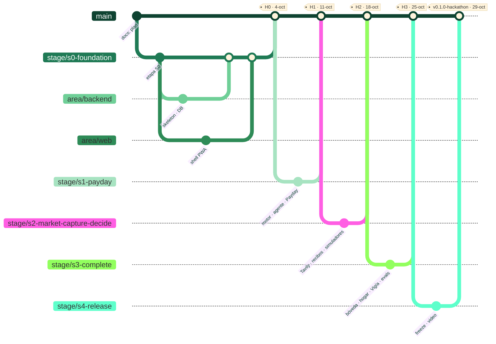

<div align="center">


<br/>


<br/>


<br/><br/>

**Acuerdo de trabajo de los fundadores de FINCH.** Todo lo del [README público](README.md), más
cómo trabajamos, qué nos obligamos a cumplir y cómo se entrega.

</div>


## 📚 Índice

1. [Jerarquía normativa](#1--jerarquía-normativa)
2. [Equipo, roles y responsabilidades](#2--equipo-roles-y-responsabilidades)
3. [Obligaciones y deberes](#3--obligaciones-y-deberes)
4. [Entorno de desarrollo](#4--entorno-de-desarrollo)
5. [Comandos](#5--comandos)
6. [Ramas, etapas e hitos](#6--ramas-etapas-e-hitos)
7. [Flujo de trabajo: de la historia al merge](#7--flujo-de-trabajo-de-la-historia-al-merge)
8. [Método: XP · Agile · CRISP-ML(Q)](#8--método-xp--agile--crisp-mlq)
9. [Definition of Ready y Definition of Done](#9--definition-of-ready-y-definition-of-done)
10. [Estándares de código](#10--estándares-de-código)
11. [IA: en el producto y como herramienta](#11--ia-en-el-producto-y-como-herramienta)
12. [Seguridad, secretos y datos](#12--seguridad-secretos-y-datos)
13. [Créditos y costos](#13--créditos-y-costos)
14. [Operación del demo y guardia](#14--operación-del-demo-y-guardia)
15. [Decisiones y escalamiento](#15--decisiones-y-escalamiento)
16. [Mapa de documentación](#16--mapa-de-documentación)


## 1. 🧭 Jerarquía normativa

Cuando dos documentos dicen cosas distintas, manda el de arriba:

```text
1. Constitución — docs/architecture/CONSTITUTION.md   (las referencias "README §N" apuntan aquí)
2. ADRs aceptados — docs/architecture/adr/
3. AGENTS.md y CLAUDE.md                                (reglas para agentes de IA)
4. Este README-DEVELOPERS.md                            (acuerdo de trabajo)
5. Catálogo de funciones — docs/hackathon/08            (fuente única de alcance)
6. Especificaciones y fórmulas — docs/hackathon/, docs/financial-formulas/
7. Código + tests
8. Issues y descripciones de PR
```

## 2. 👥 Equipo, roles y responsabilidades

| Rol                                    | Persona                                                  | Responsable de                                                                                                     |
| -------------------------------------- | -------------------------------------------------------- | ------------------------------------------------------------------------------------------------------------------ |
| **Representative ante Devpost**        | HELL                                                     | Envío, comunicación oficial, affidavits, formularios fiscales.                                                     |
| **Líder técnico backend / IA / infra** | HELL                                                     | Motor financiero, AI Gateway, agente, Market Truth, autorización, datos, Vigía, despliegue, seguridad.             |
| **Líder de producto / UX / frontend**  | Nairy                                                    | Sistema de diseño, app (PWA), flujos, copy, accesibilidad, evaluación humana (Toloka), video, narrativa del envío. |
| **Product Owner de la semana**         | Rota: S0 HELL · S1 Nairy · S2 HELL · S3 Nairy · S4 ambos | Prioriza el backlog de la semana, acepta historias en la review, decide la contingencia.                           |
| **Claude**                             | Herramienta                                              | Arquitectura, especificaciones, ADRs, threat models, revisión profunda, planeación.                                |
| **Cursor**                             | Herramienta                                              | Implementación multiarchivo, refactor, tests, depuración local.                                                    |

**Matriz RACI de bloques** (R = hace · A = aprueba · C = consultado · I = informado):

| Bloque                             | HELL         | Nairy                                |
| ---------------------------------- | ------------ | ------------------------------------ |
| Motor financiero y fórmulas        | R/A          | C (golden vectors independientes: R) |
| AI Gateway, agente, recibos, Ultra | R/A          | C                                    |
| Market Truth (Tavily)              | R/A          | I                                    |
| Autorización y hogar compartido    | R/A          | C                                    |
| Sistema de diseño y app            | C            | R/A                                  |
| Flujos de producto y copy          | C            | R/A                                  |
| Captura (recibos, bóveda)          | R (pipeline) | R (UI) · A                           |
| Evals y CRISP-ML(Q)                | R (runner)   | R (datasets, Toloka) · A             |
| Operación del demo                 | R/A          | I                                    |
| Video y Devpost                    | C            | R/A                                  |

> Las IA son **herramientas, no autoras** (AGENTS.md §1). Nunca aparecen en el historial ni en
> CODEOWNERS.

## 3. ⚖️ Obligaciones y deberes

### Innegociables (romper uno bloquea el merge)

1. **Nunca atribución de IA** en commits, PRs, headers, changelogs ni release notes.
2. **Nunca cambiar la identidad git** de nadie (`user.name`, `user.email`).
3. **El dinero nunca es `number`/float.** `bigint` en unidades menores o decimal de precisión arbitraria.
4. **Un LLM nunca es autoridad** sobre saldos, tasas, elegibilidad, pagos ni cifras.
5. **Nunca debilitar** un test, un tipo o un control de seguridad para que algo pase.
6. **Nunca secretos en el repo** ni en el cliente. Nunca datos reales en desarrollo.
7. **Nunca push directo a `main`.** Todo entra por PR revisado por el otro fundador.
8. **FINCH nunca mueve dinero** y **ninguna comisión altera un ranking**.
9. **Una sola cuenta por persona** en cada programa de créditos (reglas §11 de la hackathon).

### Deberes de cada fundador

| Deber                                                                             | Frecuencia / plazo                   |
| --------------------------------------------------------------------------------- | ------------------------------------ |
| Daily de 15 min (ayer · hoy · bloqueos)                                           | Diario, hora fija                    |
| Revisar los PRs del otro                                                          | **≤ 4 h hábiles** desde que se piden |
| Correr `pnpm check` antes de cada push                                            | Siempre                              |
| Mantener el tablero actualizado (WIP ≤ 2)                                         | Continuo                             |
| Registrar fricciones con Nebius/NVIDIA/Tavily en `docs/hackathon/feedback-log.md` | Cuando ocurran                       |
| Actualizar el estado de las funciones en el README público (✅ 🚧 🗓️)             | Al cerrar cada historia              |
| Actualizar el README del paquete si cambia su contrato                            | En el mismo PR                       |
| Escribir o actualizar el ADR si la decisión es de arquitectura                    | Antes de implementar                 |
| Asistir a planning, review y retro                                                | Lunes y domingo                      |
| Respetar el ritmo sostenible (8+ h con pausas, descanso semanal fijo)             | Siempre                              |
| Guardia del demo en su turno (01–15-dic)                                          | Según rotación (§14)                 |

### Deberes del revisor de un PR

- Leer el diff completo y ejecutar localmente si toca motor, autorización o dinero.
- Verificar la Definition of Done (§9) punto por punto.
- Bloquear si hay: cifra sin recibo, `number` en dinero, secreto, IA con autoridad, test debilitado,
  PII en logs o analítica.
- Aprobar o pedir cambios con comentarios concretos. Nunca "LGTM" sin haber leído.


## 4. 🛠️ Entorno de desarrollo

| Herramienta | Versión     | Notas                                                         |
| ----------- | ----------- | ------------------------------------------------------------- |
| Node        | **24.21.0** | `.nvmrc`; si falta `corepack`, estás en el Node equivocado.   |
| pnpm        | **11.26.0** | Vía corepack. `engine-strict` activo.                         |
| TypeScript  | **6.0.3**   | Fijado por compatibilidad con `typescript-eslint` (ADR-0033). |
| Docker      | reciente    | PostgreSQL 18.6 local.                                        |

```bash
git clone https://github.com/HCHAPS404/FINCH.git && cd FINCH
corepack enable
pnpm install --frozen-lockfile
pnpm env:doctor
cp .env.example .env
pnpm dev:infra
```

**Variables de entorno (solo en `.env` local y en el gestor de secretos del host):**

| Variable                                                                   | Para qué                                                    |
| -------------------------------------------------------------------------- | ----------------------------------------------------------- |
| `NEBIUS_API_KEY`                                                           | Token Factory (inferencia)                                  |
| `NEBIUS_BASE_URL`                                                          | `https://api.tokenfactory.nebius.com/v1/`                   |
| `NEBIUS_MODEL_FAST` · `_AGENT` · `_DEEP` · `_VISION` · `_EMBED` · `_GUARD` | IDs de modelos por nivel (confirmados con `GET /v1/models`) |
| `TAVILY_API_KEY`                                                           | Market Truth                                                |
| `LANGSMITH_API_KEY`                                                        | Traces y datasets                                           |
| `AI_DAILY_BUDGET_USD` · `AI_SESSION_BUDGET_USD`                            | Presupuestos del AI Gateway                                 |
| `DATABASE_URL`                                                             | PostgreSQL                                                  |
| `EMAIL_*` · `WEB_PUSH_*`                                                   | Channel Hub (ADR-0039)                                      |

## 5. ⌨️ Comandos

```bash
pnpm env:doctor           # verifica el toolchain
pnpm dev:infra            # PostgreSQL en Docker
pnpm lint                 # ESLint + reglas de la Constitución FINCH
pnpm typecheck            # TypeScript estricto
pnpm test                 # unitarios + corrección financiera
pnpm architecture:check   # fronteras de arquitectura (dependency-cruiser)
pnpm security:check       # higiene de archivos, gitleaks, auditoría de dependencias
pnpm financial:verify     # artefacto de corrección financiera
pnpm check                # lint + format + typecheck + architecture + test

node scripts/architecture-check.mjs --self-test   # planta una violación y exige que se detecte
node scripts/security-check.mjs --self-test       # planta un secreto y exige que se detecte
```


## 6. 🌿 Ramas, etapas e hitos

Modelo definido en [ADR-0040](docs/architecture/adr/0040-engineering-method-and-branching.md).



### Ramas permanentes y de etapa

| Rama                             | Propósito                                              | Vida            | Protección                                                                                |
| -------------------------------- | ------------------------------------------------------ | --------------- | ----------------------------------------------------------------------------------------- |
| `main`                           | Producto siempre desplegable; fuente del demo público. | Permanente      | PR obligatorio, 1 aprobación del otro fundador, CI verde, sin push directo ni force-push. |
| `stage/s0-foundation`            | Sprint 0 — Fundación                                   | 28-sep → 4-oct  | CI verde para merge.                                                                      |
| `stage/s1-payday`                | Sprint 1 — "Me llegó el sueldo"                        | 5 → 11-oct      | CI verde.                                                                                 |
| `stage/s2-market-capture-decide` | Sprint 2 — Mercado, captura y decisión                 | 12 → 18-oct     | CI verde.                                                                                 |
| `stage/s3-complete`              | Sprint 3 — Completar las 45 funciones                  | 19 → 25-oct     | CI verde.                                                                                 |
| `stage/s4-release`               | Sprint 4 — Freeze, video y envío                       | 26 → 29-oct     | CI verde; solo P0 tras el freeze.                                                         |
| `release/v0.1.0-hackathon`       | Se corta de `main` en el freeze (27-oct)               | Hasta 15-dic    | Solo lectura.                                                                             |
| `next`                           | Desarrollo tras el envío                               | 31-oct → 15-dic | CI verde.                                                                                 |

**Al inicio de cada sprint:** la rama de etapa se actualiza desde `main`
(`git switch stage/sN-… && git merge main`). **Al cierre (domingo, review):** PR
`stage/sN → main`; si el hito está verde se mergea y se etiqueta `hN`.

### Hitos por etapa

| Hito   | Fecha            | Criterio de salida (en la URL pública)                                                                                                                             |
| ------ | ---------------- | ------------------------------------------------------------------------------------------------------------------------------------------------------------------ |
| **H0** | dom 4-oct        | App shell navegable (5 destinos), onboarding, `/api/health` con Nemotron, chat vía Token Factory, CI verde, deploy automático.                                     |
| **H1** | dom 11-oct       | Payday Autopilot con recibos, sobres, tarjetas, calendario, ¿me lo puedo permitir?; agente + verificador. **Demo enviable.**                                       |
| **H2** | dom 18-oct       | Tavily, Opportunity Engine, suscripciones, anomalías, recibos por foto, importación, simuladores, Ultra, memoria, copiloto de derechos.                            |
| **H3** | dom 25-oct       | Bóveda, buscador NL, hogar, protección, hábitos, briefing, Vigía, push, .ics, correo, gastos fijos, remesas, pasaporte, impuestos, segundo país; evals publicadas. |
| **H4** | mar 27-oct 18:00 | Code freeze.                                                                                                                                                       |
| **H5** | jue 29-oct 18:00 | Envío en Devpost + tag `v0.1.0-hackathon`.                                                                                                                         |

### Ramas de área (plataformas y disciplinas)

Tres niveles: **`main` ← `stage/sN` ← `area/<área>` ← ramas de tarea.** Cada área es el carril de
integración de una plataforma o disciplina, con dueño fijo.

| Rama           | Área                       | Plataformas / alcance                                                                  | Stack (ADR)                                                                       | Dueño                           |
| -------------- | -------------------------- | -------------------------------------------------------------------------------------- | --------------------------------------------------------------------------------- | ------------------------------- |
| `area/design`  | Diseño y sistema de diseño | Tokens, componentes, iconografía, motion, prototipos; alimenta web, móvil y escritorio | `packages/design-tokens`, `ui-web`, `ui-mobile` (Constitución §34)                | Nairy                           |
| `area/backend` | Backend, motor, IA y datos | API, worker/Vigía, motor financiero, AI Gateway, Market Truth, DB, Channel Hub         | NestJS + Fastify (ADR-0007), PostgreSQL (ADR-0009), `financial-engine`, `ai-core` | HELL                            |
| `area/web`     | Frontend web               | App web / **PWA instalable** (canal principal del demo) + panel admin                  | Next.js (ADR-0005)                                                                | Nairy                           |
| `area/mobile`  | App móvil                  | **iOS y Android**                                                                      | React Native + Expo (ADR-0004)                                                    | Nairy (UI) + HELL (integración) |
| `area/desktop` | App de escritorio          | **Windows, macOS y Linux**                                                             | Tauri 2 + React/Vite (ADR-0006)                                                   | HELL (empaquetado) + Nairy (UI) |

**Reglas de área:**

- Una rama de área se **actualiza desde la rama de etapa activa todos los días** (`git merge stage/sN-…`)
  y **entrega a la etapa por PR al menos cada 2 días** — nunca acumula más de 2 días de divergencia.
- Al empezar un sprint, cada área se actualiza desde la nueva rama de etapa.
- Todo el código compartido (contratos, motor, tokens, cliente de API) vive en `packages/` y se consume
  igual en web, móvil y escritorio; las apps no se importan entre sí (dependency-cruiser).
- **Alcance en la hackathon:** la **PWA web** es la superficie principal del demo y del video. Móvil y
  escritorio entregan **apps shell funcionales** (login de demo, "Hoy", bandeja y recibos) que consumen
  los mismos paquetes, y builds instalables si el tiempo lo permite; su versión completa es P1 (Q1 2027).
  Ampliar su alcance en la hackathon requiere acuerdo de ambos (impacta la capacidad, 05 §0).

### Ramas de tarea

Formato: `<tipo>/s<N>-<slug>` — tipo ∈ `feat` · `fix` · `test` · `chore` · `docs` · `security` · `spike`.
Salen de la **rama de área** correspondiente (o de la etapa si son transversales), viven **≤ 2 días** y
vuelven por PR a su área.

Ramas del **Sprint 0** ya creadas:

| Rama                             | Sale de               | Tarea (05)                                                          | Resp.        |
| -------------------------------- | --------------------- | ------------------------------------------------------------------- | ------------ |
| `feat/s0-walking-skeleton`       | `area/backend`        | S0-07 API health + chat Nemotron + CI + deploy                      | HELL         |
| `feat/s0-db-schema-personas`     | `area/backend`        | S0-14 esquema v1 + seeds de personas sintéticas                     | HELL + Nairy |
| `feat/s0-design-system`          | `area/design`         | S0-08 tokens, tipografía, componentes base, motion, modo oscuro     | Nairy        |
| `feat/s0-app-shell-pwa`          | `area/web`            | S0-09 navegación de 5 destinos, onboarding, PWA instalable          | Nairy        |
| `feat/s0-mobile-shell`           | `area/mobile`         | Shell Expo iOS/Android consumiendo tokens y cliente de API          | Nairy + HELL |
| `feat/s0-desktop-shell`          | `area/desktop`        | Shell Tauri Windows/macOS/Linux consumiendo tokens y cliente de API | HELL         |
| `chore/s0-license-credits-setup` | `stage/s0-foundation` | S0-03/S0-04/S0-13 licencia (tras D-01), créditos, librería decimal  | HELL         |
| `docs/s0-research-evidence`      | `stage/s0-foundation` | S0-10 cifras oficiales y entrevistas                                | Nairy        |

Ramas previstas para los siguientes sprints (se crean el lunes de cada sprint desde su área):

| Sprint | `area/backend`                                                                                                                                                                                                                                 | `area/design` · `area/web`                                                                                                                               | `area/mobile` · `area/desktop`                               |
| ------ | ---------------------------------------------------------------------------------------------------------------------------------------------------------------------------------------------------------------------------------------------- | -------------------------------------------------------------------------------------------------------------------------------------------------------- | ------------------------------------------------------------ |
| S1     | `feat/s1-engine-credit-co` · `feat/s1-engine-personal-finance` · `test/s1-golden-vectors` · `feat/s1-ai-gateway` · `feat/s1-agent-receipts` · `feat/s1-payday-engine` · `docs/s1-threat-model`                                                 | `feat/s1-payday-ui` · `feat/s1-money-screens` · `feat/s1-afford-ui` · `feat/s1-receipt-panel`                                                            | `feat/s1-mobile-today-inbox` · `feat/s1-desktop-today-inbox` |
| S2     | `feat/s2-market-truth-tavily` · `feat/s2-opportunity-engine` · `feat/s2-import-recurring-anomalies` · `feat/s2-receipt-pipeline` · `feat/s2-decision-cards-ultra` · `feat/s2-memory` · `feat/s2-rights-docs`                                   | `feat/s2-opportunities-ui` · `feat/s2-camera-capture-ui` · `feat/s2-simulators-ui` · `feat/s2-rights-flows` · `test/s2-eval-datasets`                    | `feat/s2-mobile-camera-capture` · `feat/s2-desktop-import`   |
| S3     | `feat/s3-vault` · `feat/s3-nl-query` · `feat/s3-household` · `feat/s3-watcher-briefing` · `feat/s3-email-channel` · `feat/s3-fixed-costs-remittances` · `feat/s3-passport` · `feat/s3-tax-co` · `feat/s3-second-country` · `chore/s3-demo-ops` | `feat/s3-vault-ui` · `feat/s3-household-ui` · `feat/s3-protection-habits-close` · `feat/s3-push-ics` · `feat/s3-premium-polish` · `test/s3-evals-toloka` | `feat/s3-mobile-push-builds` · `feat/s3-desktop-builds`      |
| S4     | `fix/s4-bug-bash-*` · `chore/s4-release`                                                                                                                                                                                                       | `docs/s4-readme-devpost` · `fix/s4-bug-bash-*`                                                                                                           | `fix/s4-bug-bash-*`                                          |

## 7. 🔁 Flujo de trabajo: de la historia al merge

```text
Historia (tablero, "Ready") → rama de tarea desde area/<área> (o stage/sN si es transversal) → TDD donde aplique → commits pequeños
→ pnpm check → PR a su área (plantilla) → revisión del otro fundador (≤ 4 h) → CI verde
→ merge (squash) → PR área → stage (≤ 2 días) → preview → actualizar estado en README público → tarjeta a "Done"
```

**Commits:** [Conventional Commits](https://www.conventionalcommits.org/), en inglés, sin
atribución de IA.

```text
feat(budgeting): allocate paycheck across obligations and goals
fix(credit-cards): use cut-off date when computing interest-free days
test(financial-engine): add golden vectors for rate conversion
docs(adr): add channel hub decision
```

**Descripción del PR (en este orden, AGENTS.md):** archivos cambiados · resumen · tests ejecutados ·
resultado · impacto de seguridad · impacto de arquitectura · función del catálogo (ID) · capturas
si es UI.

## 8. 🧪 Método: XP · Agile · CRISP-ML(Q)

Detalle en [`docs/architecture/SOFTWARE-ARCHITECTURE.md`](docs/architecture/SOFTWARE-ARCHITECTURE.md) §5–§7.

| Día     | Ceremonia    | Duración | Resultado                                                                           |
| ------- | ------------ | -------- | ----------------------------------------------------------------------------------- |
| Lunes   | **Planning** | 60 min   | Objetivo del sprint, historias elegidas, riesgos, ramas de tarea creadas.           |
| Diario  | **Daily**    | 15 min   | Bloqueos resueltos o escalados.                                                     |
| Domingo | **Review**   | 45 min   | Demo en la URL pública contra el hito; merge `stage → main` o contingencia (05 §5). |
| Domingo | **Retro**    | 30 min   | Mantener · cambiar · probar; métricas de IA (CRISP-ML(Q) fase 6).                   |

**XP en una línea por práctica:** TDD obligatorio en motor, autorización, verificador y DSL ·
parejas en lo crítico · integración continua · releases pequeñas · diseño simple · refactor continuo ·
propiedad colectiva · estándares comunes · ritmo sostenible · cliente en sitio (PO rotativo +
testers) · planning game semanal · metáfora "CFO con recibos".

**CRISP-ML(Q) para cada componente de IA (ML-1…ML-10):** comprensión del negocio y datos →
ingeniería de datos (datasets sintéticos) → ingeniería del modelo (nivel, prompt, esquema) →
evaluación (batch, Toloka, Ultra) → despliegue (flag, fallback, presupuesto) → monitoreo (verificador,
fallbacks, costo, latencia). **Ningún prompt o modelo nuevo entra sin pasar la evaluación.**


## 9. ✅ Definition of Ready y Definition of Done

**Ready** (antes de empezar):

- [ ] ID de función del catálogo y criterios de aceptación claros.
- [ ] Fórmula/skill identificada (y su versión) si hay cifras.
- [ ] Diseño disponible si es UI; copy en ES/EN.
- [ ] Riesgo R0–R4 asignado; ADR identificado si aplica.

**Done** (antes del merge; complementa la Constitución §75):

- [ ] Criterios de aceptación del catálogo cumplidos y demostrados.
- [ ] Tests: unitarios; golden vectors para fórmulas; autorización para datos compartidos; E2E del flujo principal.
- [ ] `pnpm check` verde local y en CI.
- [ ] Toda cifra visible con recibo; clases de verdad correctas.
- [ ] Sin PII en logs/analítica; secretos fuera del código.
- [ ] Estados vacío / cargando / error / desactualizado diseñados.
- [ ] Accesible (teclado, lector de pantalla, contraste AA) y responsive.
- [ ] ES/EN.
- [ ] Modos de fallo y observabilidad documentados en el README del módulo.
- [ ] Para IA: prompt versionado, eval ejecutada, resultado registrado.
- [ ] Revisado y aprobado por el otro fundador.

## 10. 📐 Estándares de código

- **TypeScript estricto**; sin `any`; errores con la taxonomía de `packages/contracts`.
- **Dinero:** `Money` de `packages/financial-engine`; redondeo siempre explícito; nunca `toNumber()`.
- **Fórmulas:** registradas con `formulaId@version`; cambiar = nueva versión; nunca editar en sitio.
- **Módulos hexagonales:** `domain/ · application/ · ports/ · adapters/`; sin lecturas cruzadas de tablas.
- **Validación en fronteras** con Zod; respuestas de IA siempre validadas por esquema.
- **Idempotencia** en comandos sensibles y consumidores de eventos.
- **UI:** solo tokens de `packages/design-tokens`; nada comunicado solo por color; badges de verdad con texto e ícono.
- **i18n:** ningún texto visible hardcodeado; formatos por locale; reglas de país en `jurisdictions/`.
- **Nombres:** código y commits en inglés; documentación interna en español.

## 11. 🤖 IA: en el producto y como herramienta

**En el producto (runtime):**

- Todo acceso a modelos pasa por el **AI Gateway** (`packages/ai-core`).
- El modelo escribe **marcadores**, nunca cifras; el verificador rinde números solo desde recibos.
- Contenido de web, correo y documentos = **dato no confiable**, nunca instrucciones.
- Solo modelos NVIDIA Nemotron en Token Factory para razonamiento (requisito de la hackathon);
  Claude **no** se usa dentro del producto.

**Como herramienta de desarrollo:**

- Claude y Cursor son herramientas; nunca aprueban su propio cambio crítico.
- Nunca editan simultáneamente el mismo worktree.
- Todo lo que generan pasa por `pnpm check` y por la revisión del otro fundador.
- Verificar versiones y APIs contra documentación oficial; nunca inventar.

## 12. 🔐 Seguridad, secretos y datos

- Secretos solo en `.env` local (ignorado) y en el gestor de secretos del host. Rotación inmediata ante cualquier exposición.
- `pnpm security:check` antes de hacer público el repo y en CI.
- Datos **sintéticos** en desarrollo y demo; datos reales solo en espacios privados del propio usuario.
- PII redactada antes de cualquier LLM; nunca en logs, traces ni analítica.
- Documentos: cuarentena, tipos permitidos, cifrado en reposo, borrado real.
- Threat model por función R1+ en `docs/architecture/threat-models/`.

## 13. 💳 Créditos y costos

| Servicio             | Crédito                                                           | Dueño de la cuenta       |
| -------------------- | ----------------------------------------------------------------- | ------------------------ |
| Nebius Token Factory | USD 25 promo + USD 25 Builders (por persona)                      | Cada fundador, su cuenta |
| Tavily               | Plan gratuito + add-on del Builders (HELL: 4.125 créditos add-on) | Cada fundador, su cuenta |
| LangSmith · Toloka   | USD 100 c/u (Builders)                                            | HELL                     |

- Registrar saldos (nunca llaves) en `docs/hackathon/credits.md` cada lunes.
- **Reservar ≥ 40 % del crédito de inferencia para el periodo de jurados (01–15-dic).**
- Presupuesto de caja máximo según decisión D-08.

## 14. 📟 Operación del demo y guardia

- Monitor de uptime con alertas a ambos; revisión diaria de salud y créditos.
- Despliegues solo desde CI; tras el envío, solo desde `release/v0.1.0-hackathon`.
- **Guardia 01–15-dic:** HELL días impares, Nairy días pares; runbook en `docs/operations/runbooks/hackathon-demo.md`.
- Incidente: estabilizar → comunicar al otro fundador → registrar → postmortem breve.

## 15. 🧯 Decisiones y escalamiento

```text
STOP → EXPLAIN → PROPOSE → WAIT (si la decisión es material)
```

- Decisiones de arquitectura → **ADR** antes de implementar (Constitución §76).
- Decisiones de producto/alcance → catálogo (08) + acuerdo de ambos fundadores.
- Decisiones abiertas → `docs/hackathon/07-risks-and-decisions.md` (D-01…D-13).
- Desacuerdo → cada uno expone en 5 min; decide el Product Owner de la semana; se registra.

## 16. 🗺️ Mapa de documentación

| Documento                                                                                  | Contenido                                                                                                         |
| ------------------------------------------------------------------------------------------ | ----------------------------------------------------------------------------------------------------------------- |
| [`README.md`](README.md)                                                                   | Documentación pública del producto (inglés)                                                                       |
| [`docs/architecture/CONSTITUTION.md`](docs/architecture/CONSTITUTION.md)                   | Constitución de ingeniería y producto                                                                             |
| [`docs/architecture/SOFTWARE-ARCHITECTURE.md`](docs/architecture/SOFTWARE-ARCHITECTURE.md) | Arquitectura de software, CRISP-ML(Q), XP, Agile                                                                  |
| [`docs/architecture/adr/`](docs/architecture/adr/)                                         | Decisiones de arquitectura (ADR-0001…0040)                                                                        |
| [`docs/hackathon/`](docs/hackathon/)                                                       | Plan de la hackathon: reglas, estrategia, producto, arquitectura, IA, cronograma, kit de envío, riesgos, catálogo |
| [`docs/financial-formulas/`](docs/financial-formulas/)                                     | Contratos matemáticos del motor                                                                                   |
| [`AGENTS.md`](AGENTS.md) · [`CLAUDE.md`](CLAUDE.md)                                        | Reglas para agentes de IA                                                                                         |
| [`CONTRIBUTING.md`](CONTRIBUTING.md) · [`SECURITY.md`](SECURITY.md)                        | Contribución y seguridad                                                                                          |

<div align="center">
<br/>


<sub><b>FINCH</b> · construido por sus fundadores · Nemotron explica. La matemática decide.</sub>

</div>
