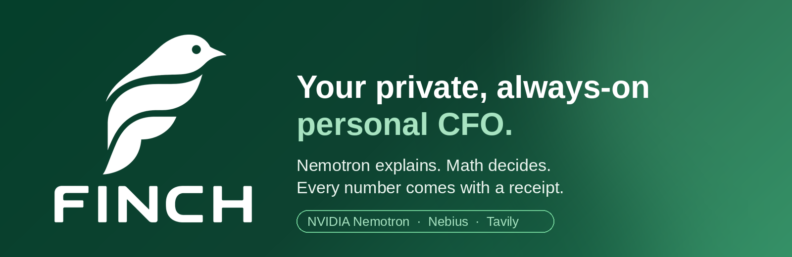
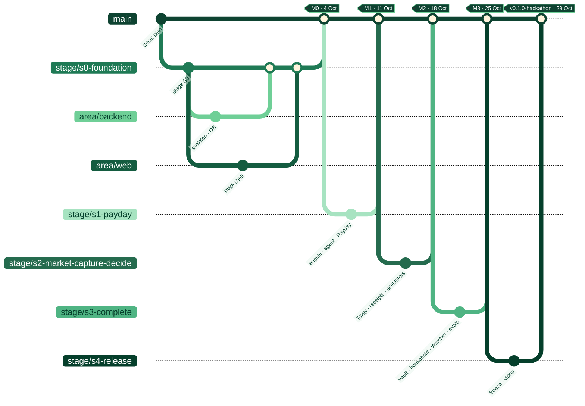

<div align="center">



<br/>


<br/>


<br/><br/>

**The FINCH founders' working agreement.** Everything in the [public README](README.md), plus how we
work, what we commit to and how we deliver.

</div>

<a id="dev-index"></a>


1. [Order of authority](#dev-01)
2. [Team, roles and responsibilities](#dev-02)
3. [Obligations and duties](#dev-03)
4. [Development environment](#dev-04)
5. [Commands](#dev-05)
6. [Branches, stages and milestones](#dev-06)
7. [Workflow: from story to merge](#dev-07)
8. [Method: XP · Agile · CRISP-ML(Q)](#dev-08)
9. [Definition of Ready and Definition of Done](#dev-09)
10. [Coding standards](#dev-10)
11. [AI: in the product and as a tool](#dev-11)
12. [Security, secrets and data](#dev-12)
13. [Credits and costs](#dev-13)
14. [Demo operations and on-call](#dev-14)
15. [Decisions and escalation](#dev-15)
16. [Documentation map](#dev-16)
17. [Agents, rules, skills and Figma](#dev-17)

<a id="dev-01"></a>


When two documents disagree, the higher one wins:

```text
1. Constitution — docs/architecture/CONSTITUTION.md   ("README §N" references point here)
2. Accepted ADRs — docs/architecture/adr/
3. AGENTS.md and CLAUDE.md                              (rules for AI agents)
4. This README-DEVELOPERS.md                            (working agreement)
5. Feature catalog — docs/hackathon/08                  (single source of scope)
6. Specifications and formulas — docs/hackathon/, docs/financial-formulas/
7. Code + tests
8. Issues and PR descriptions
```

<a id="dev-02"></a>


| Role                                     | Person                                                     | Responsible for                                                                                               |
| ---------------------------------------- | ---------------------------------------------------------- | ------------------------------------------------------------------------------------------------------------- |
| **Devpost Representative**               | HELL                                                       | Submission, official communication, affidavits, tax forms.                                                    |
| **Technical lead: backend / AI / infra** | HELL                                                       | Financial engine, AI Gateway, agent, Market Truth, authorization, data, Watcher, deployment, security.        |
| **Product / UX / front-end lead**        | Nairy                                                      | Design system, app (PWA), flows, copy, accessibility, human evaluation (Toloka), video, submission narrative. |
| **Product Owner of the week**            | Rotates: S0 HELL · S1 Nairy · S2 HELL · S3 Nairy · S4 both | Prioritizes the week's backlog, accepts stories at the review, decides on contingency.                        |
| **Claude**                               | Tool                                                       | Architecture, specifications, ADRs, threat models, deep review, planning.                                     |
| **Cursor**                               | Tool                                                       | Multi-file implementation, refactoring, tests, local debugging.                                               |

**RACI matrix by block** (R = does · A = approves · C = consulted · I = informed):

| Block                              | HELL         | Nairy                             |
| ---------------------------------- | ------------ | --------------------------------- |
| Financial engine and formulas      | R/A          | C (independent golden vectors: R) |
| AI Gateway, agent, receipts, Ultra | R/A          | C                                 |
| Market Truth (Tavily)              | R/A          | I                                 |
| Authorization and shared household | R/A          | C                                 |
| Design system and app              | C            | R/A                               |
| Product flows and copy             | C            | R/A                               |
| Capture (receipts, vault)          | R (pipeline) | R (UI) · A                        |
| Evals and CRISP-ML(Q)              | R (runner)   | R (datasets, Toloka) · A          |
| Demo operations                    | R/A          | I                                 |
| Video and Devpost                  | C            | R/A                               |

> AI tools are **tools, not authors** (AGENTS.md §1). They never appear in the history or in
> CODEOWNERS.

<a id="dev-03"></a>


### Non-negotiables (breaking one blocks the merge)

1. **Never AI attribution** in commits, PRs, headers, changelogs or release notes.
2. **Never change anyone's git identity** (`user.name`, `user.email`).
3. **Money is never a `number`/float.** `bigint` in minor units or arbitrary-precision decimal.
4. **An LLM is never the authority** on balances, rates, eligibility, payments or figures.
5. **Never weaken** a test, a type or a security control to make something pass.
6. **Never secrets in the repository** or in the client. Never real data in development.
7. **Never push directly to `main`.** Everything goes in through a PR reviewed by the other founder.
8. **FINCH never moves money** and **no commission changes a ranking**.
9. **One account per person** in each credits program (hackathon rules §11).

### Duties of each founder

| Duty                                                                       | Frequency / deadline                   |
| -------------------------------------------------------------------------- | -------------------------------------- |
| 15-minute daily (yesterday · today · blockers)                             | Daily, fixed time                      |
| Review the other's PRs                                                     | **≤ 4 working hours** from the request |
| Run `pnpm check` before every push                                         | Always                                 |
| Keep the board up to date (WIP ≤ 2)                                        | Continuous                             |
| Log friction with Nebius/NVIDIA/Tavily in `docs/hackathon/feedback-log.md` | When it happens                        |
| Update feature status in the public README (✅ 🚧 🗓️)                      | When closing each story                |
| Update the package README when its contract changes                        | In the same PR                         |
| Write or update the ADR when the decision is architectural                 | Before implementing                    |
| Attend planning, review and retro                                          | Monday and Sunday                      |
| Keep a sustainable pace (8+ h with breaks, fixed weekly rest)              | Always                                 |
| Demo on-call on your shift (1–15 Dec)                                      | Per rotation (§14)                     |

### Duties of a PR reviewer

- Read the whole diff and run it locally if it touches the engine, authorization or money.
- Check the Definition of Done (§9) item by item.
- Block on: a figure without a receipt, `number` for money, a secret, AI with authority, a weakened
  test, PII in logs or analytics.
- Approve or request changes with concrete comments. Never "LGTM" without reading.

<a id="dev-04"></a>


| Tool       | Version     | Notes                                                          |
| ---------- | ----------- | -------------------------------------------------------------- |
| Node       | **24.21.0** | `.nvmrc`; if `corepack` is missing, you are on the wrong Node. |
| pnpm       | **11.26.0** | Via corepack. `engine-strict` on.                              |
| TypeScript | **6.0.3**   | Pinned for compatibility with `typescript-eslint` (ADR-0033).  |
| Docker     | recent      | Local PostgreSQL 18.6.                                         |

```bash
git clone https://github.com/HCHAPS404/FINCH.git && cd FINCH
corepack enable
pnpm install --frozen-lockfile
pnpm env:doctor
cp .env.example .env
pnpm dev:infra
```

**Environment variables (only in the local `.env` and the host secret store):**

| Variable                                                                   | Purpose                                              |
| -------------------------------------------------------------------------- | ---------------------------------------------------- |
| `NEBIUS_API_KEY`                                                           | Token Factory (inference)                            |
| `NEBIUS_BASE_URL`                                                          | `https://api.tokenfactory.nebius.com/v1/`            |
| `NEBIUS_MODEL_FAST` · `_AGENT` · `_DEEP` · `_VISION` · `_EMBED` · `_GUARD` | Model IDs per tier (confirmed with `GET /v1/models`) |
| `TAVILY_API_KEY`                                                           | Market Truth                                         |
| `LANGSMITH_API_KEY`                                                        | Traces and datasets                                  |
| `AI_DAILY_BUDGET_USD` · `AI_SESSION_BUDGET_USD`                            | AI Gateway budgets                                   |
| `DATABASE_URL`                                                             | PostgreSQL                                           |
| `EMAIL_*` · `WEB_PUSH_*`                                                   | Channel Hub (ADR-0039)                               |

<a id="dev-05"></a>


```bash
pnpm env:doctor           # verify the toolchain
pnpm dev:infra            # PostgreSQL in Docker
pnpm lint                 # ESLint + FINCH Constitution rules
pnpm typecheck            # strict TypeScript
pnpm test                 # unit + financial correctness
pnpm architecture:check   # architecture boundaries (dependency-cruiser)
pnpm security:check       # file hygiene, gitleaks, dependency audit
pnpm financial:verify     # financial correctness artifact
pnpm ai:sync              # regenerate agent adapters from .ai/
pnpm check                # ai:check + lint + format + typecheck + architecture + test

node scripts/architecture-check.mjs --self-test   # plants a violation and requires detection
node scripts/security-check.mjs --self-test       # plants a secret and requires detection
```

<a id="dev-06"></a>


Model defined in [ADR-0040](docs/architecture/adr/0040-engineering-method-and-branching.md).



### Permanent and stage branches

| Branch                           | Purpose                                               | Lifetime        | Protection                                                                              |
| -------------------------------- | ----------------------------------------------------- | --------------- | --------------------------------------------------------------------------------------- |
| `main`                           | Always-deployable product; source of the public demo. | Permanent       | PR required, 1 approval from the other founder, green CI, no direct push or force-push. |
| `stage/s0-foundation`            | Sprint 0 — Foundation                                 | 28 Sep → 4 Oct  | Green CI to merge.                                                                      |
| `stage/s1-payday`                | Sprint 1 — "My paycheck arrived"                      | 5 → 11 Oct      | Green CI.                                                                               |
| `stage/s2-market-capture-decide` | Sprint 2 — Market, capture and decide                 | 12 → 18 Oct     | Green CI.                                                                               |
| `stage/s3-complete`              | Sprint 3 — Complete the 45 features                   | 19 → 25 Oct     | Green CI.                                                                               |
| `stage/s4-release`               | Sprint 4 — Freeze, video and submission               | 26 → 29 Oct     | Green CI; P0 only after the freeze.                                                     |
| `release/v0.1.0-hackathon`       | Cut from `main` at the freeze (27 Oct)                | Until 15 Dec    | Read-only.                                                                              |
| `next`                           | Development after submission                          | 31 Oct → 15 Dec | Green CI.                                                                               |

**At the start of each sprint:** the stage branch is updated from `main`
(`git switch stage/sN-… && git merge main`). **At close (Sunday, review):** PR `stage/sN → main`; if
the milestone is green it is merged and tagged `mN`.

### Milestones per stage

| Milestone | Date             | Exit criterion (at the public URL)                                                                                                                                 |
| --------- | ---------------- | ------------------------------------------------------------------------------------------------------------------------------------------------------------------ |
| **M0**    | Sun 4 Oct        | Navigable app shell (5 destinations), onboarding, `/api/health` with Nemotron, chat via Token Factory, green CI, automatic deploy.                                 |
| **M1**    | Sun 11 Oct       | Payday Autopilot with receipts, envelopes, cards, calendar, can I afford it?; agent + verifier. **Demo submittable.**                                              |
| **M2**    | Sun 18 Oct       | Tavily, Opportunity Engine, subscriptions, anomalies, receipts by photo, import, simulators, Ultra, memory, rights copilot.                                        |
| **M3**    | Sun 25 Oct       | Vault, NL search, household, protection, habits, briefing, Watcher, push, .ics, email, fixed costs, remittances, passport, taxes, second country; evals published. |
| **M4**    | Tue 27 Oct 18:00 | Code freeze.                                                                                                                                                       |
| **M5**    | Thu 29 Oct 18:00 | Devpost submission + tag `v0.1.0-hackathon`.                                                                                                                       |

### Area branches (platforms and disciplines)

Three levels: **`main` ← `stage/sN` ← `area/<area>` ← task branches.** Each area is the integration
lane of one platform or discipline, with a fixed owner.

| Branch         | Area                         | Platforms / scope                                                                  | Stack (ADR)                                                                       | Owner                           |
| -------------- | ---------------------------- | ---------------------------------------------------------------------------------- | --------------------------------------------------------------------------------- | ------------------------------- |
| `area/design`  | Design and design system     | Tokens, components, iconography, motion, prototypes; feeds web, mobile and desktop | `packages/design-tokens`, `ui-web`, `ui-mobile` (Constitution §34)                | Nairy                           |
| `area/backend` | Backend, engine, AI and data | API, worker/Watcher, financial engine, AI Gateway, Market Truth, DB, Channel Hub   | NestJS + Fastify (ADR-0007), PostgreSQL (ADR-0009), `financial-engine`, `ai-core` | HELL                            |
| `area/web`     | Web front end                | Web app / **installable PWA** (main demo channel) + admin panel                    | Next.js (ADR-0005)                                                                | Nairy                           |
| `area/mobile`  | Mobile app                   | **Android, then iOS**                                                              | React Native + Expo (ADR-0004)                                                    | Nairy (UI) + HELL (integration) |
| `area/desktop` | Desktop app                  | **Windows, then macOS** (Linux builds come free with Tauri)                        | Tauri 2 + React/Vite (ADR-0006)                                                   | HELL (packaging) + Nairy (UI)   |

**Area rules:**

- An area branch is **updated from the active stage branch every day** (`git merge stage/sN-…`) and
  **delivers to the stage by PR at least every 2 days** — never more than 2 days of divergence.
- At the start of a sprint, each area is updated from the new stage branch.
- All shared code (contracts, engine, tokens, API client) lives in `packages/` and is consumed the
  same way on web, mobile and desktop; apps never import each other (dependency-cruiser).
- **Platform order (decision 2026-09-28):** **web → Windows → Android → macOS + iOS**. Everything is
  proven on web first; see [`docs/delivery/DELEGATION.md`](docs/delivery/DELEGATION.md).
- **Hackathon scope:** the **web PWA** is the only surface of the demo and the video. `area/desktop`
  and `area/mobile` stay parked until their phases (Windows from 2 Nov, Android from 23 Nov);
  widening their scope during the hackathon requires both founders' agreement (it affects capacity,
  05 §0).

### Task branches

Format: `<type>/s<N>-<slug>` — type ∈ `feat` · `fix` · `test` · `chore` · `docs` · `security` ·
`spike`. They start from the matching **area branch** (or from the stage if cross-cutting), live
**≤ 2 days** and return by PR to their area.

**Sprint 0** branches already created:

| Branch                           | From                  | Task (05)                                                        | Owner        |
| -------------------------------- | --------------------- | ---------------------------------------------------------------- | ------------ |
| `feat/s0-walking-skeleton`       | `area/backend`        | S0-07 API health + Nemotron chat + CI + deploy                   | HELL         |
| `feat/s0-db-schema-personas`     | `area/backend`        | S0-14 schema v1 + synthetic persona seeds                        | HELL + Nairy |
| `feat/s0-design-system`          | `area/design`         | S0-08 tokens, typography, base components, motion, dark mode     | Nairy        |
| `feat/s0-app-shell-pwa`          | `area/web`            | S0-09 5-destination navigation, onboarding, installable PWA      | Nairy        |
| `feat/s0-mobile-shell`           | `area/mobile`         | **Parked until phase 3 (Android)** — Expo shell                  | Nairy + HELL |
| `feat/s0-desktop-shell`          | `area/desktop`        | **Parked until phase 2 (Windows)** — Tauri shell                 | HELL         |
| `chore/s0-license-credits-setup` | `stage/s0-foundation` | S0-03/S0-04/S0-13 license (after D-01), credits, decimal library | HELL         |
| `docs/s0-research-evidence`      | `stage/s0-foundation` | S0-10 official figures and interviews                            | Nairy        |

Branches planned for the following sprints (created on each sprint's Monday from their area):

| Sprint | `area/backend`                                                                                                                                                                                                                                 | `area/design` · `area/web`                                                                                                                                                                   |
| ------ | ---------------------------------------------------------------------------------------------------------------------------------------------------------------------------------------------------------------------------------------------- | -------------------------------------------------------------------------------------------------------------------------------------------------------------------------------------------- |
| S1     | `feat/s1-engine-credit-co` · `feat/s1-engine-personal-finance` · `test/s1-golden-vectors` · `feat/s1-ai-gateway` · `feat/s1-agent-receipts` · `feat/s1-payday-engine` · `docs/s1-threat-model`                                                 | `feat/s1-core-components` · `feat/s1-payday-ui` · `feat/s1-money-screens` · `feat/s1-afford-ui` · `feat/s1-receipt-panel`                                                                    |
| S2     | `feat/s2-market-truth-tavily` · `feat/s2-opportunity-engine` · `feat/s2-import-recurring-anomalies` · `feat/s2-receipt-pipeline` · `feat/s2-decision-cards-ultra` · `feat/s2-memory` · `feat/s2-rights-docs`                                   | `feat/s2-decision-patterns` · `feat/s2-brand-motion` · `feat/s2-opportunities-ui` · `feat/s2-camera-capture-ui` · `feat/s2-simulators-ui` · `feat/s2-rights-flows` · `test/s2-eval-datasets` |
| S3     | `feat/s3-vault` · `feat/s3-nl-query` · `feat/s3-household` · `feat/s3-watcher-briefing` · `feat/s3-email-channel` · `feat/s3-fixed-costs-remittances` · `feat/s3-passport` · `feat/s3-tax-co` · `feat/s3-second-country` · `chore/s3-demo-ops` | `feat/s3-vault-ui` · `feat/s3-household-ui` · `feat/s3-protection-habits-close` · `feat/s3-push-ics` · `feat/s3-premium-polish` · `test/s3-evals-toloka`                                     |
| S4     | `fix/s4-bug-bash-*` · `chore/s4-release`                                                                                                                                                                                                       | `docs/s4-readme-devpost` · `fix/s4-bug-bash-*`                                                                                                                                               |

Desktop and mobile branches for phases 2–4 are listed in
[`docs/delivery/DELEGATION.md`](docs/delivery/DELEGATION.md) §4.

<a id="dev-07"></a>


```text
Story (board, "Ready") → task branch from area/<area> (or stage/sN if cross-cutting) → TDD where it applies → small commits
→ pnpm check → PR to its area (template) → review by the other founder (≤ 4 h) → green CI
→ merge (squash) → PR area → stage (≤ 2 days) → preview → update status in the public README → card to "Done"
```

**Commits:** [Conventional Commits](https://www.conventionalcommits.org/), in English, with no AI
attribution.

```text
feat(budgeting): allocate paycheck across obligations and goals
fix(credit-cards): use cut-off date when computing interest-free days
test(financial-engine): add golden vectors for rate conversion
docs(adr): add channel hub decision
```

**PR description (in this order, AGENTS.md):** files changed · summary · tests run · result ·
security impact · architecture impact · catalog feature (ID) · screenshots if UI.

<a id="dev-08"></a>


Detail in [`docs/architecture/SOFTWARE-ARCHITECTURE.md`](docs/architecture/SOFTWARE-ARCHITECTURE.md)
§5–§7.

| Day    | Ceremony     | Duration | Outcome                                                                                    |
| ------ | ------------ | -------- | ------------------------------------------------------------------------------------------ |
| Monday | **Planning** | 60 min   | Sprint goal, chosen stories, risks, task branches created.                                 |
| Daily  | **Daily**    | 15 min   | Blockers resolved or escalated.                                                            |
| Sunday | **Review**   | 45 min   | Demo at the public URL against the milestone; merge `stage → main` or contingency (05 §5). |
| Sunday | **Retro**    | 30 min   | Keep · change · try; AI metrics (CRISP-ML(Q) phase 6).                                     |

**XP in one line per practice:** TDD mandatory in the engine, authorization, verifier and DSL ·
pairing on the critical parts · continuous integration · small releases · simple design · continuous
refactoring · collective ownership · shared standards · sustainable pace · on-site customer (rotating
PO + testers) · weekly planning game · the "CFO with receipts" metaphor.

**CRISP-ML(Q) for every AI component (ML-1…ML-10):** business and data understanding → data
engineering (synthetic datasets) → model engineering (tier, prompt, schema) → evaluation (batch,
Toloka, Ultra) → deployment (flag, fallback, budget) → monitoring (verifier, fallbacks, cost,
latency). **No new prompt or model ships without passing evaluation.**

<a id="dev-09"></a>


**Ready** (before starting):

- [ ] Catalog feature ID and clear acceptance criteria.
- [ ] Formula/skill identified (and its version) if there are figures.
- [ ] Design available if it is UI; copy in ES/EN.
- [ ] Risk tier R0–R4 assigned; ADR identified if applicable.

**Done** (before merging; complements Constitution §75):

- [ ] Catalog acceptance criteria met and demonstrated.
- [ ] Tests: unit; golden vectors for formulas; authorization for shared data; E2E of the main flow.
- [ ] `pnpm check` green locally and in CI.
- [ ] Every visible figure with a receipt; correct truth classes.
- [ ] No PII in logs/analytics; secrets out of the code.
- [ ] Empty / loading / error / stale states designed.
- [ ] Accessible (keyboard, screen reader, AA contrast) and responsive.
- [ ] ES/EN.
- [ ] Failure modes and observability documented in the module README.
- [ ] For AI: versioned prompt, eval run, result recorded.
- [ ] Reviewed and approved by the other founder.

<a id="dev-10"></a>


- **Strict TypeScript**; no `any`; errors from the `packages/contracts` taxonomy.
- **Money:** `Money` from `packages/financial-engine`; rounding always explicit; never `toNumber()`.
- **Formulas:** registered as `formulaId@version`; a change = a new version; never edited in place.
- **Hexagonal modules:** `domain/ · application/ · ports/ · adapters/`; no cross-table reads.
- **Validation at boundaries** with Zod; AI responses always schema-validated.
- **Idempotency** in sensitive commands and event consumers.
- **UI:** only tokens from `packages/design-tokens`; nothing conveyed by color alone; truth badges with
  text and icon.
- **i18n:** no hardcoded visible text; per-locale formats; country rules in `jurisdictions/`.
- **Language:** the repository is in English — code, commits, documentation, images and assets. The
  product UI is bilingual (es-CO / en) through message files.

<a id="dev-11"></a>


**In the product (runtime):**

- All model access goes through the **AI Gateway** (`packages/ai-core`).
- The model writes **placeholders**, never figures; the verifier renders numbers only from receipts.
- Web, email and document content = **untrusted data**, never instructions.
- Only NVIDIA Nemotron models on Token Factory for reasoning (hackathon requirement); Claude is
  **not** used inside the product.

**As a development tool:**

- Claude and Cursor are tools; they never approve their own critical change.
- They never edit the same worktree at the same time.
- Everything they generate goes through `pnpm check` and the other founder's review.
- Verify versions and APIs against official documentation; never invent.

<a id="dev-12"></a>


- Secrets only in the local `.env` (ignored) and the host secret store. Immediate rotation on any
  exposure.
- `pnpm security:check` before making the repository public and in CI.
- **Synthetic** data in development and the demo; real data only in the user's own private spaces.
- PII redacted before any LLM; never in logs, traces or analytics.
- Documents: quarantine, allowed types, encryption at rest, real deletion.
- A threat model per R1+ feature in `docs/architecture/threat-models/`.

<a id="dev-13"></a>


| Service              | Credit                                                   | Account owner                   |
| -------------------- | -------------------------------------------------------- | ------------------------------- |
| Nebius Token Factory | USD 25 promo + USD 25 Builders (per person)              | Each founder, their own account |
| Tavily               | Free plan + Builders add-on (HELL: 4,125 add-on credits) | Each founder, their own account |
| LangSmith · Toloka   | USD 100 each (Builders)                                  | HELL                            |

- Record balances (never keys) in `docs/hackathon/credits.md` every Monday.
- **Reserve ≥ 40 % of the inference credit for the judging period (1–15 Dec).**
- Maximum cash budget per decision D-08.

<a id="dev-14"></a>


- Uptime monitor alerting both founders; daily review of health and credits.
- Deploys only from CI; after submission, only from `release/v0.1.0-hackathon`.
- **On-call 1–15 Dec:** HELL on odd days, Nairy on even days; runbook in
  `docs/operations/runbooks/hackathon-demo.md`.
- Incident: stabilize → tell the other founder → record → short postmortem.

<a id="dev-15"></a>


```text
STOP → EXPLAIN → PROPOSE → WAIT (when the decision is material)
```

- Architecture decisions → **ADR** before implementing (Constitution §76).
- Product/scope decisions → catalog (08) + agreement of both founders.
- Open decisions → `docs/hackathon/07-risks-and-decisions.md` (D-01…D-13).
- Disagreement → each presents in 5 minutes; the Product Owner of the week decides; it is recorded.

<a id="dev-16"></a>


| Document                                                                                   | Contents                                                                                             |
| ------------------------------------------------------------------------------------------ | ---------------------------------------------------------------------------------------------------- |
| [`README.md`](README.md)                                                                   | Public product documentation                                                                         |
| [`docs/architecture/CONSTITUTION.md`](docs/architecture/CONSTITUTION.md)                   | Engineering and product Constitution                                                                 |
| [`docs/architecture/SOFTWARE-ARCHITECTURE.md`](docs/architecture/SOFTWARE-ARCHITECTURE.md) | Software architecture, CRISP-ML(Q), XP, Agile                                                        |
| [`docs/architecture/adr/`](docs/architecture/adr/)                                         | Architecture decisions (ADR-0001…0041)                                                               |
| [`docs/hackathon/`](docs/hackathon/)                                                       | Hackathon plan: rules, strategy, product, architecture, AI, schedule, submission kit, risks, catalog |
| [`docs/financial-formulas/`](docs/financial-formulas/)                                     | The engine's mathematical contracts                                                                  |
| [`AGENTS.md`](AGENTS.md) · [`CLAUDE.md`](CLAUDE.md)                                        | Rules for AI agents                                                                                  |
| [`CONTRIBUTING.md`](CONTRIBUTING.md) · [`SECURITY.md`](SECURITY.md)                        | Contribution and security                                                                            |
| [`docs/design/`](docs/design/)                                                             | Design principles, Figma, toolchain, front-end architecture, component map                           |
| [`docs/delivery/DELEGATION.md`](docs/delivery/DELEGATION.md)                               | Delegation by branch, sprints and platform phases                                                    |
| [`docs/quality/HARNESS.md`](docs/quality/HARNESS.md)                                       | Quality harness and its status                                                                       |
| [`.ai/`](.ai/)                                                                             | Source of rules and skills for every agent                                                           |

<a id="dev-17"></a>


One context system for **Claude Code, Cursor, Codex and Antigravity**.

| Piece                    | Where                                                                                                                                              | What it does                                                                                                                                                                                                                                                                        |
| ------------------------ | -------------------------------------------------------------------------------------------------------------------------------------------------- | ----------------------------------------------------------------------------------------------------------------------------------------------------------------------------------------------------------------------------------------------------------------------------------- |
| **Rules** (source)       | `.ai/rules/*.md`                                                                                                                                   | 9 rules: core, financial correctness, architecture, AI runtime, security, premium front end (anti-slop), testing, Figma handoff, platforms.                                                                                                                                         |
| **Skills** (source)      | `.ai/skills/<name>/SKILL.md`                                                                                                                       | 14 executable playbooks: `financial-formula`, `domain-module`, `api-endpoint`, `ai-component`, `market-truth-source`, `premium-screen`, `ui-component`, `figma-to-code`, `design-critique`, `platform-port`, `db-migration`, `security-review`, `pr-ready`, `hackathon-submission`. |
| **Adapters** (generated) | `.claude/skills/` · `.cursor/rules/` · block in `AGENTS.md` (Codex) · imports in `CLAUDE.md` · `.agent/rules` and `.agent/workflows` (Antigravity) | Generated with `pnpm ai:sync`; **never edited by hand**.                                                                                                                                                                                                                            |
| **Verification**         | `pnpm ai:check` (inside `pnpm check` and CI)                                                                                                       | Fails when an adapter is missing, stale or hand-edited.                                                                                                                                                                                                                             |
| **Figma**                | `.mcp.json` (Claude Code) · `.cursor/mcp.json` (Cursor)                                                                                            | Figma's official MCP server (`https://mcp.figma.com/mcp`); Codex and Antigravity are configured per user. Guide: [`docs/design/FIGMA.md`](docs/design/FIGMA.md).                                                                                                                    |

**Changing a rule or skill:** edit the source in `.ai/` → `pnpm ai:sync` → commit source and
adapters in the same PR.

**Design and quality:** principles and anti-slop blacklist in
[`docs/design/DESIGN-PRINCIPLES.md`](docs/design/DESIGN-PRINCIPLES.md) · front-end architecture in
[`docs/design/FRONTEND-ARCHITECTURE.md`](docs/design/FRONTEND-ARCHITECTURE.md) · tokens with verified
AA contrast in [`packages/design-tokens`](packages/design-tokens/README.md) · harness in
[`docs/quality/HARNESS.md`](docs/quality/HARNESS.md) · delegation by branch and platform in
[`docs/delivery/DELEGATION.md`](docs/delivery/DELEGATION.md).

<div align="center">
<br/>


<sub><b>FINCH</b> · built by its founders · Nemotron explains. Math decides.</sub>

</div>
