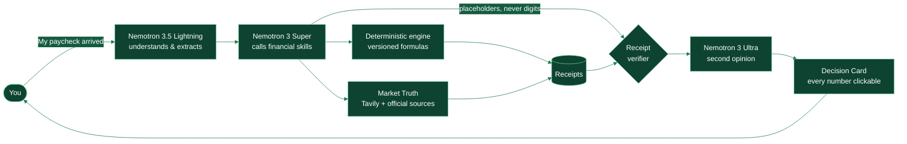
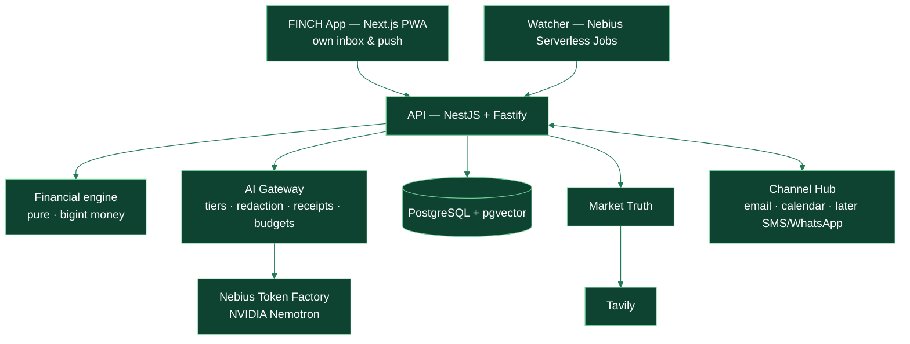

<div align="center">


<br/>


<br/>


<br/><br/>

**[What it is](#what-is-finch)** · **[Features](#features)** · **[How it works](#how-it-works)** ·
**[Nemotron & Nebius](#nemotron-nebius)** · **[Architecture](#architecture)** ·
**[Quickstart](#quickstart)** · **[Roadmap](#roadmap)** · **[Team](#team)**

</div>

<a id="what-is-finch"></a>


**FINCH is a premium personal-finance app that manages your money the way a personal CFO
would** — privately, every day, and with proof.

When your paycheck lands, FINCH plans the whole month in seconds. It keeps your cards under
control, stops you before a bad purchase, finds money you are quietly losing, searches the real
market for better credit and savings products, and protects your household. **Every number it
shows you comes with a receipt**: the formula, its version, its inputs and its sources.

> [!IMPORTANT]
> **Nemotron explains. Math decides.** In FINCH the language model is **not allowed to write
> numbers**. It writes placeholders that point to calculation receipts produced by a deterministic,
> versioned financial engine. A verifier rejects any figure without a receipt, and NVIDIA Nemotron 3
> Ultra audits every recommendation before you see it.

<table>
<tr>
<td width="33%" valign="top">

### 🔒 Private

Your data stays under your control. Personal identifiers are redacted before any model call. You
can see, correct and forget everything FINCH remembers. Export or delete everything in one tap.

</td>
<td width="33%" valign="top">

### ⏱️ Always on

A daily watcher running on **Nebius Serverless Jobs** re-checks your finances and the market, and
tells you — inside the app — only when something matters.

</td>
<td width="33%" valign="top">

### 🧾 Provable

Deterministic math with `bigint` money and versioned formulas. Live market data is cited with URL,
time and freshness. Nothing is made up; unknowns are labelled as such.

</td>
</tr>
</table>

FINCH is **global-ready and Colombia-deep**: multi-currency with live reference FX everywhere, full
Colombian rules (effective-annual vs monthly rates, the legal usury cap, the 4×1,000 transaction tax,
CDT withholding, DIAN calendars) and a second country pack.

> [!NOTE]
> FINCH never moves money. It plans, controls, verifies and drafts; you execute. Product comparisons
> are neutral — no commission can ever change a ranking. Investment content is educational
> simulation, not advice.

<a id="features"></a>


Status legend: ✅ shipped · 🚧 in progress · 🗓️ planned for the hackathon submission (30 Oct 2026).
Full specification: [`docs/hackathon/08-feature-catalog.md`](docs/hackathon/08-feature-catalog.md).

<details open>
<summary><b>💼 Manage your money — the intelligent wallet</b></summary>

|     | Feature                | What it does                                                                                                                                                                                                     | Status |
| --- | ---------------------- | ---------------------------------------------------------------------------------------------------------------------------------------------------------------------------------------------------------------- | ------ |
| B1  | **Payday Autopilot**   | Detects income (tap, pasted bank notification, forwarded email, statement) and builds the month: bills by due date, debt minimums, emergency fund, goals, investing, free-to-spend, plus an execution checklist. | 🗓️     |
| B2  | **Envelopes**          | Living budget envelopes born from the paycheck plan, with alerts at 80 % and 100 %.                                                                                                                              | 🗓️     |
| B3  | **Card control**       | Cut-off and due dates, utilisation, the real cost of paying the minimum or splitting into instalments, usury-cap alerts, which card to use and which to pay first.                                               | 🗓️     |
| B4  | **Financial calendar** | Every payment, cut-off, income and expiry date, holiday-aware; private `.ics` export.                                                                                                                            | 🗓️     |
| B5  | **Month-end close**    | Plan vs actual, lessons, and next month's adjustment.                                                                                                                                                            | 🗓️     |
| B6  | **Multiple incomes**   | Salary, freelance, rent, business, foreign-currency income; conservative projections for variable income.                                                                                                        | 🗓️     |
| B7  | **Financial health**   | Explainable 0–100 score with published weights and "how to gain 5 points". Not a credit score.                                                                                                                   | 🗓️     |
| B8  | **Net worth**          | Assets minus liabilities, multi-currency, with what moved it each month.                                                                                                                                         | 🗓️     |

</details>

<details open>
<summary><b>🧭 Decide before you spend</b></summary>

|     | Feature                   | What it does                                                                                                          | Status |
| --- | ------------------------- | --------------------------------------------------------------------------------------------------------------------- | ------ |
| C1  | **Can I afford it?**      | Impact on your month, envelopes and goals; cash vs instalments with real interest; "wait until the 12th" when needed. | 🗓️     |
| C2  | **What-if simulator**     | Raises, job loss, a motorbike on credit, moving out — up to three scenarios side by side over 12–60 months.           | 🗓️     |
| C3  | **Storm mode**            | Runway if income stops, what to cut first, which debts to protect, what to ask your bank.                             | 🗓️     |
| C4  | **Goals with trade-offs** | Feasibility, monthly contribution and explicit trade-offs between competing goals.                                    | 🗓️     |
| C5  | **Investment simulator**  | Educational projections with conservative/base/optimistic scenarios, net of tax and inflation.                        | 🗓️     |

</details>

<details open>
<summary><b>💸 Find money you are losing</b></summary>

|     | Feature                    | What it does                                                                                                                                           | Status |
| --- | -------------------------- | ------------------------------------------------------------------------------------------------------------------------------------------------------ | ------ |
| D1  | **Opportunity Engine**     | Best credit for a need by total real cost, balance-transfer offers, best CDTs and savings accounts by real net return — live, cited, neutrally ranked. | 🗓️     |
| D2  | **Subscription detective** | Recurring charges, duplicates, silent price rises, trials that started billing.                                                                        | 🗓️     |
| D3  | **Anomaly detector**       | Duplicate charges, new fees, FX mark-ups, out-of-pattern spending, with a personal baseline.                                                           | 🗓️     |
| D4  | **Fixed-cost optimiser**   | Compares phone, internet, streaming, insurance and memberships with public alternatives.                                                               | 🗓️     |
| D5  | **Remittance comparator**  | True cost of sending money across borders: fee plus FX margin, and exactly what arrives.                                                               | 🗓️     |

</details>

<details open>
<summary><b>📸 Capture and organise</b></summary>

|     | Feature                          | What it does                                                                                              | Status |
| --- | -------------------------------- | --------------------------------------------------------------------------------------------------------- | ------ |
| E1  | **Receipts & invoices by photo** | Snap a receipt or forward an e-invoice; multimodal extraction, confirmation, filed to the right envelope. | 🗓️     |
| E2  | **Document vault**               | Insurance, SOAT, contracts, warranties, statements — encrypted, with expiry reminders.                    | 🗓️     |
| E3  | **Ask your money**               | "How much did I spend on delivery in August?" answered through a safe, bounded query language.            | 🗓️     |
| E4  | **Import**                       | Statements (CSV/XLSX/PDF), bank notifications and quick manual entry, deduplicated.                       | 🗓️     |

</details>

<details open>
<summary><b>🏡 Share and protect</b></summary>

|     | Feature                     | What it does                                                                                     | Status |
| --- | --------------------------- | ------------------------------------------------------------------------------------------------ | ------ |
| F1  | **Household finances**      | Shared workspaces where each member chooses what to share; fair splits and minimal settlements.  | 🗓️     |
| F2  | **Protection radar**        | Emergency-fund gap, dependants and coverage, duplicated insurance inside credits.                | 🗓️     |
| F3  | **Financial passport**      | Share proof of financial health without exposing transactions — expiring, revocable, verifiable. | 🗓️     |
| F4  | **Consumer-rights copilot** | Guided claims against financial institutions, documents with receipts, deadlines and escalation. | 🗓️     |
| F5  | **Taxes (Colombia)**        | "Must I file?", DIAN calendar, withholding, 4×1,000 and an income-tax simulation — sourced.      | 🗓️     |

</details>

<details open>
<summary><b>🌎 Global experience and habits</b></summary>

|       | Feature                      | What it does                                                                                     | Status |
| ----- | ---------------------------- | ------------------------------------------------------------------------------------------------ | ------ |
| G1    | **Commitments & habits**     | Challenges you choose, progress in real money, no childish gamification.                         | 🗓️     |
| G2    | **Daily & weekly briefing**  | Three things that matter today; weekly wins and adjustments.                                     | 🗓️     |
| G3    | **Multi-currency & live FX** | Accounts and income in any currency, consolidated with cited reference rates.                    | 🗓️     |
| G4    | **Second country**           | A full jurisdiction pack proving FINCH scales without touching its core.                         | 🗓️     |
| H1–H3 | **Channels**                 | In-app inbox and push first; email in/out and calendar as optional extras (SMS, WhatsApp later). | 🗓️     |

</details>

<details>
<summary><b>🛡️ Trust core (under every feature)</b></summary>

|     | Capability                                                                | Status                                                                       |
| --- | ------------------------------------------------------------------------- | ---------------------------------------------------------------------------- |
| A1  | Financial Twin — versioned facts with truth class and provenance          | 🗓️                                                                           |
| A2  | Financial engine — `Money`, formula registry, credit & cash-flow formulas | ✅ foundation · ✅ 8 credit/cash-flow formulas (S1-01) · 🚧 personal finance |
| A3  | Proof-carrying answers + receipt verifier                                 | 🗓️                                                                           |
| A4  | Tiered Nemotron agent (Lightning · Super · Ultra)                         | 🗓️                                                                           |
| A5  | Nemotron 3 Ultra second opinion                                           | 🗓️                                                                           |
| A6  | Decision Cards                                                            | 🗓️                                                                           |
| A7  | Controllable memory — "What FINCH knows about you"                        | 🗓️                                                                           |
| A8  | Privacy by design — redaction, consent, audit, export/delete              | 🗓️                                                                           |
| A9  | Published evaluations                                                     | 🗓️                                                                           |
| A10 | Bilingual (EN/ES), locale-aware                                           | 🗓️                                                                           |
| A11 | Always-on watcher on Nebius Serverless Jobs                               | 🗓️                                                                           |

</details>

<a id="how-it-works"></a>




1. **Understand** — your Financial Twin holds facts with a truth class: _observed_, _declared by
   you_, _calculated_, _estimated_ or _AI narrative_.
2. **Decide** — the agent can only use versioned skills. Every result is a receipt.
3. **Verify** — the model writes placeholders; a deterministic verifier renders numbers only from
   receipts; Ultra audits the recommendation.
4. **Act safely** — plans, checklists, drafts and reminders. FINCH never moves money.
5. **Watch** — every morning a Nebius Serverless Job re-checks everything and briefs you.

<a id="nemotron-nebius"></a>


| Tier            | Model (on Nebius Token Factory)                     | Used for                                                                                                      |
| --------------- | --------------------------------------------------- | ------------------------------------------------------------------------------------------------------------- |
| Fast            | **NVIDIA Nemotron 3.5 Lightning**                   | Intent routing, entity and notification extraction, merchant normalisation, briefings — the majority of calls |
| Agent           | **NVIDIA Nemotron 3 Super**                         | Tool-calling agent over financial skills, natural-language queries, explanations                              |
| Deep            | **NVIDIA Nemotron 3 Ultra**                         | Second-opinion audit of every recommendation; evaluation judge                                                |
| Vision          | NVIDIA multimodal model _(confirmed at build time)_ | Receipts, invoices and vault documents                                                                        |
| Memory / Safety | Embedding and guard models on Token Factory         | Semantic memory; input/output safety                                                                          |

**Where Token Factory accelerates us:** OpenAI-compatible API (swap models by configuration),
structured outputs and function calling for every contract, and **batch inference** to run the full
evaluation suite at lower cost. **Nebius AI Cloud Serverless Jobs** run the always-on watcher.
**Tavily** powers Market Truth: live rates, products, FX, remittance quotes and official tax data,
always cited.

<details>
<summary><b>Personal AI track mapping</b></summary>

| Track asks for                        | FINCH                                                                           |
| ------------------------------------- | ------------------------------------------------------------------------------- |
| Always-on                             | Daily watcher on Nebius Serverless Jobs + in-app briefing and push              |
| Private, your data under your control | PII redaction, consent per source, "What FINCH knows about you", export/delete  |
| Persistent memory                     | Financial Twin + semantic memory of goals and preferences                       |
| Reusable skills                       | Versioned financial skills with schemas                                         |
| Tools and information you choose      | Toggle sources and channels: web, documents, email, calendar                    |
| Tasks across daily workflows          | Paycheck plans, receipt capture, vault reminders, claims, household settlements |

</details>

<a id="architecture"></a>


A **modular monolith** with hexagonal modules, domain-driven bounded contexts and a pure financial
engine. Full description: [`docs/architecture/SOFTWARE-ARCHITECTURE.md`](docs/architecture/SOFTWARE-ARCHITECTURE.md).



| Layer        | Technology                                                                                      |
| ------------ | ----------------------------------------------------------------------------------------------- |
| App          | Next.js (PWA), TypeScript, design tokens from the FINCH brand                                   |
| API & worker | NestJS on Fastify, Zod validation, transactional outbox                                         |
| Engine       | Pure TypeScript, `bigint` minor units, arbitrary-precision decimals, versioned formula registry |
| Data         | PostgreSQL + pgvector, encrypted document storage                                               |
| AI           | Nebius Token Factory (NVIDIA Nemotron), AI Gateway, LangSmith tracing                           |
| Quality      | Vitest, golden vectors, dependency-cruiser fitness functions, ESLint "FINCH Constitution" rules |
| Method       | XP + weekly Agile sprints; AI components governed by CRISP-ML(Q)                                |

<a id="quickstart"></a>


> Requirements: **Node 24.21.0** (see `.nvmrc`), **pnpm 11.26.0** via corepack, Docker.

```bash
git clone https://github.com/HCHAPS404/FINCH.git
cd FINCH
corepack enable
pnpm install --frozen-lockfile
pnpm env:doctor            # verifies your toolchain
cp .env.example .env       # add NEBIUS_API_KEY and TAVILY_API_KEY — never commit them
pnpm dev:infra             # PostgreSQL in Docker
pnpm check                 # lint · format · typecheck · architecture · tests
```

Application run commands (`pnpm dev`, seeds, evals) are added as each module lands; see
[`README-DEVELOPERS.md`](README-DEVELOPERS.md).

<details>
<summary><b>Repository layout</b></summary>

```text
apps/            web · api · worker · admin · mobile · desktop
packages/        contracts · financial-engine · domain · ai-core · authorization · db ·
                 design-tokens · ui-web · ui-mobile · provider-sdk · observability · security · testing
jurisdictions/   country rules (CO first) — kept out of the core
docs/            architecture (Constitution, ADRs, software architecture) · hackathon plan · formulas
evals/           AI evaluation datasets and results
fixtures/        synthetic personas and documents — never real data
assets/brand/    logos, banner
```

</details>

<a id="quality"></a>


| Evaluation             | Measures                                    | Target         |
| ---------------------- | ------------------------------------------- | -------------- |
| E1 Financial math      | Golden vectors verified independently       | 100 %          |
| E2 Tool use            | Correct skill and arguments                 | ≥ 90 %         |
| E3 Grounding           | Numbers shown without a receipt             | 0              |
| E4 Safety              | Prompt injection, harmful advice, PII leaks | ≥ 95 % handled |
| E5 Explanation quality | Human (Toloka) and Ultra-as-judge ratings   | ≥ 4 / 5        |
| E6 Cost & latency      | Tiered routing vs a single large model      | ≤ 50 % cost    |

Results are published in `evals/RESULTS.md` with **real numbers**, not targets, as they are measured.

<a id="security"></a>


- Secrets never live in the repository or the client; keys are server-side only.
- Personal identifiers are redacted before any model call; model output can never become financial
  truth.
- Web content and documents are treated as untrusted data (prompt-injection aware).
- Synthetic data only in development; production data never reaches a laptop.
- Report vulnerabilities as described in [`SECURITY.md`](SECURITY.md).

<a id="roadmap"></a>


| When             | Milestone                                                                                                                  |
| ---------------- | -------------------------------------------------------------------------------------------------------------------------- |
| **Oct 2026**     | Phase 1 — **Web (PWA)**: 45 features, weekly milestones — [`docs/hackathon/05`](docs/hackathon/05-roadmap-and-timeline.md) |
| **30 Oct 2026**  | Submission to the Nebius × NVIDIA Global AI Hackathon (Personal AI track)                                                  |
| **Nov 2026**     | Phase 2 — **Windows** desktop app (Tauri 2)                                                                                |
| **Nov–Dec 2026** | Phase 3 — **Android** app (Expo)                                                                                           |
| **Jan 2027**     | Phase 4 — **macOS** and **iOS**                                                                                            |
| **2027**         | Closed alpha in Colombia · open-finance data · FINCH Premium · partner actions · WhatsApp & SMS channels                   |

<a id="team"></a>


FINCH is built by its two founders, **Helmut** ([@HCHAPS404](https://github.com/HCHAPS404)) and
**Nairy**, in Colombia. AI tools (Claude, Cursor) assist development; authorship and responsibility
remain with the founders.

<a id="license"></a>


Open-source licensing follows [ADR-0037](docs/architecture/adr/0037-open-source-license.md)
(Apache-2.0 proposed; the `LICENSE` file is added when the founders approve it). The **FINCH** name
and logo are trademarks of the founders and are not licensed for reuse.

<div align="center">
<br/>


<sub><b>FINCH</b> · Nemotron explains. Math decides. Every number comes with a receipt.</sub>

</div>
