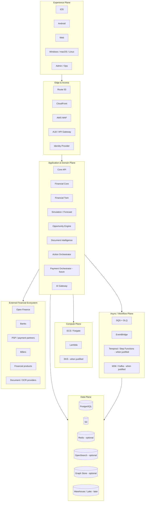

# FINCH
## Financial Decision & Action OS

> **Estado:** `APPROVED FOR SCAFFOLD`  
> **Documento:** README raíz / Engineering & Product Constitution  
> **Versión:** 1.0.0  
> **Baseline:** 17 de septiembre de 2026  
> **Mercado inicial:** Colombia  
> **Plataformas:** Android · iOS · Web · Windows · macOS · Linux  
> **Modelo de construcción:** founder-led, AI-assisted engineering con Claude + Cursor; GitHub como source of truth  
> **Principio rector:** el tamaño del equipo no limita el nivel arquitectónico. La complejidad se acepta cuando una capacidad real de FINCH la justifica.

---

# 1. Qué es FINCH

FINCH es una plataforma financiera cuyo objetivo es evolucionar desde una aplicación de inteligencia financiera personal hacia un **Financial Decision & Action OS**: un sistema capaz de comprender el estado financiero de una persona, hogar o empresa, simular decisiones, comparar alternativas, explicar consecuencias y, cuando exista autorización y una infraestructura regulada apropiada, ejecutar acciones financieras de forma controlada y auditable.

FINCH no se concibe como un simple presupuesto, una hoja de cálculo con interfaz bonita, un chatbot que genera consejos genéricos ni un agregador de cuentas. Su núcleo es una representación verificable y versionada de la realidad financiera del usuario —el **Financial Twin**— sobre la cual operan motores deterministas de cálculo, forecast, comparación, detección de oportunidades y workflows de acción.

La arquitectura conceptual del producto tiene tres capas:

```text
FINCH UNDERSTANDS
Financial data + provenance + Financial Twin
        ↓
FINCH DECIDES
Rules + financial math + simulation + forecast + opportunities
        ↓
FINCH ACTS
Approval + workflow + provider + execution + reconciliation + outcome
```

FINCH no pretende reemplazar bancos, BRE-B, ACH, PSE, adquirentes, entidades vigiladas ni rails financieros. La visión defendible es convertirse en una **capa de inteligencia, decisión y orquestación** por encima de infraestructura financiera existente.

---

# 2. Alcance de este README

Este archivo es la puerta de entrada oficial al repositorio. Debe permitir que una persona o agente de software entienda:

- qué es FINCH;
- cómo está estructurado;
- cuáles son sus invariantes;
- qué tecnología utiliza;
- qué tecnología puede incorporar después;
- cómo se modelan identidad, tenancy y datos financieros;
- cómo se desarrolla con Claude y Cursor;
- cómo se prueba;
- cómo se despliega;
- cómo se observa;
- cómo se recupera de fallos;
- qué artefactos debe producir cada cambio;
- qué decisiones requieren ADR;
- qué significa que una feature esté terminada;
- cuáles son las etapas de implementación.

El README **no sustituye** la documentación especializada. Actúa como índice y contrato de alto nivel.

Jerarquía normativa recomendada del repositorio:

```text
1. Architecture Constitution / Security invariants
2. Accepted ADRs
3. FINCH Engineering Masterplan
4. Domain/module documentation
5. API / event / data contracts
6. Feature specifications
7. Code + tests
8. Issues / PR descriptions
```

Un ADR aceptado puede superseder una decisión previa del masterplan, pero no puede romper silenciosamente una cláusula constitucional: para ello debe declarar explícitamente qué cláusula cambia y por qué.

---

# 3. Resultado del último architecture review

Antes de declarar este README listo para scaffold se revisó el masterplan v0.2.0. Los principales cambios incorporados aquí son los siguientes.

## 3.1 El sistema deja de estar centrado en `user_id`

Este es el cambio estructural más importante.

FINCH quiere servir progresivamente a:

- una persona;
- un hogar;
- una pareja;
- un independiente;
- una microempresa;
- una empresa;
- un equipo financiero;
- usuarios delegados.

Por ello `User` no puede ser a la vez identidad, tenant, dueño financiero y unidad contable.

FINCH separará:

```text
Principal
    quién se autentica

Party
    quién es la persona/organización económicamente representada

Workspace
    frontera de aislamiento, colaboración y configuración

Membership / Grant
    qué puede hacer un Principal dentro de un Workspace o sobre un recurso
```

Ejemplo:

```text
Helmut (Principal)
   ↓ member-of
Personal Workspace
   ↓ financial-owner
Helmut Person Party
```

Ejemplo hogar:

```text
Principal A ─┐
             ├─ Membership → Household Workspace
Principal B ─┘                     │
                                   ├─ shared goals
                                   ├─ shared obligations
                                   └─ selectively shared accounts
```

Ejemplo empresa:

```text
Principal CFO ─┐
Principal Ops ─┼─ Membership → ACME Workspace → Organization Party
Principal CEO ─┘
```

Todas las tablas tenant-owned deben usar `workspace_id`. `principal_id` se usa para actor/auditoría; `party_id` para propiedad económica cuando aplique.

Esto evita una migración traumática cuando aparezca FINCH Business.

## 3.2 Se formaliza una arquitectura de autorización relacional

RBAC simple no es suficiente para:

- cuentas compartidas;
- hogares;
- organizaciones;
- delegaciones;
- soporte;
- administradores;
- acciones de alto riesgo.

El contrato conceptual será:

```text
authorize(
  principal,
  action,
  resource,
  workspace,
  context
)
```

La implementación inicial puede ser código TypeScript tipado y testeado. Si la complejidad de políticas lo justifica se podrá evaluar Cedar/AWS Verified Permissions, OPA u otro policy engine sin cambiar los dominios.

PostgreSQL Row Level Security puede añadirse como defensa en profundidad para datasets adecuados, pero no sustituye autorización de aplicación ni debe habilitarse sin un harness que valide session scoping y pooling.

## 3.3 Se formalizan cuatro clases de verdad

FINCH nunca debe confundir un dato observado con una predicción o un texto de IA.

```text
OBSERVED / VERIFIED
Provider, documento confirmado o acción reconciliada.

USER_ASSERTED
Dato ingresado o confirmado por el usuario.

DERIVED_DETERMINISTIC
Resultado de fórmula/regla reproducible.

ESTIMATED / MODELLED
Forecast, clasificación probabilística o inferencia.

GENERATED_NARRATIVE
Texto/explicación producida por un LLM.
```

Una explicación LLM puede describir un cálculo, pero no elevar su propia salida a `VERIFIED`.

## 3.4 Se separan cuatro zonas de datos

```text
RAW
payload original / documento / evidencia
   ↓ normalization
CANONICAL
modelo financiero normalizado
   ↓ deterministic/model computation
DERIVED
snapshots, forecasts, opportunities, decision cards
   ↓ privacy controlled export
ANALYTICAL
pseudonimizado/agregado para métricas, BI o ML autorizado
```

Esta separación simplifica lineage, privacidad, reprocessing y debugging.

## 3.5 Se añade riesgo por capacidad

FINCH clasificará features:

```text
R0 — Read / education / visualization
R1 — Derived financial intelligence
R2 — External non-monetary action
R3 — Money movement / sensitive regulated execution
R4 — Custody / ledger-critical capabilities
```

A mayor riesgo, más gates, observabilidad, revisión, SLO y controles.

## 3.6 Se fortalece supply-chain y release provenance

Una release profesional debe tener:

- immutable git SHA;
- SBOM;
- dependency scan;
- SAST;
- secret scan;
- container scan;
- checksums;
- migration bundle;
- OpenAPI diff;
- financial correctness report;
- build provenance/attestation cuando se active;
- signing/notarization para desktop/mobile;
- rollback plan.

## 3.7 Se corrige OpenAPI

La especificación OpenAPI más reciente a la fecha de referencia es **3.2.1**, publicada el 10 de septiembre de 2026. Sin embargo, el repositorio no debe adoptar una revisión que rompa generadores o tooling. El ADR de API fijará la versión efectiva —3.1.x o 3.2.x— después de ejecutar compatibility tests del toolchain.

## 3.8 OpenTelemetry JS

Traces y Metrics son estables; Logs continúan en desarrollo en la documentación actual. FINCH usará OpenTelemetry principalmente para traces/metrics y logs estructurados mediante el pipeline de logging elegido, evitando depender de OTel Logs como único mecanismo.

## 3.9 Well-Architected se convierte en review framework

Las revisiones periódicas deben evaluar explícitamente los seis pilares de AWS Well-Architected:

- Operational Excellence;
- Security;
- Reliability;
- Performance Efficiency;
- Cost Optimization;
- Sustainability.

No se usa como checklist ceremonial: cada revisión debe producir issues concretos.

---

# 4. Architecture Constitution

Las siguientes reglas son de máximo nivel.

1. **El tamaño del equipo no determina el nivel de arquitectura.**
2. **Financial truth no depende de un LLM.**
3. **Money jamás usa floating point binario como representación financiera autoritativa.**
4. **Toda cifra financiera importante debe tener provenance.**
5. **Toda decisión histórica debe poder reproducirse o explicar por qué ya no puede reproducirse.**
6. **Una acción financiera irreversible requiere autorización explícita y actual del usuario o un mandato previamente acordado y técnicamente verificable.**
7. **Un documento no confirmado no puede activar una acción monetaria irreversible.**
8. **Recommendation, Action, PaymentIntent, ExecutionAttempt y Reconciliation son conceptos diferentes.**
9. **Los adapters de proveedores externos no definen el dominio de FINCH.**
10. **Los secretos no viven en el repositorio ni en clientes.**
11. **Los cambios productivos pasan por CI/CD y producen evidencia.**
12. **Los consumidores de eventos son idempotentes.**
13. **El sistema asume entrega at-least-once salvo prueba formal de otra semántica.**
14. **Audit log y application log son mecanismos diferentes.**
15. **La monetización no altera el ranking financiero.**
16. **Privacidad, propósito y consentimiento se validan en backend, no solo en UI.**
17. **Admin no equivale a acceso irrestricto.**
18. **Production data no se copia a desarrollo local.**
19. **Cada tecnología nueva debe resolver una capacidad real y documentar sus costos.**
20. **FINCH debe poder degradarse sin inventar certeza.**

---

# 5. Quality Attributes

La arquitectura se evalúa contra atributos explícitos.

| Atributo | Objetivo arquitectónico |
|---|---|
| Correctness | cálculos reproducibles, invariantes y fixtures independientes |
| Security | least privilege, zero trust, defense in depth |
| Privacy | purpose limitation, minimización, consent y lifecycle |
| Reliability | tolerancia a fallos, retries acotados, DLQ, recovery probado |
| Auditability | provenance, traceability y decisiones versionadas |
| Availability | degradación por capability, no caída total innecesaria |
| Performance | budgets medibles, async para procesos costosos |
| Scalability | scale-out donde sea útil sin replatforming prematuro |
| Maintainability | bounded contexts, contracts, fitness functions |
| Portability | dominio desacoplado de vendors; cloud pragmáticamente AWS-first |
| Operability | observabilidad, runbooks, kill switches, IaC |
| Cost | costos observables y presupuestos por workload/provider |
| Accessibility | WCAG-oriented UX y equivalentes textuales de información crítica |

---

# 6. Arquitectura de plataforma



La arquitectura objetivo puede ser sofisticada; la topología desplegada debe ser la mínima que satisfaga correctamente el workload actual. “Mínima” no significa insegura ni amateur: significa sin componentes que no aporten capacidad.

---

# 7. Planos arquitectónicos

FINCH se divide en planos para evitar mezclar responsabilidades.

## 7.1 Experience Plane

- Android/iOS;
- web;
- desktop;
- admin;
- notifications.

No es source of truth.

## 7.2 Domain Plane

- accounts;
- transactions;
- debts;
- goals;
- income;
- obligations;
- forecasting;
- simulation;
- offers;
- opportunities;
- decision cards;
- actions;
- payments.

## 7.3 Integration Plane

- bank/open-finance adapters;
- payment adapters;
- biller adapters;
- product catalog ingestion;
- document providers;
- identity/KYC;
- email/push.

## 7.4 Data Plane

- PostgreSQL OLTP;
- S3 evidence/documents;
- queues/event log;
- analytical copies;
- future cache/search/graph.

## 7.5 Control Plane

- configuration;
- feature flags;
- entitlements;
- regulatory enablement;
- provider routing;
- kill switches;
- formula versions;
- model versions;
- prompt versions.

## 7.6 Operations Plane

- telemetry;
- CI/CD;
- security posture;
- recovery;
- incidents;
- FinOps;
- release evidence.

---

# 8. Identity, tenancy y ownership

## 8.1 Principal

Entidad que puede autenticarse o actuar.

Tipos:

```text
HUMAN
SERVICE
SYSTEM
ADMIN
```

## 8.2 Party

Entidad económica/legal representada:

```text
PERSON
ORGANIZATION
```

## 8.3 Workspace

Frontera principal de aislamiento y colaboración.

Tipos iniciales:

```text
PERSONAL
HOUSEHOLD
BUSINESS
```

## 8.4 Membership

Relaciona Principal con Workspace y roles/capabilities.

## 8.5 Grant

Permiso más granular sobre recursos concretos.

Ejemplo: un miembro de un hogar puede ver una meta compartida sin ver la tarjeta personal de la pareja.

## 8.6 Reglas de datos

- cada recurso tenant-owned tiene `workspace_id`;
- `party_id` se usa cuando la propiedad económica es relevante;
- `created_by_principal_id` identifica actor, no owner;
- IDs externos no son claves de dominio;
- un `Workspace` no se deduce de email;
- los servicios actúan con service principals.

---

# 9. Authorization Architecture

Modelo inicial:

```text
Subject = Principal
Action = typed capability
Resource = domain object
Workspace = tenant boundary
Context = device/session/risk/purpose/etc.
```

Ejemplo:

```text
can(
  principal,
  "account.read",
  account,
  workspace,
  context
)
```

Políticas críticas deben tener tests negativos, no solo happy path.

Harness mínimo:

```text
owner allowed
other workspace denied
membership without grant denied
revoked member denied
support masked-only
admin scoped
service principal least privilege
```

---

# 10. Canonical Financial Data Model

Conceptos principales:

```text
Workspace
Principal
Party
Membership
Consent
Institution
InstitutionConnection
Account
BalanceObservation
Transaction
Merchant
Category
RecurringObligation
IncomeStream
CreditFacility
CreditCard
Offer
Product
Quote
Goal
Plan
FinancialStateSnapshot
Scenario
ScenarioResult
Forecast
Opportunity
DecisionCard
Document
ExtractedField
Action
Approval
PaymentIntent
ExecutionAttempt
ReconciliationRecord
Outcome
AuditEvent
OutboxEvent
```

Los modelos de pago/ledger pueden existir como contratos desde el principio aunque no estén operativos.

---

# 11. Data Truth & Provenance

Todo dato significativo debe declarar origen.

```text
source_type
source_ref
observed_at
effective_at
ingested_at
confidence
verified_by_principal
normalizer_version
schema_version
```

`confidence` nunca reemplaza `source_type`.

Ejemplo:

```text
Balance COP 4.200.000
source: provider
observed_at: 2026-09-17T...
truth_class: observed
freshness: fresh
```

Ejemplo forecast:

```text
Projected balance COP 3.850.000
truth_class: estimated
model: cashflow-forecast/2
snapshot: fs_...
range: 3.4M–4.2M
```

---

# 12. Data Zones

## 12.1 RAW

- payloads de provider;
- webhooks;
- documentos;
- import files.

Inmutabilidad y retención controlada.

## 12.2 CANONICAL

- accounts;
- transactions;
- debts;
- obligations;
- normalized products.

## 12.3 DERIVED

- snapshots;
- forecasts;
- opportunities;
- scenarios;
- decision cards.

## 12.4 ANALYTICAL

- eventos pseudonimizados;
- cohort metrics;
- datasets autorizados.

No usar analytical store como financial truth.

---

# 13. Financial Twin

El Financial Twin es una representación versionada del estado financiero de un Workspace/Party.

Un snapshot puede incluir:

```text
liquid accounts
debts
credit cards
income streams
recurring obligations
goals
reserves
known future movements
risk buffers
data freshness
uncertainty
```

Toda simulación importante referencia un snapshot immutable.

```text
FinancialStateSnapshot
  ├── input references
  ├── generated_at
  ├── data freshness
  ├── rules/model versions
  └── checksum
```

---

# 14. Financial Engine

`packages/financial-engine` debe ser una librería pura.

No imports desde:

```text
NestJS
React
AWS SDK
Drizzle
LLM SDKs
```

Subdominios:

```text
money
rates
rounding
periods
financial-calendar
amortization
refinancing
cashflow
forecast
stress
safe-to-spend
goals
purchase-comparison
```

## 14.1 Money

Preferencia:

```text
settled amount → bigint minor units
rates/intermediate calculations → arbitrary precision decimal
```

Nunca `float/double` como financial truth.

## 14.2 Formula Registry

Cada fórmula tiene:

```text
formula_id
version
purpose
inputs
units
rounding
assumptions
source/reference
examples
edge cases
implementation path
test vectors
```

Cambiar una fórmula crea una nueva versión.

---

# 15. Financial Correctness Harness

Debe existir antes de recomendaciones reales.

Incluye:

- golden vectors;
- property-based tests;
- boundary cases;
- regression fixtures;
- independent reference calculations;
- optional Python cross-checks para fórmulas críticas.

Artifacts:

```text
financial-correctness.json
financial-correctness.html
formula-diff.md
```

Ejemplos de invariantes:

```text
principal repaid == original principal within declared rounding
increasing interest rate cannot reduce total interest ceteris paribus
extra prepayment cannot increase remaining principal
simulation never mutates canonical state
safe-to-spend never consumes protected obligations
```

---

# 16. Decision Architecture

Pipeline:

```text
Signals
  ↓
Eligibility
  ↓
Deterministic calculations
  ↓
Candidate opportunities
  ↓
Ranking
  ↓
Explanation
  ↓
Decision Card
  ↓
User action
  ↓
Outcome
```

Commercial commission **no entra** en ranking.

---

# 17. Decision Card

Una Decision Card debe poder contestar:

- qué detectó FINCH;
- por qué importa;
- impacto estimado;
- datos usados;
- assumptions;
- freshness;
- confidence;
- alternativas;
- downside;
- siguiente acción;
- conflicto de interés comercial.

Persistir estructura, no solo prose.

---

# 18. Risk Tiers por feature

## R0 — Information

Ejemplos:
- visualización;
- educación;
- categorización editable.

## R1 — Financial Intelligence

- forecast;
- credit comparison;
- safe-to-spend;
- opportunity.

Requiere correctness/provenance.

## R2 — External Action

- iniciar solicitud de cotización;
- deep-link;
- cambio de proveedor;
- enviar formulario.

Requiere explicit action/audit.

## R3 — Money Movement

- payment initiation;
- transfer;
- autopay.

Requiere fuerte idempotencia, risk checks, reconciliation, dedicated runbooks y external security review.

## R4 — Custody / Ledger Critical

Si FINCH llegara a custodiar/intermediar fondos, exige una arquitectura y revisión regulatoria/operativa adicional. No es v1.

---

# 19. Backend Architecture

## 19.1 Core style

**Modular monolith con deployable boundaries**.

Esto permite:

- transacciones ACID donde tienen sentido;
- contratos estrictos;
- extracción futura;
- menor coupling operacional accidental.

No se elige por headcount.

## 19.2 API

- NestJS;
- Fastify adapter;
- REST;
- OpenAPI;
- typed codegen;
- Zod/boundary validation;
- stable error codes;
- idempotency para comandos sensibles.

## 19.3 Worker

Mismo monorepo, entrypoint distinto.

- outbox publication;
- provider sync;
- document pipelines;
- recomputations;
- notifications;
- background jobs.

---

# 20. Bounded Contexts

```text
identity
workspaces
parties
authorization
consent
institutions
accounts
transactions
categorization
recurrence
income
obligations
debts
credit-cards
goals
planning
financial-twin
forecasting
simulation
offers
product-catalog
opportunities
decision-cards
documents
notifications
actions
payments
reconciliation
risk
providers
audit
analytics-events
ai-gateway
admin-ops
```

Un módulo posee sus invariantes y tablas.

Cross-module DB reads directos están prohibidos salvo read-model explícito documentado.

---

# 21. Event Architecture

## 21.1 Transactional Outbox

En la misma transacción:

```text
update domain state
insert outbox event
commit
```

Publisher asíncrono publica a SQS/EventBridge.

## 21.2 Event envelope

```text
event_id
event_type
event_version
workspace_id
aggregate_type
aggregate_id
occurred_at
producer
correlation_id
causation_id
trace_id
payload
```

## 21.3 Delivery

At-least-once por defecto.

Todos los consumers:

- idempotent;
- bounded retries;
- DLQ;
- observable.

---

# 22. Durable Workflows

SQS no debe usarse para modelar arbitrariamente workflows de días.

Evaluar Temporal o AWS Step Functions cuando aparezcan:

- timers largos;
- human approval;
- múltiples sistemas externos;
- compensaciones;
- retries complejos;
- resume after deploy/failure;
- auditable workflow history.

Candidates:

```text
PaymentExecutionWorkflow
ReconciliationWorkflow
AccountDeletionWorkflow
DataExportWorkflow
ProviderSwitchWorkflow
KYCWorkflow
DisputeWorkflow
```

Temporal documenta durable execution capaz de retomar workflows tras fallos de proceso, red o infraestructura.

---

# 23. Compute Strategy

No existe una única tecnología “correcta”.

| Workload | Primera opción | Evolución |
|---|---|---|
| Core API | ECS/Fargate | EKS si capabilities lo justifican |
| Long-lived worker | ECS/Fargate | EKS |
| Webhook ingress | Lambda o API | según volumen/latency |
| S3 event/preflight | Lambda | container si pesado |
| Scheduled lightweight trigger | Lambda/EventBridge | worker |
| Durable workflow | Temporal/Step Functions | — |
| GPU workload | managed endpoint/EKS | según necesidades |
| Large stream processing | SQS first | MSK/Kafka cuando haya stream semantics |

## 23.1 ECS/Fargate

Default pragmático para containers estables.

## 23.2 Lambda

Primera clase dentro de FINCH cuando el workload sea:

- event-driven;
- stateless;
- bounded;
- bursty;
- corto.

AWS señala S3, API Gateway, EventBridge y SQS como sources naturales para Lambda.

## 23.3 EKS

No está prohibido ni “reservado para equipos grandes”. EKS Auto Mode administra capacidades como compute autoscaling, networking, load balancing, DNS, block storage y GPU support. Se adopta cuando Kubernetes aporte capacidades que ECS/Lambda no resuelvan adecuadamente.

## 23.4 Kafka/MSK

Adoptar solo cuando FINCH necesite realmente:

- retained event streams;
- replay histórico;
- múltiples consumidores independientes;
- ordering por partición;
- high sustained throughput;
- stream processing.

---

# 24. Database Architecture

## 24.1 PostgreSQL

Source of truth OLTP.

Baseline actual: PostgreSQL 18.x; el repositorio debe fijar el patch soportado en IaC/container tooling.

## 24.2 Schemas

Posible división:

```text
identity
security
finance
planning
decision
documents
actions
integration
audit
```

## 24.3 Multi-tenancy

`workspace_id` obligatorio en recursos tenant-owned.

La aplicación realiza authorization explícita. RLS puede añadirse como defense in depth tras validación.

## 24.4 Future data stores

- Redis: cache/ephemeral coordination cuando exista caso medido;
- OpenSearch: search dedicado;
- Graph DB: traversals complejas;
- Warehouse/lake: analytics/ML;
- Kafka: event streaming.

Ninguno reemplaza Postgres por estética arquitectónica.

---

# 25. Ledger Architecture

## 25.1 PFM Transaction Store

Representa transacciones observadas.

No es un ledger interno de fondos.

## 25.2 Double-entry Ledger futuro

Solo cuando FINCH deba registrar money movement/custody/settlement propio.

Conceptos:

```text
LedgerAccount
Journal
Posting
Entry
Settlement
BalanceProjection
```

Invariante:

```text
Σ debits == Σ credits
```

Append-only; correcciones mediante entries compensatorias.

---

# 26. Payment Architecture futura

```text
Decision
  ↓
Action Proposal
  ↓
User Approval / mandate
  ↓
PaymentIntent
  ↓
Risk Check
  ↓
ExecutionAttempt
  ↓
Provider/Rail
  ↓
Provider state
  ↓
Reconciliation
  ↓
Outcome
```

Estados no deben ser booleanos.

```text
draft
proposed
approval_required
approved
risk_check
ready
submitted
provider_pending
settled
failed
reversal_pending
reversed
cancelled
expired
manual_review
```

---

# 27. Provider Architecture

Ports internos:

```text
AccountDataProvider
PaymentProvider
DocumentExtractorProvider
IdentityProvider
NotificationProvider
AIProvider
ProductDataProvider
```

El dominio nunca importa directamente un SDK de vendor.

Cada adapter implementa:

- auth;
- timeout;
- retries;
- rate limits;
- normalization;
- health metrics;
- contract fixtures;
- error mapping;
- webhook verification cuando aplique.

---

# 28. Provider Capability Registry

Mantener capabilities normalizadas:

```text
provider
country
institutions
accounts
transactions
balances
payments
webhooks
refresh_mode
sla
latency
health
```

Permite provider routing futuro sin hardcodear un vendor.

---

# 29. Document Intelligence

Pipeline:

```text
upload
→ quarantine
→ MIME/magic-byte validation
→ malware scan
→ SHA-256
→ protected storage
→ classifier
→ OCR/extraction
→ structured fields
→ confidence
→ human verification
→ canonical model
```

El original es evidencia; extracción y normalización son versiones distintas.

---

# 30. AI Architecture

FINCH usa IA como capa de comprensión y comunicación, no como autoridad financiera.

## Permitido

- explanations;
- document interpretation;
- merchant enrichment;
- intent parsing;
- conversational UX;
- support drafting;
- structured extraction asistida.

## Prohibido como source of truth

- saldos;
- autorización;
- intereses;
- payment state;
- reconciliation;
- eligibility contractual no verificada;
- money movement.

## AI Gateway

```text
Domain
  ↓ structured request
AI Gateway
  ├─ policy / PII classification
  ├─ provider routing
  ├─ prompt registry
  ├─ schema validation
  ├─ timeout/cost limits
  ├─ audit metadata
  └─ provider adapter
```

Claude como herramienta de desarrollo y Claude como runtime provider son decisiones independientes.

---

# 31. AI Data Policy

Antes de cada request se clasifica el contenido:

```text
PUBLIC
INTERNAL
CONFIDENTIAL
RESTRICTED_FINANCIAL
RESTRICTED_IDENTITY
```

La policy determina:

- si puede enviarse;
- a qué proveedor;
- qué redacción aplicar;
- qué logging es permitido;
- si requiere consentimiento/configuración específica.

Document text se trata como input no confiable frente a prompt injection.

---

# 32. AI Eval Harness

Eval categories:

```text
explanation fidelity
number preservation
structured output validity
document extraction
prompt injection
PII leakage
classification
fallback behavior
latency
cost
```

Un cambio de prompt/modelo puede fallar CI si degrada evals críticas.

---

# 33. Product Clients

## 33.1 Mobile — Android / iOS

**React Native + Expo**.

Baseline actual de Expo docs: SDK 57 → React Native 0.86, React 19.2.3; fijar versión exacta en lockfile.

Estado:

- TanStack Query para server state;
- React state/Zustand para UI local;
- React Hook Form;
- Zod;
- SecureStore;
- LocalAuthentication;
- development builds para native/security testing.

## 33.2 Web

**Next.js + React**.

`apps/web` no se mezcla con `apps/admin`.

## 33.3 Desktop

**Tauri 2 + React/Vite** para Windows/macOS/Linux.

Tauri soporta múltiples plataformas, pero FINCH utiliza Expo como stack móvil primario para no sacrificar UX/ecosistema móvil.

Rust layer mínimo y privilegiado.

---

# 34. Design System

Packages:

```text
design-tokens
ui-mobile
ui-web
```

Semantic tokens:

```text
surface
text
border
positive
negative
warning
critical
verified
estimated
stale
pending
```

No depender de verde/rojo únicamente.

Light/dark first-class.

---

# 35. Accessibility

Desde la primera beta:

- screen readers;
- dynamic type;
- keyboard web/desktop;
- focus states;
- contrast;
- reduced motion;
- large touch targets;
- textual fallback para charts.

Todo gráfico financiero crítico debe tener una representación accesible equivalente.

---

# 36. Localization / Country Architecture

Inicial:

```text
locale: es-CO
timezone: America/Bogota
currency: COP
```

No hardcodear reglas colombianas dentro del core global.

```text
jurisdictions/
  CO/
    calendar/
    rate-conventions/
    legal-copy/
    product-taxonomy/
    capabilities/
```

Future country adapters deben poder convivir.

---

# 37. Regulatory Capability Layer

Sin sustituir asesoría jurídica, el software debe saber qué clase de capacidad está ejecutando.

```text
INFORMATION
COMPARISON
SIMULATION
PERSONALIZED_RECOMMENDATION
EXTERNAL_ACTION
PAYMENT_INITIATION
MONEY_MOVEMENT
CUSTODY
```

Feature enablement puede depender de:

```text
jurisdiction
partner
user consent
regulatory status
feature risk tier
```

Esto evita que una feature experimental pase accidentalmente a una actividad regulatoriamente distinta.

---

# 38. Security Baseline

Referencias mínimas:

- OWASP ASVS 5.0.0 para web/application controls;
- OWASP API Security Top 10 2023;
- OWASP MASVS/MASTG para mobile;
- threat modeling por feature de riesgo.

## Threats prioritarias

- account takeover;
- BOLA/IDOR;
- broken property authorization;
- credential stuffing;
- malicious documents;
- webhook spoofing;
- replay;
- provider compromise;
- SSRF;
- API abuse/resource exhaustion;
- supply-chain compromise;
- insider/admin abuse;
- PII exfiltration;
- prompt injection;
- model leakage;
- compromised device;
- destructive migration.

---

# 39. Threat Modeling Process

Features R1+ deben incluir:

```text
assets
actors
entry points
trust boundaries
abuse cases
STRIDE threats
privacy/LINDDUN considerations where relevant
controls
tests
residual risk
```

R3/R4 requieren revisión independiente antes de GA.

---

# 40. Secrets & Key Management

- AWS Secrets Manager;
- KMS;
- short-lived AWS credentials;
- GitHub OIDC;
- no long-lived AWS keys en Actions;
- no server secrets en clients;
- rotation plan.

GitHub documenta OIDC con AWS precisamente para evitar credenciales AWS de larga duración en GitHub secrets.

---

# 41. AWS Account & Network Topology

Objetivo maduro:

```text
finch-management
finch-nonprod
finch-prod
finch-security
finch-log-archive
```

No es necesario crear todas el día uno, pero prod y nonprod deben estar separados antes de datos financieros reales.

Production VPC:

```text
public subnets
  └─ public load balancing only where necessary
private application subnets
  ├─ ECS/EKS workloads
  └─ workers
isolated data subnets
  └─ RDS/cache
```

VPC endpoints para servicios AWS donde reduzcan exposición/costo.

---

# 42. Workload Identity

No shared master role.

```text
finch-api-role
finch-worker-role
finch-document-role
finch-provider-sync-role
finch-notification-role
finch-payment-role
finch-ci-deploy-role
```

ECS task roles / Lambda execution roles / EKS workload identities según compute.

---

# 43. Supply Chain Security

- frozen lockfile;
- dependency review;
- CodeQL/SAST;
- gitleaks;
- Trivy/container scan;
- SBOM;
- pinned high-risk Actions by SHA;
- artifact checksums;
- signed release artifacts where feasible;
- future SLSA/Sigstore provenance when CI matures.

Agents no pueden introducir una librería sensible sin referencia oficial y razón.

---

# 44. CI/CD

## PR gate

```text
checkout
→ frozen install
→ lint
→ formatting
→ typecheck
→ unit tests
→ integration tests
→ financial harness
→ architecture fitness
→ build
→ OpenAPI diff
→ migration validation
→ dependency review
→ SAST
→ secret scan
→ SBOM
→ container/IaC checks if relevant
→ artifacts
```

## Deployment

```text
immutable build
→ nonprod deploy
→ smoke
→ E2E
→ security/financial gates
→ approval
→ prod promotion
→ health verification
→ release evidence
```

Build once; promote same artifact.

---

# 45. Release Certification

Cada release candidate debe poder generar:

```text
release-manifest.json
changelog.md
openapi.json
sbom.spdx.json
checksums.txt
financial-correctness.json
security-scan.json
migration-plan.md
rollback-plan.md
known-risks.md
architecture-diff.md
```

Mobile/desktop añaden signing/notarization evidence.

---

# 46. Observability

Server:

- structured logs;
- OpenTelemetry traces;
- OpenTelemetry metrics;
- Sentry;
- CloudWatch;
- correlation IDs.

OpenTelemetry JS actualmente marca Traces y Metrics como stable y Logs como development; por eso los logs estructurados no dependerán exclusivamente del SDK OTel Logs.

Telemetry debe viajar:

```text
HTTP
→ outbox
→ queue
→ worker
→ provider
```

con `trace_id`, `correlation_id` y `causation_id` cuando sea posible.

---

# 47. SLO / SLI Baseline

Antes de money movement:

| SLI | Objetivo inicial |
|---|---:|
| API availability | 99.9% mensual |
| Simple API read p95 | < 500 ms |
| Simple internal write p95 | < 800 ms |
| Deterministic simulation | < 300 ms typical |
| Worker normal start latency | < 60 s |
| Crash-free mobile sessions | > 99.5% |
| Critical deterministic reproducibility | 100% |

R3/R4 deben tener SLO propios más estrictos.

---

# 48. Graceful Degradation

Ejemplos:

```text
LLM down
→ calculations and structured Decision Cards continue.

Bank provider down
→ last verified snapshot remains with stale badge.

Document AI down
→ manual entry continues.

Notification provider down
→ in-app remains.

Payment rail down
→ analysis works; execution disabled.
```

FINCH no inventa datos para mantener una pantalla “bonita”.

---

# 49. Resilience Patterns

External dependencies deben evaluar:

- timeout;
- bounded retry;
- jitter;
- circuit breaker;
- bulkhead;
- backpressure;
- rate-limit handling;
- DLQ;
- stale fallback.

No retry infinito.

---

# 50. Backup & Disaster Recovery

PostgreSQL:

- automated backups;
- PITR;
- pre-risk migration snapshot;
- restore drills.

S3:

- versioning;
- SSE-KMS;
- lifecycle;
- Object Lock donde la evidencia requiera WORM.

Baseline pre-payments:

```text
RPO target <= 15 min
RTO target <= 4 h
```

No se consideran válidos hasta haber probado recovery.

---

# 51. Data Lifecycle & Privacy Operations

FINCH debe soportar desde arquitectura:

- consent grant/revoke;
- purpose;
- retention policy;
- data export;
- account deletion;
- legal hold when applicable;
- provider revocation;
- anonymization where appropriate.

`DELETE FROM users CASCADE` no es un sistema de privacidad.

---

# 52. Admin / Ops

Admin es una aplicación independiente y una superficie crítica.

Permitido de forma controlada:

- connection health;
- support cases;
- masked user lookup;
- audit viewer;
- recommendation debug;
- document processing status;
- feature flags;
- DLQ metadata;
- provider health.

Prohibido por defecto:

- unrestricted impersonation;
- plaintext secrets;
- direct balance edits;
- payment approval on behalf of user;
- unrestricted document download.

Toda acción admin produce audit.

---

# 53. Product Analytics

Herramienta sugerida: PostHog o equivalente con adapter/policy.

Jamás enviar sin aprobación explícita:

- full balances;
- account numbers;
- raw transaction descriptions;
- IDs oficiales;
- document contents;
- tokens.

CI puede bloquear propiedades analytics prohibidas.

---

# 54. Event / Product Analytics Separation

No confundir:

```text
Domain event
Audit event
Telemetry event
Product analytics event
```

Tienen objetivos, retention y sensibilidad distintos.

---

# 55. Monorepo

```text
finch/
├─ apps/
│  ├─ api/
│  ├─ worker/
│  ├─ mobile/
│  ├─ web/
│  ├─ admin/
│  └─ desktop/
├─ packages/
│  ├─ domain/
│  ├─ financial-engine/
│  ├─ contracts/
│  ├─ api-client/
│  ├─ db/
│  ├─ authorization/
│  ├─ provider-sdk/
│  ├─ ai-core/
│  ├─ observability/
│  ├─ security/
│  ├─ config/
│  ├─ testing/
│  ├─ design-tokens/
│  ├─ ui-mobile/
│  ├─ ui-web/
│  └─ eslint-config/
├─ jurisdictions/
│  └─ CO/
├─ infra/
│  ├─ tofu/
│  └─ docker/
├─ docs/
│  ├─ architecture/
│  ├─ domain/
│  ├─ product/
│  ├─ security/
│  ├─ privacy/
│  ├─ operations/
│  ├─ providers/
│  └─ financial-formulas/
├─ evals/
│  ├─ financial/
│  ├─ ai/
│  ├─ authorization/
│  └─ documents/
├─ fixtures/
│  ├─ colombia/
│  ├─ providers/
│  └─ documents/
├─ scripts/
├─ .ai/
│  ├─ skills/
│  ├─ tasks/
│  ├─ reviews/
│  └─ handoffs/
├─ .cursor/rules/
├─ .github/
├─ AGENTS.md
├─ CLAUDE.md
├─ SECURITY.md
├─ CONTRIBUTING.md
└─ README.md
```

---

# 56. Toolchain Baseline

| Área | Baseline recomendado |
|---|---|
| Runtime | Node.js 24 LTS |
| Package manager | pnpm |
| Monorepo | Turborepo |
| Language | TypeScript strict |
| Mobile | React Native + Expo |
| Web/Admin | Next.js + React |
| Desktop | Tauri 2 + React/Vite |
| Backend | NestJS + Fastify |
| DB | PostgreSQL 18.x managed |
| Query layer | Drizzle + explicit SQL when appropriate |
| IaC | OpenTofu 1.12.x baseline |
| Cloud | AWS |
| Containers | ECS/Fargate default |
| Event compute | Lambda where suited |
| Kubernetes | EKS when capability requires |
| Queues | SQS |
| Scheduling | EventBridge Scheduler |
| Durable workflows | Temporal/Step Functions when triggered |
| Object storage | S3 |
| Auth | OIDC provider behind port; Auth0 baseline candidate |
| Observability | OTel + Sentry + CloudWatch |
| Unit/integration | Vitest + Testcontainers |
| Web E2E | Playwright |
| Mobile E2E | Maestro |
| Product analytics | PostHog adapter/policy |

No usar `latest` en producción; versions se pinnean en lockfile/IaC.

---

# 57. TypeScript Rules

```text
strict=true
noUncheckedIndexedAccess=true
exactOptionalPropertyTypes=true
noImplicitOverride=true
useUnknownInCatchVariables=true
```

No `any` salvo adapter documentado.

No business logic en:

- controllers;
- React components;
- provider SDK wrappers.

---

# 58. API Contract

REST first.

```text
/api/v1/...
```

Stable errors:

```json
{
  "error": {
    "code": "FINCH_VALIDATION_ERROR",
    "message": "La solicitud contiene datos inválidos.",
    "correlationId": "...",
    "details": []
  }
}
```

Sensitive create/execute endpoints usan `Idempotency-Key`.

OpenAPI se genera en CI y produce diff.

---

# 59. API Compatibility

Mobile clients sobreviven más tiempo que backend versions.

Política:

- server backward-compatible dentro de supported client window;
- breaking changes requieren deprecation;
- usage telemetry antes de removal;
- forced mobile upgrade solo por incompatibilidad crítica/security.

---

# 60. Time / Calendar / Currency

Store timestamps en UTC.

Default presentation:

```text
America/Bogota
```

Usar `Clock` inyectable en dominio.

Financial calendar se abstrae para:

- business days;
- holidays;
- due-date rules.

Money siempre incluye ISO currency.

FX es entidad separada con source/freshness.

---

# 61. Configuration

Typed, validated at startup.

Separar:

```text
public config
secret config
feature flags
jurisdiction config
provider config
risk limits
```

Critical configuration changes generan audit.

---

# 62. Feature Flags & Kill Switches

Flags para rollout.

Kill switches explícitos:

```text
disable_bank_sync
disable_document_ai
disable_opportunity_kind_x
disable_external_actions
disable_payment_execution
disable_ai_explanations
```

Tipos de kill:

```text
prevent_new
read_only
disable_execution
hard_stop
```

---

# 63. Engineering Harnesses

## Financial Correctness

Fórmulas, invariantes, regression.

## Authorization

Cross-workspace/resource attacks.

## Provider Sandbox

Timeouts, duplicates, rate limits, malformed payloads.

## Security

SAST, secrets, dependencies, API abuse tests.

## AI Eval

Fidelity, PII, injection, schema.

## Recovery

DB restore, DLQ redrive, outbox replay, provider outage.

## UI Visual/Accessibility

Critical financial states.

## Architecture Fitness

Dependency boundaries, forbidden imports, cycles.

---

# 64. Architecture Fitness Functions

CI debe comprobar progresivamente:

- financial-engine no depende de frameworks;
- domain no depende de infrastructure;
- provider SDKs solo aparecen en adapters;
- no direct cross-domain DB access;
- no money APIs con float/number autoritativo;
- no secret patterns;
- generated API client sync;
- analytics property allowlist;
- no forbidden package cycles.

Herramientas:

- ESLint custom rules;
- dependency-cruiser;
- scripts propios.

---

# 65. Claude + Cursor Operating Model

Claude y Cursor son multiplicadores de capacidad, no autoridades finales.

## Claude

Principal para:

- architecture reasoning;
- specs;
- ADRs;
- threat models;
- financial invariants;
- deep review;
- implementation planning.

## Cursor

Principal para:

- repository navigation;
- multi-file implementation;
- refactor;
- test implementation;
- local debugging.

## Source of truth

GitHub + repo docs + accepted ADRs.

No memoria conversacional como única fuente.

---

# 66. Agent Permission Model

```text
L0 read repository
L1 edit local branch/worktree
L2 run local tests/tooling
L3 create PR
L4 inspect sanitized nonprod telemetry
L5 deploy nonprod through CI
```

No prod DB console, unrestricted AWS admin, raw secrets ni payment execution para coding agents.

---

# 67. AI Development Workflow

```text
Issue
→ Context Pack
→ Spec
→ invariants
→ threat/privacy notes
→ implementation plan
→ branch/worktree
→ tests/fixtures
→ implementation
→ local checks
→ Cursor self-review
→ Claude independent review
→ CI artifacts
→ human approval
→ merge
→ nonprod deploy
→ observe
```

Claude y Cursor no editan simultáneamente el mismo worktree.

---

# 68. `.ai/skills`

```text
architecture-change
api-feature
domain-feature
financial-formula
financial-product
provider-integration
payment-feature
workflow-feature
database-migration
security-review
privacy-review
mobile-feature
web-feature
desktop-feature
lambda-function
eks-workload
queue-consumer
temporal-workflow
ai-feature
model-evaluation
incident
release
dependency-upgrade
performance
recovery-test
```

Cada skill contiene:

```text
SKILL.md
templates/
examples/
checks/
```

---

# 69. FINCH Superpowers

Superpowers son capabilities compuestas, no shortcuts arquitectónicos.

```text
Financial Second Opinion
Credit Radar
Debt Watchdog
Paycheck Autopilot
Emergency Mode
Household Engine
Financial Twin
Action Orchestrator
```

Ejemplo Financial Second Opinion:

```text
Document/Input
→ Offer Normalizer
→ Financial Engine
→ Product Catalog
→ Scenario Engine
→ Decision Card
→ explanation
```

---

# 70. Branching

Trunk-oriented.

```text
main
feat/FIN-123-...
fix/FIN-456-...
security/FIN-...
spike/FIN-...
```

`main` siempre deployable.

No `develop` permanente salvo ADR.

---

# 71. Commit / PR Discipline

Conventional Commits.

PR pequeño y coherente.

Cambios críticos no mezclan refactor cosmético + schema + financial logic si puede evitarse.

PR artifacts cuando apliquen:

- tests;
- screenshots;
- OpenAPI diff;
- schema/migration diff;
- financial report;
- AI eval diff;
- security scan;
- IaC plan.

---

# 72. Database Migrations

Expand → migrate/backfill → contract.

Production:

- migrations versionadas;
- no `push` directo de schema;
- lock impact reviewed;
- online index strategy cuando scale lo requiera;
- checkpointed backfills.

---

# 73. Testing Pyramid

- domain unit tests;
- financial property/golden tests;
- PostgreSQL integration con Testcontainers;
- API contract tests;
- provider fixture tests;
- web E2E Playwright;
- mobile E2E Maestro;
- desktop smoke;
- security tests;
- load tests;
- recovery/chaos tests en nonprod.

100% global coverage no es objetivo. Critical correctness coverage sí.

---

# 74. Security Gates por risk tier

| Tier | Gate mínimo |
|---|---|
| R0 | normal CI + auth/privacy review |
| R1 | correctness/provenance + threat notes |
| R2 | full threat model + audit + failure/retry tests |
| R3 | independent security review + reconciliation + incident runbooks |
| R4 | specialized architecture/compliance review + ledger/integrity controls |

---

# 75. Definition of Done

Una feature termina únicamente cuando los elementos aplicables están completos:

- [ ] spec;
- [ ] non-goals;
- [ ] risk tier;
- [ ] domain model;
- [ ] auth rules;
- [ ] privacy/purpose;
- [ ] threat impact;
- [ ] API/events;
- [ ] schema/migration;
- [ ] provenance;
- [ ] tests;
- [ ] financial vectors si aplica;
- [ ] accessibility;
- [ ] localization;
- [ ] analytics allowlisted;
- [ ] logs/metrics/traces;
- [ ] stale/offline/error states;
- [ ] retries/idempotency;
- [ ] feature flag/kill path;
- [ ] rollback/roll-forward;
- [ ] docs;
- [ ] artifacts;
- [ ] CI green.

---

# 76. ADR Trigger

ADR obligatorio si se propone:

- nueva base de datos;
- nuevo runtime/language;
- microservice extraction;
- EKS;
- Kafka/MSK;
- Temporal/Step Functions as core workflow;
- vendor core;
- auth architecture change;
- payment/ledger change;
- new trust boundary;
- change to Architecture Constitution;
- data residency change;
- breaking contract.

---

# 77. Technology Admission Rule

```text
Need exists?
  NO → do not add technology
  YES
   ↓
Current architecture solves it safely?
  YES → keep current
  NO
   ↓
Candidate materially improves required quality?
  NO → reject
  YES
   ↓
ADR + prototype + operational plan + exit plan
```

Complejidad necesaria es bienvenida; complejidad accidental no.

---

# 78. Build vs Buy

Para cada capability externa:

Evaluar:

- strategic differentiation;
- security;
- compliance;
- time;
- cost;
- vendor lock-in;
- portability;
- SLA;
- data handling;
- exit strategy.

FINCH construye aquello que constituye su core diferenciador; compra/integra commodity cuando hacerlo propio no crea ventaja.

---

# 79. Environments

```text
local
dev
integration
staging
prod
```

`preprod` puede añadirse si payments/compliance lo justifican.

No usar production data en nonprod.

Synthetic Colombian financial personas para fixtures/E2E.

---

# 80. Synthetic Personas

```text
salaried_simple
salaried_multi_debt
freelancer_variable
household_shared
credit_card_heavy
saver_goal_oriented
microbusiness_owner
```

Permiten probar escenarios realistas sin PII.

---

# 81. Bootstrap

Objetivo de developer experience:

```bash
git clone <repo>
corepack enable
pnpm install --frozen-lockfile
pnpm env:doctor
pnpm dev:infra
pnpm db:migrate
pnpm db:seed
pnpm dev
```

`env:doctor` verifica toolchain y prerequisitos.

---

# 82. Root Commands

Objetivo:

```text
pnpm dev
pnpm build
pnpm lint
pnpm typecheck
pnpm test
pnpm test:integration
pnpm financial:verify
pnpm ai:eval
pnpm architecture:check
pnpm security:check
pnpm db:migrate
pnpm openapi:generate
pnpm release:verify
```

Evolución: `finch` CLI interno.

---

# 83. Initial Vertical Slices

## Slice 1 — Analiza mi crédito

```text
auth
→ manual offer
→ financial calculation
→ stress test
→ Decision Card
→ save scenario
→ audit
```

## Slice 2 — Mi panorama de 30 días

```text
accounts + income + obligations
→ snapshot
→ forecast
→ deficit warning
→ safe-to-spend
```

## Slice 3 — Sube una oferta

```text
document
→ extraction
→ verification
→ normalize
→ compare
→ Decision Card
```

Estos slices validan arquitectura real mejor que construir dashboards vacíos.

---

# 84. 24-Week Program

## Weeks 1–2 — Engineering System

- monorepo;
- clients shells;
- API/worker;
- Postgres;
- dev cloud;
- IaC;
- CI;
- OTel;
- Sentry;
- security scans;
- architecture fitness;
- Claude/Cursor rules.

## Weeks 3–4 — Identity / Workspace / Security / Consent

- Principal;
- Party;
- Workspace;
- Membership;
- policy abstraction;
- Auth provider;
- consent;
- audit;
- session/security.

## Weeks 5–7 — Financial Data Core

- accounts;
- balances;
- transactions;
- provenance;
- raw/canonical boundary;
- import/manual flows;
- snapshot.

## Weeks 8–10 — Financial Engine

- rates;
- amortization;
- debts;
- income;
- obligations;
- goals;
- forecast;
- stress tests;
- correctness harness.

## Weeks 11–13 — Second Opinion

- offer model;
- normalizer;
- product catalog baseline;
- comparison;
- scenarios;
- Decision Cards.

## Weeks 14–16 — Documents / AI

- quarantine;
- malware scan;
- extraction;
- human verification;
- AI Gateway;
- evals.

## Weeks 17–19 — Opportunity Engine

- signals;
- eligibility;
- priority;
- outcomes;
- notifications.

## Weeks 20–21 — Provider Platform

- provider port;
- sandbox;
- one viable live integration;
- sync;
- circuit breaker;
- stale UX.

## Weeks 22–23 — Reliability / Security

- load;
- recovery;
- threat review;
- privacy export/delete;
- admin;
- incident drills.

## Week 24 — Closed Beta Gate

Beta solo si correctness, security, recovery y observability pasan.

---

# 85. Maturity Model

```text
M0 Scaffold
M1 Financial Core
M2 Intelligent Product
M3 Connected Platform
M4 Action Platform
M5 Payment Platform
M6 Scaled Platform
```

EKS/Kafka/graph/multi-region no se asocian a tamaño de equipo, sino a transición de maturity/capability.

---

# 86. Scale Strategy

## 1k users

Arquitectura base.

## 10k

- indexing;
- pooling;
- worker concurrency;
- caching medido;
- provider quotas.

## 100k+

Evaluar:

- read replicas;
- table partitioning;
- extracted services;
- Redis;
- dedicated processing;
- EKS/Kafka donde capabilities lo justifiquen.

No sharding preventivo.

---

# 87. Service Extraction Criteria

Un módulo se extrae cuando existe evidencia de:

- independent scaling;
- security isolation;
- different SLA;
- failure-domain isolation;
- different deployment cadence;
- specialized runtime;
- ownership/team boundary;
- regulatory/vendor requirement.

Proceso:

```text
stable module contract
→ eliminate cross-boundary DB reads
→ anti-corruption layer
→ projection/data boundary
→ shadow/dual validation
→ cutover
```

---

# 88. Read Models & CQRS

Commands/queries pueden estar separados conceptualmente.

No se necesitan dos databases inicialmente.

Physical CQRS entra si read/write patterns divergen de forma medible.

Dashboard usa read model/projection, no 25 joins en cada apertura.

---

# 89. Event Sourcing

No global.

Puede ser adecuado para dominios específicos donde history is truth.

Ledger/audit append-only semantics no obligan a event-sourcear Accounts, Goals, etc.

---

# 90. Cache / Search / Graph / Warehouse Triggers

## Redis

Cuando haya cache distribuida, lock o rate-limit concreto.

## OpenSearch

Cuando PostgreSQL FTS/trigram no satisfaga búsqueda.

## Graph DB

Cuando traversals/algorithms complejos tengan benchmark real.

## Warehouse

Cuando analytical load no deba tocar OLTP.

---

# 91. Data Analytics Evolution

```text
PostgreSQL / raw data
→ controlled CDC/batch
→ S3/warehouse
→ transformations
→ BI/ML
```

Cada dataset tiene owner, purpose, classification y retention.

---

# 92. Performance Engineering

Medir antes de optimizar.

Budgets por:

- API;
- app startup;
- list rendering;
- forecast;
- document processing;
- provider sync.

Load profiles:

```text
steady
spike
soak
provider-degraded
queue-backlog
```

---

# 93. FinOps

Tags:

```text
project=finch
environment=
service=
owner=
managed-by=tofu
```

Alertar:

- AWS daily anomaly;
- LLM token spike;
- document AI spike;
- Lambda runaway;
- NAT/egress spike;
- logging spike;
- provider API overage.

---

# 94. Incident Management

Severity:

```text
SEV-0 active money/data integrity compromise
SEV-1 auth compromise / major outage
SEV-2 material feature/provider degradation
SEV-3 minor defect
```

Runbooks mínimos:

```text
provider-down
db-latency
queue-backlog
auth-outage
suspected-account-takeover
pii-leak
incorrect-financial-calculation
bad-migration
rollback-release
compromised-secret
```

---

# 95. Financial Calculation Incident

Si se detecta un cálculo incorrecto:

1. kill switch;
2. preserve evidence;
3. identify formula version;
4. identify affected Decision Cards;
5. fix as new formula version;
6. verify independent vectors;
7. deploy;
8. supersede old recommendations;
9. communicate where appropriate;
10. postmortem.

No editar historia silenciosamente.

---

# 96. Vendor Governance

Mantener inventory:

```text
vendor
purpose
data classes
regions
DPA
subprocessors
security docs
SLA
exit plan
owner
```

Core vendors necesitan exit strategy.

---

# 97. Documentation System

```text
docs/architecture/c4/
docs/architecture/adr/
docs/architecture/threat-models/
docs/domain/
docs/product/features/
docs/security/
docs/privacy/
docs/operations/runbooks/
docs/financial-formulas/
docs/providers/
docs/releases/
```

Documentación viva, no ceremonial.

---

# 98. Module README

Cada módulo debe declarar:

```text
responsibility
owns
does-not-own
commands
queries
events emitted
events consumed
tables
authorization
invariants
failure modes
observability
tests
```

---

# 99. First ADRs

Crear como mínimo:

```text
ADR-0001 architecture-style
ADR-0002 primary-language
ADR-0003 monorepo
ADR-0004 mobile-stack
ADR-0005 web-stack
ADR-0006 desktop-stack
ADR-0007 backend-stack
ADR-0008 api-contract-version
ADR-0009 postgres-source-of-truth
ADR-0010 tenancy-principal-party-workspace
ADR-0011 authorization-model
ADR-0012 aws-primary-cloud
ADR-0013 compute-strategy
ADR-0014 async-outbox-sqs-eventbridge
ADR-0015 identity-provider
ADR-0016 money-precision
ADR-0017 financial-engine-boundary
ADR-0018 ai-gateway
ADR-0019 no-graph-db-until-trigger
ADR-0020 streaming-trigger-policy
ADR-0021 no-custody-v1
ADR-0022 provider-abstraction
ADR-0023 admin-separate-surface
ADR-0024 observability
ADR-0025 opentofu
ADR-0026 trunk-development
ADR-0027 audit-semantics
ADR-0028 data-classification
ADR-0029 document-pipeline
ADR-0030 expand-contract-migrations
ADR-0031 data-zones
ADR-0032 feature-risk-tiers
```

---

# 100. Anti-Patterns

No hacer:

- user-centric schema que impida organizations;
- microservice por entidad;
- Kubernetes por prestigio;
- evitar Kubernetes solo por headcount;
- Kafka como job queue;
- LLM como calculator;
- floats para money;
- direct provider SDK in domain;
- admin omnipotente;
- generic JSON column para todo;
- shared `utils.ts` infinito;
- production secrets in `.env`;
- retries infinitos;
- queue sin DLQ;
- webhook sin verification;
- destructive migration single-step;
- analytics con PII cruda;
- giant AI-generated PR;
- una sola AI implementando y aprobando cambio crítico;
- hardcoded `user_id` como tenant universal;
- treating prediction as verified truth.

---

# 101. Completeness Gate antes del scaffold

Este README se considera suficiente para comenzar si están explícitos:

- [x] product architecture;
- [x] target architecture;
- [x] complexity policy;
- [x] identity/tenant model;
- [x] authorization model;
- [x] financial truth model;
- [x] canonical data model;
- [x] financial engine;
- [x] decision architecture;
- [x] payments future boundary;
- [x] provider architecture;
- [x] document architecture;
- [x] AI boundaries/evals;
- [x] mobile/web/desktop stacks;
- [x] cloud/compute options;
- [x] data architecture;
- [x] security/threat model;
- [x] privacy lifecycle;
- [x] CI/CD;
- [x] supply-chain security;
- [x] observability;
- [x] SLO/DR;
- [x] testing/harnesses;
- [x] release evidence;
- [x] Claude/Cursor workflow;
- [x] skills/superpowers;
- [x] roadmap/gates;
- [x] extraction triggers;
- [x] documentation/ADR governance.

Esto no significa que la arquitectura sea inmutable. Significa que **ya existe suficiente claridad para construir sin improvisar los fundamentos**.

---

# 102. Scaffold Acceptance Criteria

El Foundation Scaffold no termina hasta demostrar:

1. clean clone installs;
2. toolchain doctor passes;
3. local PostgreSQL works;
4. API health/readiness works;
5. OpenAPI generated;
6. typed client generated;
7. mobile calls API;
8. web calls API;
9. desktop calls API;
10. auth sandbox works;
11. Principal/Workspace baseline exists;
12. DB migration executes;
13. CI reproduces checks;
14. secret injection test fails CI;
15. architecture fitness catches forbidden dependency;
16. financial-engine example golden test passes;
17. OTel trace visible;
18. Sentry controlled error visible in nonprod;
19. SBOM generated;
20. release artifact bundle can be generated.

---

# 103. First Claude Scaffold Prompt

```text
You are the principal platform architect and implementation agent for FINCH.

README.md and accepted ADRs are normative.

Important:
The founder currently works alone. This MUST NOT be interpreted as permission to create a smaller, toy, insecure, non-scalable, or poorly governed architecture.

Architecture complexity is capability-driven, not headcount-driven.

Before writing code:
1. Read README.md, AGENTS.md, CLAUDE.md and accepted ADRs.
2. Verify current stable framework/tool versions using official documentation.
3. Propose dependency/version matrix.
4. Propose exact repository tree.
5. Identify architecture/security risks.
6. Flag any deviation requiring ADR.

Foundation scope:
- pnpm/Turborepo monorepo;
- strict TypeScript;
- NestJS/Fastify API;
- worker runtime;
- Expo mobile;
- Next.js web;
- separate Next.js admin;
- Tauri desktop;
- PostgreSQL/Drizzle;
- Principal/Party/Workspace foundation;
- authorization package;
- financial-engine package;
- contracts;
- OpenAPI/codegen;
- config;
- observability;
- testing;
- local Docker;
- OpenTofu AWS skeleton;
- CI/security scans;
- architecture fitness;
- AGENTS/CLAUDE/Cursor rules;
- skill scaffolds;
- initial ADRs.

Do not implement product features yet.
Do not silently redesign accepted architecture.
Do not use financial floats.
Do not give LLM authority over financial truth.
Do not commit secrets.
Do not introduce infrastructure without a capability statement.

EKS, Lambda, Temporal, Kafka and specialized data stores are permitted technologies, but only introduce them in Foundation if a concrete requirement already justifies them and an ADR is accepted.

At the end:
- run all checks;
- produce artifacts;
- show exact command results;
- list unresolved risks.
```

---

# 104. Cursor Implementation Contract

```text
Read README.md, AGENTS.md, CLAUDE.md, relevant ADRs and .cursor/rules.

Implement the assigned issue only.

If architecture conflicts appear:
- stop that portion;
- report the conflict;
- propose an ADR if needed;
- never bypass it with an expedient shortcut.

Mandatory:
- typed contracts;
- tests;
- authorization;
- provenance where applicable;
- small coherent diffs;
- architecture checks;
- no secret leakage;
- no silent schema changes.
```

---

# 105. Daily Operating Loop

```text
pull main
→ env:doctor
→ choose FIN issue
→ context pack
→ Claude spec/invariants/threat notes
→ branch/worktree
→ tests/fixtures
→ Cursor implementation
→ local check
→ architecture/security/financial harness
→ diff review
→ Claude independent review
→ CI
→ artifacts
→ human approval
→ merge
→ nonprod smoke
```

---

# 106. Release / Go-No-Go Gates

## Gate A — Foundation

CI, secrets, auth, DB, money types, observability.

## Gate B — Financial Intelligence

formula registry, provenance, correctness harness, snapshots.

## Gate C — External Data

consent, provider adapter, idempotency, raw/canonical boundary, revocation.

## Gate D — Closed Beta

recovery drill, privacy operations, support, security review, crash monitoring.

## Gate E — External Actions

workflow, audit, rollback, partner failures, explicit approvals.

## Gate F — Money Movement

specialized compliance/security review, idempotency, risk, reconciliation, incident controls, stronger SLO.

## Gate G — Custody

separate architecture/regulatory program; not implied by previous gates.

---

# 107. Initial Repository Issues

Prioridad de arranque:

```text
FIN-001 repo/bootstrap
FIN-002 strict TS
FIN-003 lint/format
FIN-004 architecture fitness
FIN-005 API
FIN-006 worker
FIN-007 Postgres/Drizzle
FIN-008 first migration
FIN-009 health/readiness
FIN-010 OpenAPI/codegen
FIN-011 Expo
FIN-012 Web
FIN-013 Admin
FIN-014 Tauri
FIN-015 design tokens
FIN-016 config
FIN-017 Principal
FIN-018 Party
FIN-019 Workspace
FIN-020 Membership/authorization
FIN-021 Auth provider port
FIN-022 structured logging
FIN-023 OTel
FIN-024 Sentry
FIN-025 CI
FIN-026 OIDC AWS
FIN-027 secret scan
FIN-028 SAST
FIN-029 SBOM
FIN-030 Money/Decimal
FIN-031 Rate types
FIN-032 Formula registry
FIN-033 Financial harness
FIN-034 Account
FIN-035 Balance observation
FIN-036 Transaction/provenance
FIN-037 Debt
FIN-038 Amortization
FIN-039 Financial snapshot
FIN-040 first vertical slice shell
```

Después se expande según el roadmap de 24 semanas.

---

# 108. Architecture Review Cadence

Durante Foundation:

- review semanal.

Después:

- monthly architecture review;
- quarterly Well-Architected review.

Inputs:

- incidents;
- cost;
- latency;
- scale;
- developer friction;
- provider constraints;
- security findings;
- regulatory changes;
- roadmap.

---

# 109. Architecture Scorecard

No vanity score. Cada dimensión exige evidencia:

```text
Correctness
Security
Privacy
Reliability
Recoverability
Observability
Deployability
Architecture compliance
Cost control
Developer reproducibility
```

---

# 110. Official Technical Baseline — September 2026

Verificar de nuevo antes de ejecutar scaffold; esta sección documenta el estado revisado al emitir este README.

- **Node.js:** v24 `Krypton` está en LTS; v26 está Current.
- **Expo:** la referencia actual lista SDK 57 → React Native 0.86 / React 19.2.3.
- **PostgreSQL:** 18 es la major current; 18.6 fue publicada el 13 de agosto de 2026.
- **OpenAPI:** 3.2.1 fue publicada el 10 de septiembre de 2026. Adoptar 3.2.x solo si codegen/toolchain del repo pasa compatibility tests; 3.1.x sigue siendo una opción válida de contrato si ecosystem compatibility lo requiere.
- **OpenTofu:** documentación actual 1.12.x.
- **OpenTelemetry JavaScript:** traces/metrics stable; logs development.
- **Tauri:** Tauri 2 soporta Linux, macOS, Windows, Android e iOS; FINCH mantiene Expo para móvil.
- **AWS EKS Auto Mode:** AWS administra componentes de compute autoscaling, pod/service networking, load balancing, DNS, block storage y GPU support.
- **AWS Lambda:** AWS documenta arquitecturas event-driven con S3, API Gateway, EventBridge y SQS.
- **Temporal:** durable workflow execution puede reanudar procesos tras crashes, network failures o infrastructure outages.
- **OWASP ASVS:** latest stable indicado por OWASP: 5.0.0.
- **OWASP API Security:** edición vigente listada: 2023.

---

# 111. Official Reference Set

Arquitectura y cloud:

- https://docs.aws.amazon.com/wellarchitected/latest/framework/the-pillars-of-the-framework.html
- https://docs.aws.amazon.com/eks/latest/userguide/automode.html
- https://docs.aws.amazon.com/lambda/latest/dg/concepts-event-driven-architectures.html
- https://docs.aws.amazon.com/lambda/latest/dg/concepts-application-design.html
- https://docs.aws.amazon.com/AmazonECS/latest/developerguide/
- https://docs.aws.amazon.com/scheduler/latest/UserGuide/

Frameworks/runtime:

- https://nodejs.org/en/about/previous-releases
- https://docs.expo.dev/versions/latest/
- https://nextjs.org/docs
- https://v2.tauri.app/
- https://docs.nestjs.com/
- https://www.postgresql.org/docs/18/
- https://opentofu.org/docs/

Contracts/observability/workflows:

- https://spec.openapis.org/oas/
- https://opentelemetry.io/docs/languages/js/
- https://docs.temporal.io/
- https://docs.github.com/en/actions/how-tos/secure-your-work/security-harden-deployments/oidc-in-aws

Security:

- https://owasp.org/projects/asvs
- https://api-security.owasp.org/
- https://mas.owasp.org/MASVS/

Estas referencias no reemplazan verification durante implementación. Cada nueva integración crítica debe verificar documentación oficial actual.

---

# 112. Qué queda deliberadamente abierto

Un documento profesional no debe fingir haber decidido lo que todavía no puede saberse.

Queda para ADR/spikes:

- Auth0 vs Cognito/otro OIDC provider definitivo;
- OpenAPI 3.1.x vs 3.2.x según toolchain;
- provider open-finance inicial;
- document extraction provider;
- Temporal vs Step Functions cuando aparezca primer durable workflow;
- ECS-only vs EKS para workloads futuros;
- Redis/OpenSearch/graph trigger;
- warehouse technology;
- AI runtime provider mix;
- payment partner;
- data region/residency contractual decisions;
- enterprise authorization external policy engine;
- exact payment ledger technology if custody/settlement arises.

Mantener estas decisiones reversibles hoy es una fortaleza, no una carencia.

---

# 113. Qué NO queda abierto

Sí está decidido:

- FINCH es Financial Decision & Action OS;
- architecture is capability-driven;
- Principal/Party/Workspace separation;
- PostgreSQL source of truth initial;
- TypeScript primary;
- Expo mobile;
- Next.js web/admin;
- Tauri desktop;
- NestJS/Fastify API;
- deterministic financial engine;
- no floats for money;
- provenance;
- audit;
- provider ports;
- AI trust boundary;
- action/payment separation;
- IaC;
- CI/CD evidence;
- test/harness discipline;
- no custody in v1;
- no monetization influence in ranking.

---

# 114. Final Engineering Doctrine

FINCH no debe ser fácil porque se eliminaron los problemas difíciles.

Debe ser **controlable** a pesar de resolver problemas difíciles.

La fórmula es:

```text
Necessary complexity
+ explicit boundaries
+ automation
+ deterministic financial truth
+ security
+ provenance
+ verification
+ observability
+ recovery
= controlled sophistication
```

El resultado esperado no es solamente una app que funcione.

Es una plataforma que pueda responder, ante cualquier cifra o acción importante:

```text
¿Qué dato se usó?
¿De dónde vino?
¿Cuándo fue observado?
¿Quién tenía permiso?
¿Qué fórmula/modelo lo transformó?
¿Qué versión estaba activa?
¿Qué assumptions existieron?
¿Qué resultado produjo?
¿Qué usuario aprobó?
¿Qué proveedor ejecutó?
¿Se reconcilió?
¿Qué ocurrió después?
```

Cuando FINCH pueda responder esas preguntas sistemáticamente, tendrá una base digna de una plataforma financiera profesional.

---


# 115. Notifications Architecture

Las notificaciones forman parte de la plataforma, pero no deben acceder libremente al dominio.

Tipos:

```text
SECURITY
FINANCIAL_CRITICAL
FINANCIAL_INSIGHT
REMINDER
PRODUCT
MARKETING
```

`MARKETING` no puede camuflarse como `FINANCIAL_CRITICAL`.

Pipeline:

```text
Domain Event
→ Notification Policy
→ deduplication
→ preference/consent check
→ quiet-hours policy
→ template version
→ channel selection
→ delivery provider
→ delivery outcome
```

Canales iniciales:

- in-app;
- push;
- email.

SMS entra únicamente cuando una necesidad de seguridad/operación justifique costo y manejo de datos.

Cada template crítico debe versionarse. Alertas financieras deben registrar por qué se enviaron y qué snapshot/regla las originó.

---

# 116. Offline, Local Storage & Sync

Una fintech no debe comportarse como si información cacheada fuera actual.

## Mobile

Cache local permitida, de manera mínima:

- último home snapshot;
- categorías;
- preferencias no sensibles;
- historial reciente estrictamente necesario.

No persistir sin necesidad:

- provider access credentials;
- documentos completos;
- raw bank payloads;
- full transaction history;
- sensitive debug payloads.

Secure storage se usa para tokens pequeños y secretos de cliente permitidos por arquitectura; no como base de datos.

Si un local relational cache llega a ser necesario, SQLite es candidato y debe evaluarse cifrado/backup behavior por plataforma.

## Desktop

Puede mantener un cache local mayor, pero sigue siendo cache, nunca source of truth.

## Web

Sensitive authenticated responses deben usar políticas de cache privadas/no-store según sensibilidad.

## UX de staleness

La UI debe poder mostrar:

```text
Actualizado hace 3 min
Actualizado ayer
Datos potencialmente desactualizados
Sin conexión
Esperando confirmación del servidor
```

Acciones R2+ no se consideran completadas offline. Una acción financiera solo existe como ejecutada después de confirmación server-side y, cuando aplique, reconciliación.

---

# 117. Authentication Hardening, Passkeys & Recovery

Biometría del dispositivo prueba presencia local; no reemplaza identidad backend.

Arquitectura objetivo:

- OIDC/OAuth 2.x;
- Authorization Code + PKCE para native clients;
- short-lived access tokens;
- refresh rotation/revocation;
- MFA;
- passkeys/WebAuthn cuando provider y UX estén listos;
- active-session viewer/revoke;
- step-up para operaciones de alto riesgo.

Step-up candidates:

```text
new financial institution connection
change identity/contact channel
sensitive data export
account deletion
new payment destination
money movement approval
security settings change
```

## Recovery

Account recovery es un flujo de riesgo alto.

Debe producir:

- strong identity verification;
- revocation/rotation de sesiones relevantes;
- security notification;
- audit;
- risk-based delay/cooldown cuando proceda.

No crear backdoors de soporte para recuperar cuentas.

---

# 118. Device & Client Integrity Signals

FINCH puede utilizar señales como:

- Apple App Attest/DeviceCheck;
- Google Play Integrity;
- app version;
- device/session anomaly;
- root/jailbreak indicators.

Estas señales contribuyen a riesgo, no deben ser verdad absoluta. Root/jailbreak detection es evadible y puede producir falsos positivos.

Certificate pinning solo se adopta mediante ADR después de evaluar:

- key rotation;
- certificate lifecycle;
- incident recovery;
- app-version fragmentation;
- operational lockout risk.

---

# 119. API Operational Contract

Además del schema, toda API profesional necesita límites operativos explícitos.

## Pagination

Colecciones de alto volumen usan cursor pagination.

```text
items
next_cursor
has_more
```

No offset pagination para historiales masivos.

## Query guards

- max page size;
- max date range;
- allowed filters;
- server-side timeouts.

## Error taxonomy

```text
AUTH_*
AUTHZ_*
CONSENT_*
VALIDATION_*
FINANCIAL_*
PROVIDER_*
DOCUMENT_*
ACTION_*
PAYMENT_*
RATE_LIMIT_*
INTERNAL_*
```

Raw provider errors no se exponen al usuario.

## Rate limiting

Diferenciado para:

- anonymous;
- authenticated;
- admin;
- webhook;
- expensive AI/document endpoints.

## Webhook contract

```text
capture raw bytes
→ verify signature
→ timestamp/replay check
→ deduplicate provider event
→ persist receipt/evidence
→ enqueue normalized processing
→ fast response
```

---

# 120. Reconciliation, Conflict Resolution & Data Quality

FINCH recibirá datos contradictorios. No puede resolverlos sobrescribiendo silenciosamente.

Ejemplo:

```text
manual debt balance != provider debt balance
```

Representar:

- candidate values;
- provenance;
- effective timestamp;
- source priority policy;
- user verification when needed.

## Transaction reconciliation

Debe soportar:

```text
pending → posted
provider duplicate
reversal
internal transfer matching
late provider correction
```

## Data consistency scanner

Jobs de integridad pueden detectar:

- orphan rows;
- duplicate provider IDs;
- missing workspace/provenance;
- invalid state transition;
- impossible currency relationship;
- unexpected negative principal;
- broken snapshot lineage.

Un scanner reporta/alarma; no borra datos automáticamente.

---

# 121. Support & Operational Cases

Soporte financiero debe ser auditable.

```text
SupportCase
  id
  workspace_id
  category
  severity
  status
  evidence_refs
  assigned_actor
  audit
```

Un error visible al usuario puede mostrar un support code corto vinculado al `correlation_id`, sin exponer internals.

Si FINCH entra en pagos, `Dispute` será un dominio distinto a soporte genérico.

---

# 122. Mobile & Desktop Release Security

## Android

```text
development
internal testing
closed beta
production
```

Signing material fuera del repositorio y gestionado con controles de acceso.

## iOS

```text
development
TestFlight internal
TestFlight external
App Store
```

Certificates/profiles/keys tratados como secretos operacionales.

## Desktop

- Windows signing;
- macOS code signing + notarization;
- signed update metadata;
- Linux packages con checksums/signatures cuando aplique.

Tauri updater requiere una cadena de confianza explícita; un update comprometido equivale a comprometer el cliente.

## Release rule

Build reproducible/immutable cuando sea viable; no recompilar una release “igual” después de aprobación.

---

# 123. Security & Compliance Readiness Roadmap

FINCH no necesita obtener todas las certificaciones antes del primer commit, pero sí debe producir evidencia compatible desde temprano.

## ISO 27001 / SOC 2 readiness

Diseñar desde el inicio evidencia para:

- access management;
- change management;
- vulnerability management;
- incident response;
- backup/recovery;
- vendor management;
- logging/monitoring;
- risk assessment;
- security awareness/operational procedures.

## PCI DSS trigger

FINCH debe **evitar manejar PAN/cardholder data directamente** cuando partners/tokenization permitan no hacerlo.

Si una futura capability almacena, procesa o transmite cardholder data dentro del alcance definido por PCI DSS, se debe abrir un programa/ADR específico de PCI scope antes de implementación productiva.

## Payments/compliance

R3/R4 features exigen revisión especializada sobre:

- partner responsibilities;
- KYC/AML obligations según rol;
- fraud operations;
- incident obligations;
- consumer/support flows;
- data retention;
- audit evidence.

La arquitectura no asume que “usar un partner” elimina todas las responsabilidades.

---

# 124. Business Continuity Beyond Backups

Un backup existente no equivale a continuidad operativa.

FINCH debe probar escenarios:

```text
AWS service degradation
primary database failure
bad deploy
bad migration
identity provider outage
bank-data provider outage
notification provider outage
AI provider outage
compromised secret
lost mobile signing material
region-level disruption
```

Multi-region no se adopta por marketing. Se activa cuando business continuity/SLA/regulatory requirements justifiquen la complejidad de consistencia.

Antes de active-active financiero, definir claramente consistency semantics; no prometer multi-region write availability sin resolverlas.

---

# 125. Dependency & Vendor Failure Strategy

Para cada dependencia core registrar:

```text
criticality
failure behavior
fallback
timeout
retry policy
circuit breaker
status source
exit plan
```

Ejemplos:

- AI outage no impide cálculos;
- auth outage puede bloquear new login pero sesiones existentes siguen según policy;
- open-finance outage mantiene último snapshot stale;
- provider product catalog stale deshabilita claims de actualidad;
- payment partner outage bloquea execution sin afectar analysis.

Esto debe reflejarse tanto en arquitectura como en UX.

---

# 126. Go-Live Operational Readiness Review

Antes de cualquier beta con usuarios externos debe existir un ORR documentado.

Checklist mínimo:

- [ ] owners/on-call path definido aunque actualmente sea una sola persona;
- [ ] dashboards útiles;
- [ ] alerts accionables;
- [ ] runbooks críticos;
- [ ] backup restore probado;
- [ ] secrets rotation path;
- [ ] privacy export/delete probado;
- [ ] support route;
- [ ] status/incident communication path;
- [ ] feature kill switches;
- [ ] rollback probado;
- [ ] dependency outage behavior probado;
- [ ] security scan clean/accepted exceptions;
- [ ] financial correctness gate;
- [ ] known risks documentados.

---

# 127. Status

**Architecture baseline: COMPLETE FOR SCAFFOLD.**

“Complete” no significa que nunca cambiará. Significa que el proyecto ya tiene suficientes decisiones, invariantes, boundaries, gates y mecanismos de evolución para comenzar el desarrollo sin improvisar sus fundamentos.

A partir de este punto, la forma correcta de mejorar FINCH es **código + tests + artifacts + ADRs + feedback de ejecución**, no seguir añadiendo abstracciones hipotéticas indefinidamente.
