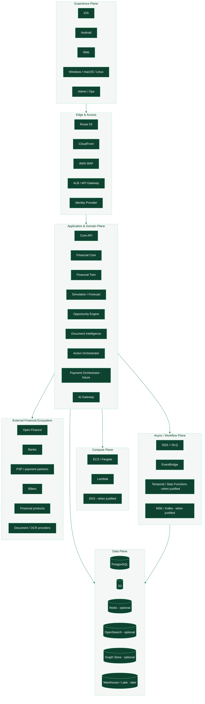

# FINCH
## Financial Decision & Action OS

> **Status:** `APPROVED FOR SCAFFOLD`  
> **Document:** Engineering & Product Constitution (the root README until 2026-09-28, ADR-0040)  
> **Version:** 1.0.0  
> **Baseline:** 17 September 2026  
> **Initial market:** Colombia  
> **Platforms:** Android · iOS · Web · Windows · macOS · Linux  
> **Build model:** founder-led, AI-assisted engineering with Claude + Cursor; GitHub as the source of truth  
> **Guiding principle:** team size does not limit the architectural level. Complexity is accepted when a real FINCH capability justifies it.

---

# 1. What FINCH is

FINCH is a financial platform whose goal is to evolve from a personal financial intelligence application into a **Financial Decision & Action OS**: a system able to understand the financial state of a person, household or company, simulate decisions, compare alternatives, explain consequences and, when there is authorization and appropriate regulated infrastructure, execute financial actions in a controlled and auditable way.

FINCH is not conceived as a simple budget, a spreadsheet with a pretty interface, a chatbot that generates generic advice or an account aggregator. Its core is a verifiable, versioned representation of the user's financial reality —the **Financial Twin**— on top of which deterministic engines for calculation, forecasting, comparison, opportunity detection and action workflows operate.

The product's conceptual architecture has three layers:

```text
FINCH UNDERSTANDS
Financial data + provenance + Financial Twin
        ↓
FINCH DECIDES
Rules + financial math + simulation + forecast + opportunities
        ↓
FINCH ACTS
Approval + workflow + provider + execution + reconciliation + outcome
```

FINCH does not aim to replace banks, BRE-B, ACH, PSE, acquirers, supervised entities or financial rails. The defensible vision is to become an **intelligence, decision and orchestration layer** on top of existing financial infrastructure.

---

# 2. Scope of this document

This file is the official entry point to the repository's engineering rules. It must allow a person or a software agent to understand:

- what FINCH is;
- how it is structured;
- what its invariants are;
- what technology it uses;
- what technology it may adopt later;
- how identity, tenancy and financial data are modelled;
- how it is developed with Claude and Cursor;
- how it is tested;
- how it is deployed;
- how it is observed;
- how it recovers from failures;
- what artifacts every change must produce;
- which decisions require an ADR;
- what it means for a feature to be done;
- what the implementation stages are.

This document **does not replace** specialized documentation. It acts as an index and a high-level contract.

Recommended order of authority for the repository:

```text
1. Architecture Constitution / Security invariants
2. Accepted ADRs
3. FINCH Engineering Masterplan
4. Domain/module documentation
5. API / event / data contracts
6. Feature specifications
7. Code + tests
8. Issues / PR descriptions
```

An accepted ADR may supersede an earlier masterplan decision, but it may not silently break a constitutional clause: to do so it must state explicitly which clause changes and why.

---

# 3. Outcome of the latest architecture review

Before declaring this document ready for scaffolding, masterplan v0.2.0 was reviewed. The main changes incorporated here are the following.

## 3.1 The system stops being centered on `user_id`

This is the most important structural change.

FINCH progressively wants to serve:

- a person;
- a household;
- a couple;
- a self-employed worker;
- a micro-business;
- a company;
- a finance team;
- delegated users.

Therefore `User` cannot be identity, tenant, financial owner and accounting unit all at once.

FINCH will separate:

```text
Principal
    who authenticates

Party
    which person/organization is economically represented

Workspace
    boundary of isolation, collaboration and configuration

Membership / Grant
    what a Principal may do inside a Workspace or on a resource
```

Example:

```text
Helmut (Principal)
   ↓ member-of
Personal Workspace
   ↓ financial-owner
Helmut Person Party
```

Household example:

```text
Principal A ─┐
             ├─ Membership → Household Workspace
Principal B ─┘                     │
                                   ├─ shared goals
                                   ├─ shared obligations
                                   └─ selectively shared accounts
```

Company example:

```text
Principal CFO ─┐
Principal Ops ─┼─ Membership → ACME Workspace → Organization Party
Principal CEO ─┘
```

Every tenant-owned table must use `workspace_id`. `principal_id` is used for actor/audit; `party_id` for economic ownership where applicable.

This avoids a traumatic migration when FINCH Business arrives.

## 3.2 A relational authorization architecture is formalized

Simple RBAC is not enough for:

- shared accounts;
- households;
- organizations;
- delegations;
- support;
- administrators;
- high-risk actions.

The conceptual contract will be:

```text
authorize(
  principal,
  action,
  resource,
  workspace,
  context
)
```

The initial implementation can be typed, tested TypeScript code. If policy complexity justifies it, Cedar/AWS Verified Permissions, OPA or another policy engine may be evaluated without changing the domains.

PostgreSQL Row Level Security may be added as defense in depth for suitable datasets, but it does not replace application authorization and must not be enabled without a harness that validates session scoping and pooling.

## 3.3 Four truth classes are formalized

FINCH must never confuse an observed fact with a prediction or an AI text.

```text
OBSERVED / VERIFIED
Provider, confirmed document or reconciled action.

USER_ASSERTED
Data entered or confirmed by the user.

DERIVED_DETERMINISTIC
Result of a reproducible formula/rule.

ESTIMATED / MODELLED
Forecast, probabilistic classification or inference.

GENERATED_NARRATIVE
Text/explanation produced by an LLM.
```

An LLM explanation may describe a calculation, but it may not raise its own output to `VERIFIED`.

## 3.4 Four data zones are separated

```text
RAW
original payload / document / evidence
   ↓ normalization
CANONICAL
normalized financial model
   ↓ deterministic/model computation
DERIVED
snapshots, forecasts, opportunities, decision cards
   ↓ privacy controlled export
ANALYTICAL
pseudonymized/aggregated for metrics, BI or authorized ML
```

This separation simplifies lineage, privacy, reprocessing and debugging.

## 3.5 Risk by capability is added

FINCH will classify features:

```text
R0 — Read / education / visualization
R1 — Derived financial intelligence
R2 — External non-monetary action
R3 — Money movement / sensitive regulated execution
R4 — Custody / ledger-critical capabilities
```

The higher the risk, the more gates, observability, review, SLOs and controls.

## 3.6 Supply chain and release provenance are strengthened

A professional release must have:

- immutable git SHA;
- SBOM;
- dependency scan;
- SAST;
- secret scan;
- container scan;
- checksums;
- migration bundle;
- OpenAPI diff;
- financial correctness report;
- build provenance/attestation once enabled;
- signing/notarization for desktop/mobile;
- rollback plan.

## 3.7 OpenAPI is corrected

The most recent OpenAPI specification at the reference date is **3.2.1**, published on 10 September 2026. However, the repository must not adopt a revision that breaks generators or tooling. The API ADR will pin the effective version —3.1.x or 3.2.x— after running toolchain compatibility tests.

## 3.8 OpenTelemetry JS

Traces and Metrics are stable; Logs remain in development in the current documentation. FINCH will use OpenTelemetry mainly for traces/metrics, and structured logs through the chosen logging pipeline, avoiding reliance on OTel Logs as the only mechanism.

## 3.9 Well-Architected becomes a review framework

Periodic reviews must explicitly assess the six pillars of AWS Well-Architected:

- Operational Excellence;
- Security;
- Reliability;
- Performance Efficiency;
- Cost Optimization;
- Sustainability.

It is not used as a ceremonial checklist: every review must produce concrete issues.

---

# 4. Architecture Constitution

The following rules are of the highest level.

1. **Team size does not determine the level of architecture.**
2. **Financial truth does not depend on an LLM.**
3. **Money never uses binary floating point as an authoritative financial representation.**
4. **Every important financial figure must have provenance.**
5. **Every historical decision must be reproducible, or explain why it can no longer be reproduced.**
6. **An irreversible financial action requires explicit, current authorization from the user or a previously agreed and technically verifiable mandate.**
7. **An unconfirmed document cannot trigger an irreversible monetary action.**
8. **Recommendation, Action, PaymentIntent, ExecutionAttempt and Reconciliation are different concepts.**
9. **External provider adapters do not define FINCH's domain.**
10. **Secrets do not live in the repository or in clients.**
11. **Production changes go through CI/CD and produce evidence.**
12. **Event consumers are idempotent.**
13. **The system assumes at-least-once delivery unless another semantic is formally proven.**
14. **Audit log and application log are different mechanisms.**
15. **Monetization does not alter the financial ranking.**
16. **Privacy, purpose and consent are validated in the backend, not only in the UI.**
17. **Admin does not mean unrestricted access.**
18. **Production data is not copied to local development.**
19. **Every new technology must solve a real capability and document its costs.**
20. **FINCH must be able to degrade without inventing certainty.**

---

# 5. Quality Attributes

The architecture is evaluated against explicit attributes.

| Attribute | Architectural objective |
|---|---|
| Correctness | reproducible calculations, invariants and independent fixtures |
| Security | least privilege, zero trust, defense in depth |
| Privacy | purpose limitation, minimization, consent and lifecycle |
| Reliability | fault tolerance, bounded retries, DLQ, proven recovery |
| Auditability | provenance, traceability and versioned decisions |
| Availability | degradation per capability, no unnecessary total outage |
| Performance | measurable budgets, async for expensive processes |
| Scalability | scale-out where useful without premature replatforming |
| Maintainability | bounded contexts, contracts, fitness functions |
| Portability | domain decoupled from vendors; pragmatically AWS-first cloud |
| Operability | observability, runbooks, kill switches, IaC |
| Cost | observable costs and budgets per workload/provider |
| Accessibility | WCAG-oriented UX and text equivalents for critical information |

---

# 6. Platform architecture



The target architecture may be sophisticated; the deployed topology must be the minimum that correctly satisfies the current workload. "Minimum" does not mean insecure or amateur: it means without components that add no capability.

---

# 7. Architectural planes

FINCH is divided into planes to avoid mixing responsibilities.

## 7.1 Experience Plane

- Android/iOS;
- web;
- desktop;
- admin;
- notifications.

It is not a source of truth.

## 7.2 Domain Plane

- accounts;
- transactions;
- debts;
- goals;
- income;
- obligations;
- forecasting;
- simulation;
- offers;
- opportunities;
- decision cards;
- actions;
- payments.

## 7.3 Integration Plane

- bank/open-finance adapters;
- payment adapters;
- biller adapters;
- product catalog ingestion;
- document providers;
- identity/KYC;
- email/push.

## 7.4 Data Plane

- PostgreSQL OLTP;
- S3 evidence/documents;
- queues/event log;
- analytical copies;
- future cache/search/graph.

## 7.5 Control Plane

- configuration;
- feature flags;
- entitlements;
- regulatory enablement;
- provider routing;
- kill switches;
- formula versions;
- model versions;
- prompt versions.

## 7.6 Operations Plane

- telemetry;
- CI/CD;
- security posture;
- recovery;
- incidents;
- FinOps;
- release evidence.

---

# 8. Identity, tenancy and ownership

## 8.1 Principal

An entity that can authenticate or act.

Types:

```text
HUMAN
SERVICE
SYSTEM
ADMIN
```

## 8.2 Party

The economic/legal entity represented:

```text
PERSON
ORGANIZATION
```

## 8.3 Workspace

The main boundary of isolation and collaboration.

Initial types:

```text
PERSONAL
HOUSEHOLD
BUSINESS
```

## 8.4 Membership

Relates a Principal to a Workspace and roles/capabilities.

## 8.5 Grant

A more granular permission on specific resources.

Example: a household member can see a shared goal without seeing their partner's personal card.

## 8.6 Data rules

- every tenant-owned resource has a `workspace_id`;
- `party_id` is used when economic ownership is relevant;
- `created_by_principal_id` identifies the actor, not the owner;
- external IDs are not domain keys;
- a `Workspace` is not inferred from an email;
- services act with service principals.

---

# 9. Authorization Architecture

Initial model:

```text
Subject = Principal
Action = typed capability
Resource = domain object
Workspace = tenant boundary
Context = device/session/risk/purpose/etc.
```

Example:

```text
can(
  principal,
  "account.read",
  account,
  workspace,
  context
)
```

Critical policies must have negative tests, not only the happy path.

Minimum harness:

```text
owner allowed
other workspace denied
membership without grant denied
revoked member denied
support masked-only
admin scoped
service principal least privilege
```

---

# 10. Canonical Financial Data Model

Main concepts:

```text
Workspace
Principal
Party
Membership
Consent
Institution
InstitutionConnection
Account
BalanceObservation
Transaction
Merchant
Category
RecurringObligation
IncomeStream
CreditFacility
CreditCard
Offer
Product
Quote
Goal
Plan
FinancialStateSnapshot
Scenario
ScenarioResult
Forecast
Opportunity
DecisionCard
Document
ExtractedField
Action
Approval
PaymentIntent
ExecutionAttempt
ReconciliationRecord
Outcome
AuditEvent
OutboxEvent
```

Payment/ledger models may exist as contracts from the start even if they are not operational.

---

# 11. Data Truth & Provenance

Every significant piece of data must declare its origin.

```text
source_type
source_ref
observed_at
effective_at
ingested_at
confidence
verified_by_principal
normalizer_version
schema_version
```

`confidence` never replaces `source_type`.

Example:

```text
Balance COP 4,200,000
source: provider
observed_at: 2026-09-17T...
truth_class: observed
freshness: fresh
```

Forecast example:

```text
Projected balance COP 3,850,000
truth_class: estimated
model: cashflow-forecast/2
snapshot: fs_...
range: 3.4M–4.2M
```

---

# 12. Data Zones

## 12.1 RAW

- provider payloads;
- webhooks;
- documents;
- import files.

Immutability and controlled retention.

## 12.2 CANONICAL

- accounts;
- transactions;
- debts;
- obligations;
- normalized products.

## 12.3 DERIVED

- snapshots;
- forecasts;
- opportunities;
- scenarios;
- decision cards.

## 12.4 ANALYTICAL

- pseudonymized events;
- cohort metrics;
- authorized datasets.

Never use the analytical store as financial truth.

---

# 13. Financial Twin

The Financial Twin is a versioned representation of the financial state of a Workspace/Party.

A snapshot may include:

```text
liquid accounts
debts
credit cards
income streams
recurring obligations
goals
reserves
known future movements
risk buffers
data freshness
uncertainty
```

Every important simulation references an immutable snapshot.

```text
FinancialStateSnapshot
  ├── input references
  ├── generated_at
  ├── data freshness
  ├── rules/model versions
  └── checksum
```

---

# 14. Financial Engine

`packages/financial-engine` must be a pure library.

No imports from:

```text
NestJS
React
AWS SDK
Drizzle
LLM SDKs
```

Subdomains:

```text
money
rates
rounding
periods
financial-calendar
amortization
refinancing
cashflow
forecast
stress
safe-to-spend
goals
purchase-comparison
```

## 14.1 Money

Preference:

```text
settled amount → bigint minor units
rates/intermediate calculations → arbitrary precision decimal
```

Never `float/double` as financial truth.

## 14.2 Formula Registry

Every formula has:

```text
formula_id
version
purpose
inputs
units
rounding
assumptions
source/reference
examples
edge cases
implementation path
test vectors
```

Changing a formula creates a new version.

---

# 15. Financial Correctness Harness

It must exist before real recommendations.

It includes:

- golden vectors;
- property-based tests;
- boundary cases;
- regression fixtures;
- independent reference calculations;
- optional Python cross-checks for critical formulas.

Artifacts:

```text
financial-correctness.json
financial-correctness.html
formula-diff.md
```

Example invariants:

```text
principal repaid == original principal within declared rounding
increasing interest rate cannot reduce total interest ceteris paribus
extra prepayment cannot increase remaining principal
simulation never mutates canonical state
safe-to-spend never consumes protected obligations
```

---

# 16. Decision Architecture

Pipeline:

```text
Signals
  ↓
Eligibility
  ↓
Deterministic calculations
  ↓
Candidate opportunities
  ↓
Ranking
  ↓
Explanation
  ↓
Decision Card
  ↓
User action
  ↓
Outcome
```

Commercial commission **does not enter** the ranking.

---

# 17. Decision Card

A Decision Card must be able to answer:

- what FINCH detected;
- why it matters;
- estimated impact;
- data used;
- assumptions;
- freshness;
- confidence;
- alternatives;
- downside;
- next action;
- commercial conflict of interest.

Persist the structure, not only prose.

---

# 18. Risk Tiers per feature

## R0 — Information

Examples:
- visualization;
- education;
- editable categorization.

## R1 — Financial Intelligence

- forecast;
- credit comparison;
- safe-to-spend;
- opportunity.

Requires correctness/provenance.

## R2 — External Action

- start a quote request;
- deep-link;
- provider switch;
- submit a form.

Requires explicit action/audit.

## R3 — Money Movement

- payment initiation;
- transfer;
- autopay.

Requires strong idempotency, risk checks, reconciliation, dedicated runbooks and an external security review.

## R4 — Custody / Ledger Critical

If FINCH were ever to hold or intermediate funds, it would require additional architecture and regulatory/operational review. It is not v1.

---

# 19. Backend Architecture

## 19.1 Core style

**Modular monolith with deployable boundaries**.

This allows:

- ACID transactions where they make sense;
- strict contracts;
- future extraction;
- less accidental operational coupling.

It is not chosen because of headcount.

## 19.2 API

- NestJS;
- Fastify adapter;
- REST;
- OpenAPI;
- typed codegen;
- Zod/boundary validation;
- stable error codes;
- idempotency for sensitive commands.

## 19.3 Worker

Same monorepo, different entrypoint.

- outbox publication;
- provider sync;
- document pipelines;
- recomputations;
- notifications;
- background jobs.

---

# 20. Bounded Contexts

```text
identity
workspaces
parties
authorization
consent
institutions
accounts
transactions
categorization
recurrence
income
obligations
debts
credit-cards
goals
planning
financial-twin
forecasting
simulation
offers
product-catalog
opportunities
decision-cards
documents
notifications
actions
payments
reconciliation
risk
providers
audit
analytics-events
ai-gateway
admin-ops
```

A module owns its invariants and tables.

Direct cross-module DB reads are forbidden except through an explicit, documented read model.

---

# 21. Event Architecture

## 21.1 Transactional Outbox

In the same transaction:

```text
update domain state
insert outbox event
commit
```

An asynchronous publisher publishes to SQS/EventBridge.

## 21.2 Event envelope

```text
event_id
event_type
event_version
workspace_id
aggregate_type
aggregate_id
occurred_at
producer
correlation_id
causation_id
trace_id
payload
```

## 21.3 Delivery

At-least-once by default.

All consumers are:

- idempotent;
- bounded retries;
- DLQ;
- observable.

---

# 22. Durable Workflows

SQS must not be used to model multi-day workflows arbitrarily.

Evaluate Temporal or AWS Step Functions when these appear:

- long timers;
- human approval;
- multiple external systems;
- compensations;
- complex retries;
- resume after deploy/failure;
- auditable workflow history.

Candidates:

```text
PaymentExecutionWorkflow
ReconciliationWorkflow
AccountDeletionWorkflow
DataExportWorkflow
ProviderSwitchWorkflow
KYCWorkflow
DisputeWorkflow
```

Temporal documents durable execution able to resume workflows after process, network or infrastructure failures.

---

# 23. Compute Strategy

There is no single "correct" technology.

| Workload | First option | Evolution |
|---|---|---|
| Core API | ECS/Fargate | EKS if capabilities justify it |
| Long-lived worker | ECS/Fargate | EKS |
| Webhook ingress | Lambda or API | by volume/latency |
| S3 event/preflight | Lambda | container if heavy |
| Scheduled lightweight trigger | Lambda/EventBridge | worker |
| Durable workflow | Temporal/Step Functions | — |
| GPU workload | managed endpoint/EKS | by need |
| Large stream processing | SQS first | MSK/Kafka when there are stream semantics |

## 23.1 ECS/Fargate

The pragmatic default for stable containers.

## 23.2 Lambda

First-class within FINCH when the workload is:

- event-driven;
- stateless;
- bounded;
- bursty;
- short.

AWS names S3, API Gateway, EventBridge and SQS as natural sources for Lambda.

## 23.3 EKS

It is neither forbidden nor "reserved for large teams". EKS Auto Mode manages capabilities such as compute autoscaling, networking, load balancing, DNS, block storage and GPU support. It is adopted when Kubernetes provides capabilities that ECS/Lambda do not solve adequately.

## 23.4 Kafka/MSK

Adopt only when FINCH genuinely needs:

- retained event streams;
- historical replay;
- multiple independent consumers;
- per-partition ordering;
- high sustained throughput;
- stream processing.

---

# 24. Database Architecture

## 24.1 PostgreSQL

The OLTP source of truth.

Current baseline: PostgreSQL 18.x; the repository must pin the supported patch in IaC/container tooling.

## 24.2 Schemas

Possible split:

```text
identity
security
finance
planning
decision
documents
actions
integration
audit
```

## 24.3 Multi-tenancy

`workspace_id` is mandatory on tenant-owned resources.

The application performs explicit authorization. RLS may be added as defense in depth after validation.

## 24.4 Future data stores

- Redis: cache/ephemeral coordination when there is a measured case;
- OpenSearch: dedicated search;
- Graph DB: complex traversals;
- Warehouse/lake: analytics/ML;
- Kafka: event streaming.

None of them replaces Postgres for architectural aesthetics.

---

# 25. Ledger Architecture

## 25.1 PFM Transaction Store

Represents observed transactions.

It is not an internal ledger of funds.

## 25.2 Future double-entry ledger

Only when FINCH must record its own money movement/custody/settlement.

Concepts:

```text
LedgerAccount
Journal
Posting
Entry
Settlement
BalanceProjection
```

Invariant:

```text
Σ debits == Σ credits
```

Append-only; corrections through compensating entries.

---

# 26. Future Payment Architecture

```text
Decision
  ↓
Action Proposal
  ↓
User Approval / mandate
  ↓
PaymentIntent
  ↓
Risk Check
  ↓
ExecutionAttempt
  ↓
Provider/Rail
  ↓
Provider state
  ↓
Reconciliation
  ↓
Outcome
```

States must not be booleans.

```text
draft
proposed
approval_required
approved
risk_check
ready
submitted
provider_pending
settled
failed
reversal_pending
reversed
cancelled
expired
manual_review
```

---

# 27. Provider Architecture

Internal ports:

```text
AccountDataProvider
PaymentProvider
DocumentExtractorProvider
IdentityProvider
NotificationProvider
AIProvider
ProductDataProvider
```

The domain never imports a vendor SDK directly.

Each adapter implements:

- auth;
- timeout;
- retries;
- rate limits;
- normalization;
- health metrics;
- contract fixtures;
- error mapping;
- webhook verification where applicable.

---

# 28. Provider Capability Registry

Keep normalized capabilities:

```text
provider
country
institutions
accounts
transactions
balances
payments
webhooks
refresh_mode
sla
latency
health
```

This enables future provider routing without hardcoding a vendor.

---

# 29. Document Intelligence

Pipeline:

```text
upload
→ quarantine
→ MIME/magic-byte validation
→ malware scan
→ SHA-256
→ protected storage
→ classifier
→ OCR/extraction
→ structured fields
→ confidence
→ human verification
→ canonical model
```

The original is evidence; extraction and normalization are separate versions.

---

# 30. AI Architecture

FINCH uses AI as a layer of understanding and communication, not as a financial authority.

## Allowed

- explanations;
- document interpretation;
- merchant enrichment;
- intent parsing;
- conversational UX;
- support drafting;
- assisted structured extraction.

## Forbidden as a source of truth

- balances;
- authorization;
- interest;
- payment state;
- reconciliation;
- unverified contractual eligibility;
- money movement.

## AI Gateway

```text
Domain
  ↓ structured request
AI Gateway
  ├─ policy / PII classification
  ├─ provider routing
  ├─ prompt registry
  ├─ schema validation
  ├─ timeout/cost limits
  ├─ audit metadata
  └─ provider adapter
```

Claude as a development tool and Claude as a runtime provider are independent decisions.

---

# 31. AI Data Policy

Before every request the content is classified:

```text
PUBLIC
INTERNAL
CONFIDENTIAL
RESTRICTED_FINANCIAL
RESTRICTED_IDENTITY
```

The policy determines:

- whether it may be sent;
- to which provider;
- what redaction to apply;
- what logging is allowed;
- whether it requires specific consent/configuration.

Document text is treated as untrusted input with respect to prompt injection.

---

# 32. AI Eval Harness

Eval categories:

```text
explanation fidelity
number preservation
structured output validity
document extraction
prompt injection
PII leakage
classification
fallback behavior
latency
cost
```

A prompt/model change may fail CI if it degrades critical evals.

---

# 33. Product Clients

## 33.1 Mobile — Android / iOS

**React Native + Expo**.

Current Expo docs baseline: SDK 57 → React Native 0.86, React 19.2.3; pin the exact version in the lockfile.

State:

- TanStack Query for server state;
- React state/Zustand for local UI;
- React Hook Form;
- Zod;
- SecureStore;
- LocalAuthentication;
- development builds for native/security testing.

## 33.2 Web

**Next.js + React**.

`apps/web` is not mixed with `apps/admin`.

## 33.3 Desktop

**Tauri 2 + React/Vite** for Windows/macOS/Linux.

Tauri supports multiple platforms, but FINCH uses Expo as its primary mobile stack so as not to sacrifice mobile UX/ecosystem.

Minimal, privileged Rust layer.

---

# 34. Design System

Packages:

```text
design-tokens
ui-mobile
ui-web
```

Semantic tokens:

```text
surface
text
border
positive
negative
warning
critical
verified
estimated
stale
pending
```

Do not depend on green/red alone.

Light/dark first-class.

---

# 35. Accessibility

From the first beta:

- screen readers;
- dynamic type;
- keyboard web/desktop;
- focus states;
- contrast;
- reduced motion;
- large touch targets;
- textual fallback for charts.

Every critical financial chart must have an equivalent accessible representation.

---

# 36. Localization / Country Architecture

Initial:

```text
locale: es-CO
timezone: America/Bogota
currency: COP
```

Do not hardcode Colombian rules inside the global core.

```text
jurisdictions/
  CO/
    calendar/
    rate-conventions/
    legal-copy/
    product-taxonomy/
    capabilities/
```

Future country adapters must be able to coexist.

---

# 37. Regulatory Capability Layer

Without replacing legal advice, the software must know what class of capability it is executing.

```text
INFORMATION
COMPARISON
SIMULATION
PERSONALIZED_RECOMMENDATION
EXTERNAL_ACTION
PAYMENT_INITIATION
MONEY_MOVEMENT
CUSTODY
```

Feature enablement may depend on:

```text
jurisdiction
partner
user consent
regulatory status
feature risk tier
```

This prevents an experimental feature from accidentally becoming a regulatorily different activity.

---

# 38. Security Baseline

Minimum references:

- OWASP ASVS 5.0.0 for web/application controls;
- OWASP API Security Top 10 2023;
- OWASP MASVS/MASTG for mobile;
- threat modeling per risky feature.

## Priority threats

- account takeover;
- BOLA/IDOR;
- broken property authorization;
- credential stuffing;
- malicious documents;
- webhook spoofing;
- replay;
- provider compromise;
- SSRF;
- API abuse/resource exhaustion;
- supply-chain compromise;
- insider/admin abuse;
- PII exfiltration;
- prompt injection;
- model leakage;
- compromised device;
- destructive migration.

---

# 39. Threat Modeling Process

R1+ features must include:

```text
assets
actors
entry points
trust boundaries
abuse cases
STRIDE threats
privacy/LINDDUN considerations where relevant
controls
tests
residual risk
```

R3/R4 require independent review before GA.

---

# 40. Secrets & Key Management

- AWS Secrets Manager;
- KMS;
- short-lived AWS credentials;
- GitHub OIDC;
- no long-lived AWS keys in Actions;
- no server secrets in clients;
- rotation plan.

GitHub documents OIDC with AWS precisely to avoid long-lived AWS credentials in GitHub secrets.

---

# 41. AWS Account & Network Topology

Mature target:

```text
finch-management
finch-nonprod
finch-prod
finch-security
finch-log-archive
```

It is not necessary to create all of them on day one, but prod and nonprod must be separated before real financial data.

Production VPC:

```text
public subnets
  └─ public load balancing only where necessary
private application subnets
  ├─ ECS/EKS workloads
  └─ workers
isolated data subnets
  └─ RDS/cache
```

VPC endpoints for AWS services where they reduce exposure/cost.

---

# 42. Workload Identity

No shared master role.

```text
finch-api-role
finch-worker-role
finch-document-role
finch-provider-sync-role
finch-notification-role
finch-payment-role
finch-ci-deploy-role
```

ECS task roles / Lambda execution roles / EKS workload identities depending on compute.

---

# 43. Supply Chain Security

- frozen lockfile;
- dependency review;
- CodeQL/SAST;
- gitleaks;
- Trivy/container scan;
- SBOM;
- pinned high-risk Actions by SHA;
- artifact checksums;
- signed release artifacts where feasible;
- future SLSA/Sigstore provenance when CI matures.

Agents may not introduce a sensitive library without an official reference and a reason.

---

# 44. CI/CD

## PR gate

```text
checkout
→ frozen install
→ lint
→ formatting
→ typecheck
→ unit tests
→ integration tests
→ financial harness
→ architecture fitness
→ build
→ OpenAPI diff
→ migration validation
→ dependency review
→ SAST
→ secret scan
→ SBOM
→ container/IaC checks if relevant
→ artifacts
```

## Deployment

```text
immutable build
→ nonprod deploy
→ smoke
→ E2E
→ security/financial gates
→ approval
→ prod promotion
→ health verification
→ release evidence
```

Build once; promote the same artifact.

---

# 45. Release Certification

Every release candidate must be able to generate:

```text
release-manifest.json
changelog.md
openapi.json
sbom.spdx.json
checksums.txt
financial-correctness.json
security-scan.json
migration-plan.md
rollback-plan.md
known-risks.md
architecture-diff.md
```

Mobile/desktop add signing/notarization evidence.

---

# 46. Observability

Server:

- structured logs;
- OpenTelemetry traces;
- OpenTelemetry metrics;
- Sentry;
- CloudWatch;
- correlation IDs.

OpenTelemetry JS currently marks Traces and Metrics as stable and Logs as development; that is why structured logs will not depend exclusively on the OTel Logs SDK.

Telemetry must travel:

```text
HTTP
→ outbox
→ queue
→ worker
→ provider
```

with `trace_id`, `correlation_id` and `causation_id` whenever possible.

---

# 47. SLO / SLI Baseline

Before money movement:

| SLI | Initial target |
|---|---:|
| API availability | 99.9% monthly |
| Simple API read p95 | < 500 ms |
| Simple internal write p95 | < 800 ms |
| Deterministic simulation | < 300 ms typical |
| Worker normal start latency | < 60 s |
| Crash-free mobile sessions | > 99.5% |
| Critical deterministic reproducibility | 100% |

R3/R4 must have their own stricter SLOs.

---

# 48. Graceful Degradation

Examples:

```text
LLM down
→ calculations and structured Decision Cards continue.

Bank provider down
→ last verified snapshot remains with stale badge.

Document AI down
→ manual entry continues.

Notification provider down
→ in-app remains.

Payment rail down
→ analysis works; execution disabled.
```

FINCH does not invent data to keep a screen "pretty".

---

# 49. Resilience Patterns

External dependencies must consider:

- timeout;
- bounded retry;
- jitter;
- circuit breaker;
- bulkhead;
- backpressure;
- rate-limit handling;
- DLQ;
- stale fallback.

No infinite retry.

---

# 50. Backup & Disaster Recovery

PostgreSQL:

- automated backups;
- PITR;
- pre-risk migration snapshot;
- restore drills.

S3:

- versioning;
- SSE-KMS;
- lifecycle;
- Object Lock where evidence requires WORM.

Pre-payments baseline:

```text
RPO target <= 15 min
RTO target <= 4 h
```

They are not considered valid until recovery has been tested.

---

# 51. Data Lifecycle & Privacy Operations

FINCH must support, from the architecture up:

- consent grant/revoke;
- purpose;
- retention policy;
- data export;
- account deletion;
- legal hold when applicable;
- provider revocation;
- anonymization where appropriate.

`DELETE FROM users CASCADE` is not a privacy system.

---

# 52. Admin / Ops

Admin is an independent application and a critical surface.

Allowed in a controlled way:

- connection health;
- support cases;
- masked user lookup;
- audit viewer;
- recommendation debug;
- document processing status;
- feature flags;
- DLQ metadata;
- provider health.

Forbidden by default:

- unrestricted impersonation;
- plaintext secrets;
- direct balance edits;
- payment approval on behalf of user;
- unrestricted document download.

Every admin action produces an audit record.

---

# 53. Product Analytics

Suggested tool: PostHog or equivalent, behind an adapter/policy.

Never send without explicit approval:

- full balances;
- account numbers;
- raw transaction descriptions;
- official IDs;
- document contents;
- tokens.

CI may block forbidden analytics properties.

---

# 54. Event / Product Analytics Separation

Do not confuse:

```text
Domain event
Audit event
Telemetry event
Product analytics event
```

They have different goals, retention and sensitivity.

---

# 55. Monorepo

```text
finch/
├─ apps/
│  ├─ api/
│  ├─ worker/
│  ├─ mobile/
│  ├─ web/
│  ├─ admin/
│  └─ desktop/
├─ packages/
│  ├─ domain/
│  ├─ financial-engine/
│  ├─ contracts/
│  ├─ api-client/
│  ├─ db/
│  ├─ authorization/
│  ├─ provider-sdk/
│  ├─ ai-core/
│  ├─ observability/
│  ├─ security/
│  ├─ config/
│  ├─ testing/
│  ├─ design-tokens/
│  ├─ ui-mobile/
│  ├─ ui-web/
│  └─ eslint-config/
├─ jurisdictions/
│  └─ CO/
├─ infra/
│  ├─ tofu/
│  └─ docker/
├─ docs/
│  ├─ architecture/
│  ├─ domain/
│  ├─ product/
│  ├─ security/
│  ├─ privacy/
│  ├─ operations/
│  ├─ providers/
│  └─ financial-formulas/
├─ evals/
│  ├─ financial/
│  ├─ ai/
│  ├─ authorization/
│  └─ documents/
├─ fixtures/
│  ├─ colombia/
│  ├─ providers/
│  └─ documents/
├─ scripts/
├─ .ai/
│  ├─ skills/
│  ├─ tasks/
│  ├─ reviews/
│  └─ handoffs/
├─ .cursor/rules/
├─ .github/
├─ AGENTS.md
├─ CLAUDE.md
├─ SECURITY.md
├─ CONTRIBUTING.md
└─ README.md
```

---

# 56. Toolchain Baseline

| Area | Recommended baseline |
|---|---|
| Runtime | Node.js 24 LTS |
| Package manager | pnpm |
| Monorepo | Turborepo |
| Language | TypeScript strict |
| Mobile | React Native + Expo |
| Web/Admin | Next.js + React |
| Desktop | Tauri 2 + React/Vite |
| Backend | NestJS + Fastify |
| DB | PostgreSQL 18.x managed |
| Query layer | Drizzle + explicit SQL when appropriate |
| IaC | OpenTofu 1.12.x baseline |
| Cloud | AWS |
| Containers | ECS/Fargate default |
| Event compute | Lambda where suited |
| Kubernetes | EKS when capability requires |
| Queues | SQS |
| Scheduling | EventBridge Scheduler |
| Durable workflows | Temporal/Step Functions when triggered |
| Object storage | S3 |
| Auth | OIDC provider behind port; Auth0 baseline candidate |
| Observability | OTel + Sentry + CloudWatch |
| Unit/integration | Vitest + Testcontainers |
| Web E2E | Playwright |
| Mobile E2E | Maestro |
| Product analytics | PostHog adapter/policy |

Do not use `latest` in production; versions are pinned in the lockfile/IaC.

---

# 57. TypeScript Rules

```text
strict=true
noUncheckedIndexedAccess=true
exactOptionalPropertyTypes=true
noImplicitOverride=true
useUnknownInCatchVariables=true
```

No `any` except in a documented adapter.

No business logic in:

- controllers;
- React components;
- provider SDK wrappers.

---

# 58. API Contract

REST first.

```text
/api/v1/...
```

Stable errors:

```json
{
  "error": {
    "code": "FINCH_VALIDATION_ERROR",
    "message": "The request contains invalid data.",
    "correlationId": "...",
    "details": []
  }
}
```

Sensitive create/execute endpoints use `Idempotency-Key`.

OpenAPI is generated in CI and produces a diff.

---

# 59. API Compatibility

Mobile clients outlive backend versions.

Policy:

- server backward-compatible within the supported client window;
- breaking changes require deprecation;
- usage telemetry before removal;
- forced mobile upgrade only for critical incompatibility/security.

---

# 60. Time / Calendar / Currency

Store timestamps in UTC.

Default presentation:

```text
America/Bogota
```

Use an injectable `Clock` in the domain.

The financial calendar is abstracted for:

- business days;
- holidays;
- due-date rules.

Money always includes an ISO currency.

FX is a separate entity with source/freshness.

---

# 61. Configuration

Typed, validated at startup.

Separate:

```text
public config
secret config
feature flags
jurisdiction config
provider config
risk limits
```

Critical configuration changes generate an audit record.

---

# 62. Feature Flags & Kill Switches

Flags for rollout.

Explicit kill switches:

```text
disable_bank_sync
disable_document_ai
disable_opportunity_kind_x
disable_external_actions
disable_payment_execution
disable_ai_explanations
```

Kill types:

```text
prevent_new
read_only
disable_execution
hard_stop
```

---

# 63. Engineering Harnesses

## Financial Correctness

Formulas, invariants, regression.

## Authorization

Cross-workspace/resource attacks.

## Provider Sandbox

Timeouts, duplicates, rate limits, malformed payloads.

## Security

SAST, secrets, dependencies, API abuse tests.

## AI Eval

Fidelity, PII, injection, schema.

## Recovery

DB restore, DLQ redrive, outbox replay, provider outage.

## UI Visual/Accessibility

Critical financial states.

## Architecture Fitness

Dependency boundaries, forbidden imports, cycles.

---

# 64. Architecture Fitness Functions

CI must progressively check that:

- financial-engine does not depend on frameworks;
- domain does not depend on infrastructure;
- provider SDKs only appear in adapters;
- no direct cross-domain DB access;
- no money APIs with an authoritative float/number;
- no secret patterns;
- generated API client in sync;
- analytics property allowlist;
- no forbidden package cycles.

Tools:

- custom ESLint rules;
- dependency-cruiser;
- our own scripts.

---

# 65. Claude + Cursor Operating Model

Claude and Cursor are capacity multipliers, not final authorities.

## Claude

Primary for:

- architecture reasoning;
- specs;
- ADRs;
- threat models;
- financial invariants;
- deep review;
- implementation planning.

## Cursor

Primary for:

- repository navigation;
- multi-file implementation;
- refactor;
- test implementation;
- local debugging.

## Source of truth

GitHub + repo docs + accepted ADRs.

Never conversational memory as the only source.

---

# 66. Agent Permission Model

```text
L0 read repository
L1 edit local branch/worktree
L2 run local tests/tooling
L3 create PR
L4 inspect sanitized nonprod telemetry
L5 deploy nonprod through CI
```

No prod DB console, unrestricted AWS admin, raw secrets or payment execution for coding agents.

---

# 67. AI Development Workflow

```text
Issue
→ Context Pack
→ Spec
→ invariants
→ threat/privacy notes
→ implementation plan
→ branch/worktree
→ tests/fixtures
→ implementation
→ local checks
→ Cursor self-review
→ Claude independent review
→ CI artifacts
→ human approval
→ merge
→ nonprod deploy
→ observe
```

Claude and Cursor never edit the same worktree at the same time.

---

# 68. `.ai/skills`

```text
architecture-change
api-feature
domain-feature
financial-formula
financial-product
provider-integration
payment-feature
workflow-feature
database-migration
security-review
privacy-review
mobile-feature
web-feature
desktop-feature
lambda-function
eks-workload
queue-consumer
temporal-workflow
ai-feature
model-evaluation
incident
release
dependency-upgrade
performance
recovery-test
```

Each skill contains:

```text
SKILL.md
templates/
examples/
checks/
```

---

# 69. FINCH Superpowers

Superpowers are composite capabilities, not architectural shortcuts.

```text
Financial Second Opinion
Credit Radar
Debt Watchdog
Paycheck Autopilot
Emergency Mode
Household Engine
Financial Twin
Action Orchestrator
```

Financial Second Opinion example:

```text
Document/Input
→ Offer Normalizer
→ Financial Engine
→ Product Catalog
→ Scenario Engine
→ Decision Card
→ explanation
```

---

# 70. Branching

Trunk-oriented. (Superseded for the hackathon period by ADR-0040: `main` ← `stage/sN` ← `area/*` ← task branches.)

```text
main
feat/FIN-123-...
fix/FIN-456-...
security/FIN-...
spike/FIN-...
```

`main` is always deployable.

No permanent `develop` branch without an ADR.

---

# 71. Commit / PR Discipline

Conventional Commits.

Small, coherent PRs.

Critical changes do not mix cosmetic refactoring + schema + financial logic when it can be avoided.

PR artifacts where applicable:

- tests;
- screenshots;
- OpenAPI diff;
- schema/migration diff;
- financial report;
- AI eval diff;
- security scan;
- IaC plan.

---

# 72. Database Migrations

Expand → migrate/backfill → contract.

Production:

- versioned migrations;
- no direct schema `push`;
- lock impact reviewed;
- online index strategy when scale requires it;
- checkpointed backfills.

---

# 73. Testing Pyramid

- domain unit tests;
- financial property/golden tests;
- PostgreSQL integration with Testcontainers;
- API contract tests;
- provider fixture tests;
- web E2E Playwright;
- mobile E2E Maestro;
- desktop smoke;
- security tests;
- load tests;
- recovery/chaos tests in nonprod.

100% global coverage is not a goal. Critical correctness coverage is.

---

# 74. Security Gates per risk tier

| Tier | Minimum gate |
|---|---|
| R0 | normal CI + auth/privacy review |
| R1 | correctness/provenance + threat notes |
| R2 | full threat model + audit + failure/retry tests |
| R3 | independent security review + reconciliation + incident runbooks |
| R4 | specialized architecture/compliance review + ledger/integrity controls |

---

# 75. Definition of Done

A feature is done only when the applicable items are complete:

- [ ] spec;
- [ ] non-goals;
- [ ] risk tier;
- [ ] domain model;
- [ ] auth rules;
- [ ] privacy/purpose;
- [ ] threat impact;
- [ ] API/events;
- [ ] schema/migration;
- [ ] provenance;
- [ ] tests;
- [ ] financial vectors if applicable;
- [ ] accessibility;
- [ ] localization;
- [ ] analytics allowlisted;
- [ ] logs/metrics/traces;
- [ ] stale/offline/error states;
- [ ] retries/idempotency;
- [ ] feature flag/kill path;
- [ ] rollback/roll-forward;
- [ ] docs;
- [ ] artifacts;
- [ ] CI green.

---

# 76. ADR Trigger

An ADR is mandatory when proposing:

- a new database;
- a new runtime/language;
- microservice extraction;
- EKS;
- Kafka/MSK;
- Temporal/Step Functions as core workflow;
- a core vendor;
- an auth architecture change;
- a payment/ledger change;
- a new trust boundary;
- a change to the Architecture Constitution;
- a data residency change;
- a breaking contract.

---

# 77. Technology Admission Rule

```text
Need exists?
  NO → do not add technology
  YES
   ↓
Current architecture solves it safely?
  YES → keep current
  NO
   ↓
Candidate materially improves required quality?
  NO → reject
  YES
   ↓
ADR + prototype + operational plan + exit plan
```

Necessary complexity is welcome; accidental complexity is not.

---

# 78. Build vs Buy

For every external capability, evaluate:

- strategic differentiation;
- security;
- compliance;
- time;
- cost;
- vendor lock-in;
- portability;
- SLA;
- data handling;
- exit strategy.

FINCH builds what constitutes its differentiating core; it buys/integrates commodities when building them in-house creates no advantage.

---

# 79. Environments

```text
local
dev
integration
staging
prod
```

`preprod` may be added if payments/compliance justify it.

Never use production data in nonprod.

Synthetic Colombian financial personas for fixtures/E2E.

---

# 80. Synthetic Personas

```text
salaried_simple
salaried_multi_debt
freelancer_variable
household_shared
credit_card_heavy
saver_goal_oriented
microbusiness_owner
```

They allow testing realistic scenarios without PII.

---

# 81. Bootstrap

Developer experience target:

```bash
git clone <repo>
corepack enable
pnpm install --frozen-lockfile
pnpm env:doctor
pnpm dev:infra
pnpm db:migrate
pnpm db:seed
pnpm dev
```

`env:doctor` verifies the toolchain and prerequisites.

---

# 82. Root Commands

Target:

```text
pnpm dev
pnpm build
pnpm lint
pnpm typecheck
pnpm test
pnpm test:integration
pnpm financial:verify
pnpm ai:eval
pnpm architecture:check
pnpm security:check
pnpm db:migrate
pnpm openapi:generate
pnpm release:verify
```

Evolution: an internal `finch` CLI.

---

# 83. Initial Vertical Slices

## Slice 1 — Analyze my loan

```text
auth
→ manual offer
→ financial calculation
→ stress test
→ Decision Card
→ save scenario
→ audit
```

## Slice 2 — My 30-day outlook

```text
accounts + income + obligations
→ snapshot
→ forecast
→ deficit warning
→ safe-to-spend
```

## Slice 3 — Upload an offer

```text
document
→ extraction
→ verification
→ normalize
→ compare
→ Decision Card
```

These slices validate real architecture better than building empty dashboards.

---

# 84. 24-Week Program

## Weeks 1–2 — Engineering System

- monorepo;
- client shells;
- API/worker;
- Postgres;
- dev cloud;
- IaC;
- CI;
- OTel;
- Sentry;
- security scans;
- architecture fitness;
- Claude/Cursor rules.

## Weeks 3–4 — Identity / Workspace / Security / Consent

- Principal;
- Party;
- Workspace;
- Membership;
- policy abstraction;
- Auth provider;
- consent;
- audit;
- session/security.

## Weeks 5–7 — Financial Data Core

- accounts;
- balances;
- transactions;
- provenance;
- raw/canonical boundary;
- import/manual flows;
- snapshot.

## Weeks 8–10 — Financial Engine

- rates;
- amortization;
- debts;
- income;
- obligations;
- goals;
- forecast;
- stress tests;
- correctness harness.

## Weeks 11–13 — Second Opinion

- offer model;
- normalizer;
- product catalog baseline;
- comparison;
- scenarios;
- Decision Cards.

## Weeks 14–16 — Documents / AI

- quarantine;
- malware scan;
- extraction;
- human verification;
- AI Gateway;
- evals.

## Weeks 17–19 — Opportunity Engine

- signals;
- eligibility;
- priority;
- outcomes;
- notifications.

## Weeks 20–21 — Provider Platform

- provider port;
- sandbox;
- one viable live integration;
- sync;
- circuit breaker;
- stale UX.

## Weeks 22–23 — Reliability / Security

- load;
- recovery;
- threat review;
- privacy export/delete;
- admin;
- incident drills.

## Week 24 — Closed Beta Gate

Beta only if correctness, security, recovery and observability pass.

---

# 85. Maturity Model

```text
M0 Scaffold
M1 Financial Core
M2 Intelligent Product
M3 Connected Platform
M4 Action Platform
M5 Payment Platform
M6 Scaled Platform
```

EKS/Kafka/graph/multi-region are not tied to team size, but to maturity/capability transitions.

---

# 86. Scale Strategy

## 1k users

Base architecture.

## 10k

- indexing;
- pooling;
- worker concurrency;
- measured caching;
- provider quotas.

## 100k+

Evaluate:

- read replicas;
- table partitioning;
- extracted services;
- Redis;
- dedicated processing;
- EKS/Kafka where capabilities justify them.

No preventive sharding.

---

# 87. Service Extraction Criteria

A module is extracted when there is evidence of:

- independent scaling;
- security isolation;
- different SLA;
- failure-domain isolation;
- different deployment cadence;
- specialized runtime;
- ownership/team boundary;
- regulatory/vendor requirement.

Process:

```text
stable module contract
→ eliminate cross-boundary DB reads
→ anti-corruption layer
→ projection/data boundary
→ shadow/dual validation
→ cutover
```

---

# 88. Read Models & CQRS

Commands/queries may be separated conceptually.

Two databases are not needed initially.

Physical CQRS comes in if read/write patterns diverge measurably.

The dashboard uses a read model/projection, not 25 joins on every open.

---

# 89. Event Sourcing

Not global.

It may suit specific domains where history is truth.

Ledger/audit append-only semantics do not force event-sourcing Accounts, Goals, etc.

---

# 90. Cache / Search / Graph / Warehouse Triggers

## Redis

When there is a concrete distributed cache, lock or rate-limit need.

## OpenSearch

When PostgreSQL FTS/trigram does not satisfy search.

## Graph DB

When complex traversals/algorithms have a real benchmark.

## Warehouse

When analytical load must not touch OLTP.

---

# 91. Data Analytics Evolution

```text
PostgreSQL / raw data
→ controlled CDC/batch
→ S3/warehouse
→ transformations
→ BI/ML
```

Every dataset has an owner, purpose, classification and retention.

---

# 92. Performance Engineering

Measure before optimizing.

Budgets for:

- API;
- app startup;
- list rendering;
- forecast;
- document processing;
- provider sync.

Load profiles:

```text
steady
spike
soak
provider-degraded
queue-backlog
```

---

# 93. FinOps

Tags:

```text
project=finch
environment=
service=
owner=
managed-by=tofu
```

Alert on:

- AWS daily anomaly;
- LLM token spike;
- document AI spike;
- Lambda runaway;
- NAT/egress spike;
- logging spike;
- provider API overage.

---

# 94. Incident Management

Severity:

```text
SEV-0 active money/data integrity compromise
SEV-1 auth compromise / major outage
SEV-2 material feature/provider degradation
SEV-3 minor defect
```

Minimum runbooks:

```text
provider-down
db-latency
queue-backlog
auth-outage
suspected-account-takeover
pii-leak
incorrect-financial-calculation
bad-migration
rollback-release
compromised-secret
```

---

# 95. Financial Calculation Incident

If an incorrect calculation is detected:

1. kill switch;
2. preserve evidence;
3. identify formula version;
4. identify affected Decision Cards;
5. fix as new formula version;
6. verify independent vectors;
7. deploy;
8. supersede old recommendations;
9. communicate where appropriate;
10. postmortem.

Never edit history silently.

---

# 96. Vendor Governance

Keep an inventory:

```text
vendor
purpose
data classes
regions
DPA
subprocessors
security docs
SLA
exit plan
owner
```

Core vendors need an exit strategy.

---

# 97. Documentation System

```text
docs/architecture/c4/
docs/architecture/adr/
docs/architecture/threat-models/
docs/domain/
docs/product/features/
docs/security/
docs/privacy/
docs/operations/runbooks/
docs/financial-formulas/
docs/providers/
docs/releases/
```

Living documentation, not ceremonial.

---

# 98. Module README

Every module must declare:

```text
responsibility
owns
does-not-own
commands
queries
events emitted
events consumed
tables
authorization
invariants
failure modes
observability
tests
```

---

# 99. First ADRs

Create at least:

```text
ADR-0001 architecture-style
ADR-0002 primary-language
ADR-0003 monorepo
ADR-0004 mobile-stack
ADR-0005 web-stack
ADR-0006 desktop-stack
ADR-0007 backend-stack
ADR-0008 api-contract-version
ADR-0009 postgres-source-of-truth
ADR-0010 tenancy-principal-party-workspace
ADR-0011 authorization-model
ADR-0012 aws-primary-cloud
ADR-0013 compute-strategy
ADR-0014 async-outbox-sqs-eventbridge
ADR-0015 identity-provider
ADR-0016 money-precision
ADR-0017 financial-engine-boundary
ADR-0018 ai-gateway
ADR-0019 no-graph-db-until-trigger
ADR-0020 streaming-trigger-policy
ADR-0021 no-custody-v1
ADR-0022 provider-abstraction
ADR-0023 admin-separate-surface
ADR-0024 observability
ADR-0025 opentofu
ADR-0026 trunk-development
ADR-0027 audit-semantics
ADR-0028 data-classification
ADR-0029 document-pipeline
ADR-0030 expand-contract-migrations
ADR-0031 data-zones
ADR-0032 feature-risk-tiers
```

---

# 100. Anti-Patterns

Do not:

- a user-centric schema that prevents organizations;
- a microservice per entity;
- Kubernetes for prestige;
- avoiding Kubernetes only because of headcount;
- Kafka as a job queue;
- an LLM as a calculator;
- floats for money;
- a provider SDK directly in the domain;
- an omnipotent admin;
- a generic JSON column for everything;
- an endless shared `utils.ts`;
- production secrets in `.env`;
- infinite retries;
- a queue without DLQ;
- a webhook without verification;
- a single-step destructive migration;
- analytics with raw PII;
- a giant AI-generated PR;
- a single AI implementing and approving a critical change;
- a hardcoded `user_id` as the universal tenant;
- treating prediction as verified truth.

---

# 101. Completeness Gate before the scaffold

This document is considered sufficient to begin if the following are explicit:

- [x] product architecture;
- [x] target architecture;
- [x] complexity policy;
- [x] identity/tenant model;
- [x] authorization model;
- [x] financial truth model;
- [x] canonical data model;
- [x] financial engine;
- [x] decision architecture;
- [x] payments future boundary;
- [x] provider architecture;
- [x] document architecture;
- [x] AI boundaries/evals;
- [x] mobile/web/desktop stacks;
- [x] cloud/compute options;
- [x] data architecture;
- [x] security/threat model;
- [x] privacy lifecycle;
- [x] CI/CD;
- [x] supply-chain security;
- [x] observability;
- [x] SLO/DR;
- [x] testing/harnesses;
- [x] release evidence;
- [x] Claude/Cursor workflow;
- [x] skills/superpowers;
- [x] roadmap/gates;
- [x] extraction triggers;
- [x] documentation/ADR governance.

This does not mean the architecture is immutable. It means **there is already enough clarity to build without improvising the foundations**.

---

# 102. Scaffold Acceptance Criteria

The Foundation Scaffold is not done until it demonstrates:

1. clean clone installs;
2. toolchain doctor passes;
3. local PostgreSQL works;
4. API health/readiness works;
5. OpenAPI generated;
6. typed client generated;
7. mobile calls API;
8. web calls API;
9. desktop calls API;
10. auth sandbox works;
11. Principal/Workspace baseline exists;
12. DB migration executes;
13. CI reproduces checks;
14. secret injection test fails CI;
15. architecture fitness catches forbidden dependency;
16. financial-engine example golden test passes;
17. OTel trace visible;
18. Sentry controlled error visible in nonprod;
19. SBOM generated;
20. release artifact bundle can be generated.

---

# 103. First Claude Scaffold Prompt

```text
You are the principal platform architect and implementation agent for FINCH.

docs/architecture/CONSTITUTION.md and accepted ADRs are normative.

Important:
The founder currently works alone. This MUST NOT be interpreted as permission to create a smaller, toy, insecure, non-scalable, or poorly governed architecture.

Architecture complexity is capability-driven, not headcount-driven.

Before writing code:
1. Read docs/architecture/CONSTITUTION.md, AGENTS.md, CLAUDE.md and accepted ADRs.
2. Verify current stable framework/tool versions using official documentation.
3. Propose dependency/version matrix.
4. Propose exact repository tree.
5. Identify architecture/security risks.
6. Flag any deviation requiring ADR.

Foundation scope:
- pnpm/Turborepo monorepo;
- strict TypeScript;
- NestJS/Fastify API;
- worker runtime;
- Expo mobile;
- Next.js web;
- separate Next.js admin;
- Tauri desktop;
- PostgreSQL/Drizzle;
- Principal/Party/Workspace foundation;
- authorization package;
- financial-engine package;
- contracts;
- OpenAPI/codegen;
- config;
- observability;
- testing;
- local Docker;
- OpenTofu AWS skeleton;
- CI/security scans;
- architecture fitness;
- AGENTS/CLAUDE/Cursor rules;
- skill scaffolds;
- initial ADRs.

Do not implement product features yet.
Do not silently redesign accepted architecture.
Do not use financial floats.
Do not give LLM authority over financial truth.
Do not commit secrets.
Do not introduce infrastructure without a capability statement.

EKS, Lambda, Temporal, Kafka and specialized data stores are permitted technologies, but only introduce them in Foundation if a concrete requirement already justifies them and an ADR is accepted.

At the end:
- run all checks;
- produce artifacts;
- show exact command results;
- list unresolved risks.
```

---

# 104. Cursor Implementation Contract

```text
Read docs/architecture/CONSTITUTION.md, AGENTS.md, CLAUDE.md, relevant ADRs and .cursor/rules.

Implement the assigned issue only.

If architecture conflicts appear:
- stop that portion;
- report the conflict;
- propose an ADR if needed;
- never bypass it with an expedient shortcut.

Mandatory:
- typed contracts;
- tests;
- authorization;
- provenance where applicable;
- small coherent diffs;
- architecture checks;
- no secret leakage;
- no silent schema changes.
```

---

# 105. Daily Operating Loop

```text
pull main
→ env:doctor
→ choose FIN issue
→ context pack
→ Claude spec/invariants/threat notes
→ branch/worktree
→ tests/fixtures
→ Cursor implementation
→ local check
→ architecture/security/financial harness
→ diff review
→ Claude independent review
→ CI
→ artifacts
→ human approval
→ merge
→ nonprod smoke
```

---

# 106. Release / Go-No-Go Gates

## Gate A — Foundation

CI, secrets, auth, DB, money types, observability.

## Gate B — Financial Intelligence

formula registry, provenance, correctness harness, snapshots.

## Gate C — External Data

consent, provider adapter, idempotency, raw/canonical boundary, revocation.

## Gate D — Closed Beta

recovery drill, privacy operations, support, security review, crash monitoring.

## Gate E — External Actions

workflow, audit, rollback, partner failures, explicit approvals.

## Gate F — Money Movement

specialized compliance/security review, idempotency, risk, reconciliation, incident controls, stronger SLO.

## Gate G — Custody

separate architecture/regulatory program; not implied by previous gates.

---

# 107. Initial Repository Issues

Start-up priority:

```text
FIN-001 repo/bootstrap
FIN-002 strict TS
FIN-003 lint/format
FIN-004 architecture fitness
FIN-005 API
FIN-006 worker
FIN-007 Postgres/Drizzle
FIN-008 first migration
FIN-009 health/readiness
FIN-010 OpenAPI/codegen
FIN-011 Expo
FIN-012 Web
FIN-013 Admin
FIN-014 Tauri
FIN-015 design tokens
FIN-016 config
FIN-017 Principal
FIN-018 Party
FIN-019 Workspace
FIN-020 Membership/authorization
FIN-021 Auth provider port
FIN-022 structured logging
FIN-023 OTel
FIN-024 Sentry
FIN-025 CI
FIN-026 OIDC AWS
FIN-027 secret scan
FIN-028 SAST
FIN-029 SBOM
FIN-030 Money/Decimal
FIN-031 Rate types
FIN-032 Formula registry
FIN-033 Financial harness
FIN-034 Account
FIN-035 Balance observation
FIN-036 Transaction/provenance
FIN-037 Debt
FIN-038 Amortization
FIN-039 Financial snapshot
FIN-040 first vertical slice shell
```

It then expands following the 24-week roadmap.

---

# 108. Architecture Review Cadence

During Foundation:

- weekly review.

Afterwards:

- monthly architecture review;
- quarterly Well-Architected review.

Inputs:

- incidents;
- cost;
- latency;
- scale;
- developer friction;
- provider constraints;
- security findings;
- regulatory changes;
- roadmap.

---

# 109. Architecture Scorecard

No vanity score. Every dimension requires evidence:

```text
Correctness
Security
Privacy
Reliability
Recoverability
Observability
Deployability
Architecture compliance
Cost control
Developer reproducibility
```

---

# 110. Official Technical Baseline — September 2026

Verify again before running the scaffold; this section documents the state reviewed when this document was issued.

- **Node.js:** v24 `Krypton` is in LTS; v26 is Current.
- **Expo:** the current reference lists SDK 57 → React Native 0.86 / React 19.2.3.
- **PostgreSQL:** 18 is the current major; 18.6 was released on 13 August 2026.
- **OpenAPI:** 3.2.1 was released on 10 September 2026. Adopt 3.2.x only if the repo's codegen/toolchain passes compatibility tests; 3.1.x remains a valid contract option if ecosystem compatibility requires it.
- **OpenTofu:** current documentation 1.12.x.
- **OpenTelemetry JavaScript:** traces/metrics stable; logs development.
- **Tauri:** Tauri 2 supports Linux, macOS, Windows, Android and iOS; FINCH keeps Expo for mobile.
- **AWS EKS Auto Mode:** AWS manages compute autoscaling, pod/service networking, load balancing, DNS, block storage and GPU support components.
- **AWS Lambda:** AWS documents event-driven architectures with S3, API Gateway, EventBridge and SQS.
- **Temporal:** durable workflow execution can resume processes after crashes, network failures or infrastructure outages.
- **OWASP ASVS:** latest stable indicated by OWASP: 5.0.0.
- **OWASP API Security:** current edition listed: 2023.

---

# 111. Official Reference Set

Architecture and cloud:

- https://docs.aws.amazon.com/wellarchitected/latest/framework/the-pillars-of-the-framework.html
- https://docs.aws.amazon.com/eks/latest/userguide/automode.html
- https://docs.aws.amazon.com/lambda/latest/dg/concepts-event-driven-architectures.html
- https://docs.aws.amazon.com/lambda/latest/dg/concepts-application-design.html
- https://docs.aws.amazon.com/AmazonECS/latest/developerguide/
- https://docs.aws.amazon.com/scheduler/latest/UserGuide/

Frameworks/runtime:

- https://nodejs.org/en/about/previous-releases
- https://docs.expo.dev/versions/latest/
- https://nextjs.org/docs
- https://v2.tauri.app/
- https://docs.nestjs.com/
- https://www.postgresql.org/docs/18/
- https://opentofu.org/docs/

Contracts/observability/workflows:

- https://spec.openapis.org/oas/
- https://opentelemetry.io/docs/languages/js/
- https://docs.temporal.io/
- https://docs.github.com/en/actions/how-tos/secure-your-work/security-harden-deployments/oidc-in-aws

Security:

- https://owasp.org/projects/asvs
- https://api-security.owasp.org/
- https://mas.owasp.org/MASVS/

These references do not replace verification during implementation. Every new critical integration must verify current official documentation.

---

# 112. What is deliberately left open

A professional document must not pretend to have decided what cannot yet be known.

Left for ADRs/spikes:

- Auth0 vs Cognito/another definitive OIDC provider;
- OpenAPI 3.1.x vs 3.2.x depending on the toolchain;
- initial open-finance provider;
- document extraction provider;
- Temporal vs Step Functions when the first durable workflow appears;
- ECS-only vs EKS for future workloads;
- Redis/OpenSearch/graph trigger;
- warehouse technology;
- AI runtime provider mix;
- payment partner;
- data region/residency contractual decisions;
- enterprise authorization external policy engine;
- exact payment ledger technology if custody/settlement arises.

Keeping these decisions reversible today is a strength, not a gap.

---

# 113. What is NOT left open

Decided:

- FINCH is a Financial Decision & Action OS;
- architecture is capability-driven;
- Principal/Party/Workspace separation;
- PostgreSQL as the initial source of truth;
- TypeScript primary;
- Expo mobile;
- Next.js web/admin;
- Tauri desktop;
- NestJS/Fastify API;
- deterministic financial engine;
- no floats for money;
- provenance;
- audit;
- provider ports;
- AI trust boundary;
- action/payment separation;
- IaC;
- CI/CD evidence;
- test/harness discipline;
- no custody in v1;
- no monetization influence in ranking.

---

# 114. Final Engineering Doctrine

FINCH must not be easy because the hard problems were removed.

It must be **controllable** despite solving hard problems.

The formula is:

```text
Necessary complexity
+ explicit boundaries
+ automation
+ deterministic financial truth
+ security
+ provenance
+ verification
+ observability
+ recovery
= controlled sophistication
```

The expected result is not merely an app that works.

It is a platform that can answer, for any important figure or action:

```text
What data was used?
Where did it come from?
When was it observed?
Who had permission?
Which formula/model transformed it?
Which version was active?
What assumptions existed?
What result did it produce?
Which user approved?
Which provider executed?
Was it reconciled?
What happened afterwards?
```

When FINCH can answer those questions systematically, it will have a foundation worthy of a professional financial platform.

---


# 115. Notifications Architecture

Notifications are part of the platform, but they must not access the domain freely.

Types:

```text
SECURITY
FINANCIAL_CRITICAL
FINANCIAL_INSIGHT
REMINDER
PRODUCT
MARKETING
```

`MARKETING` may not be disguised as `FINANCIAL_CRITICAL`.

Pipeline:

```text
Domain Event
→ Notification Policy
→ deduplication
→ preference/consent check
→ quiet-hours policy
→ template version
→ channel selection
→ delivery provider
→ delivery outcome
```

Initial channels:

- in-app;
- push;
- email.

SMS comes in only when a security/operational need justifies the cost and data handling.

Every critical template must be versioned. Financial alerts must record why they were sent and which snapshot/rule originated them.

---

# 116. Offline, Local Storage & Sync

A fintech must not behave as if cached information were current.

## Mobile

Local cache is allowed, minimally:

- latest home snapshot;
- categories;
- non-sensitive preferences;
- strictly necessary recent history.

Do not persist without need:

- provider access credentials;
- full documents;
- raw bank payloads;
- full transaction history;
- sensitive debug payloads.

Secure storage is used for small tokens and client secrets allowed by the architecture; not as a database.

If a local relational cache becomes necessary, SQLite is a candidate and its encryption/backup behavior must be evaluated per platform.

## Desktop

May keep a larger local cache, but it is still a cache, never a source of truth.

## Web

Sensitive authenticated responses must use private/no-store cache policies depending on sensitivity.

## Staleness UX

The UI must be able to show:

```text
Updated 3 min ago
Updated yesterday
Data potentially out of date
Offline
Waiting for server confirmation
```

R2+ actions are not considered completed offline. A financial action only exists as executed after server-side confirmation and, where applicable, reconciliation.

---

# 117. Authentication Hardening, Passkeys & Recovery

Device biometrics prove local presence; they do not replace backend identity.

Target architecture:

- OIDC/OAuth 2.x;
- Authorization Code + PKCE for native clients;
- short-lived access tokens;
- refresh rotation/revocation;
- MFA;
- passkeys/WebAuthn when provider and UX are ready;
- active-session viewer/revoke;
- step-up for high-risk operations.

Step-up candidates:

```text
new financial institution connection
change identity/contact channel
sensitive data export
account deletion
new payment destination
money movement approval
security settings change
```

## Recovery

Account recovery is a high-risk flow.

It must produce:

- strong identity verification;
- revocation/rotation of relevant sessions;
- security notification;
- audit;
- risk-based delay/cooldown where appropriate.

Do not create support backdoors to recover accounts.

---

# 118. Device & Client Integrity Signals

FINCH may use signals such as:

- Apple App Attest/DeviceCheck;
- Google Play Integrity;
- app version;
- device/session anomaly;
- root/jailbreak indicators.

These signals contribute to risk; they must not be absolute truth. Root/jailbreak detection can be evaded and can produce false positives.

Certificate pinning is only adopted through an ADR after evaluating:

- key rotation;
- certificate lifecycle;
- incident recovery;
- app-version fragmentation;
- operational lockout risk.

---

# 119. API Operational Contract

Beyond the schema, every professional API needs explicit operational limits.

## Pagination

High-volume collections use cursor pagination.

```text
items
next_cursor
has_more
```

No offset pagination for massive histories.

## Query guards

- max page size;
- max date range;
- allowed filters;
- server-side timeouts.

## Error taxonomy

```text
AUTH_*
AUTHZ_*
CONSENT_*
VALIDATION_*
FINANCIAL_*
PROVIDER_*
DOCUMENT_*
ACTION_*
PAYMENT_*
RATE_LIMIT_*
INTERNAL_*
```

Raw provider errors are not exposed to the user.

## Rate limiting

Differentiated for:

- anonymous;
- authenticated;
- admin;
- webhook;
- expensive AI/document endpoints.

## Webhook contract

```text
capture raw bytes
→ verify signature
→ timestamp/replay check
→ deduplicate provider event
→ persist receipt/evidence
→ enqueue normalized processing
→ fast response
```

---

# 120. Reconciliation, Conflict Resolution & Data Quality

FINCH will receive contradictory data. It cannot resolve it by silently overwriting.

Example:

```text
manual debt balance != provider debt balance
```

Represent:

- candidate values;
- provenance;
- effective timestamp;
- source priority policy;
- user verification when needed.

## Transaction reconciliation

It must support:

```text
pending → posted
provider duplicate
reversal
internal transfer matching
late provider correction
```

## Data consistency scanner

Integrity jobs may detect:

- orphan rows;
- duplicate provider IDs;
- missing workspace/provenance;
- invalid state transition;
- impossible currency relationship;
- unexpected negative principal;
- broken snapshot lineage.

A scanner reports/alerts; it never deletes data automatically.

---

# 121. Support & Operational Cases

Financial support must be auditable.

```text
SupportCase
  id
  workspace_id
  category
  severity
  status
  evidence_refs
  assigned_actor
  audit
```

An error visible to the user may show a short support code linked to the `correlation_id`, without exposing internals.

If FINCH enters payments, `Dispute` will be a domain separate from generic support.

---

# 122. Mobile & Desktop Release Security

## Android

```text
development
internal testing
closed beta
production
```

Signing material lives outside the repository and is managed with access controls.

## iOS

```text
development
TestFlight internal
TestFlight external
App Store
```

Certificates/profiles/keys are treated as operational secrets.

## Desktop

- Windows signing;
- macOS code signing + notarization;
- signed update metadata;
- Linux packages with checksums/signatures where applicable.

The Tauri updater requires an explicit chain of trust; a compromised update equals a compromised client.

## Release rule

Reproducible/immutable builds where viable; never recompile an "identical" release after approval.

---

# 123. Security & Compliance Readiness Roadmap

FINCH does not need every certification before the first commit, but it must produce compatible evidence from early on.

## ISO 27001 / SOC 2 readiness

Design evidence from the start for:

- access management;
- change management;
- vulnerability management;
- incident response;
- backup/recovery;
- vendor management;
- logging/monitoring;
- risk assessment;
- security awareness/operational procedures.

## PCI DSS trigger

FINCH must **avoid handling PAN/cardholder data directly** whenever partners/tokenization allow it.

If a future capability stores, processes or transmits cardholder data within the scope defined by PCI DSS, a specific PCI scope program/ADR must be opened before production implementation.

## Payments/compliance

R3/R4 features require specialized review of:

- partner responsibilities;
- KYC/AML obligations by role;
- fraud operations;
- incident obligations;
- consumer/support flows;
- data retention;
- audit evidence.

The architecture does not assume that "using a partner" removes all responsibilities.

---

# 124. Business Continuity Beyond Backups

An existing backup does not equal operational continuity.

FINCH must test scenarios:

```text
AWS service degradation
primary database failure
bad deploy
bad migration
identity provider outage
bank-data provider outage
notification provider outage
AI provider outage
compromised secret
lost mobile signing material
region-level disruption
```

Multi-region is not adopted for marketing. It is activated when business continuity/SLA/regulatory requirements justify the consistency complexity.

Before financial active-active, clearly define consistency semantics; do not promise multi-region write availability without resolving them.

---

# 125. Dependency & Vendor Failure Strategy

For every core dependency record:

```text
criticality
failure behavior
fallback
timeout
retry policy
circuit breaker
status source
exit plan
```

Examples:

- an AI outage does not prevent calculations;
- an auth outage may block new logins, but existing sessions continue per policy;
- an open-finance outage keeps the last snapshot as stale;
- a stale provider product catalog disables claims of currency;
- a payment partner outage blocks execution without affecting analysis.

This must be reflected both in the architecture and in the UX.

---

# 126. Go-Live Operational Readiness Review

Before any beta with external users there must be a documented ORR.

Minimum checklist:

- [ ] owners/on-call path defined, even if it is currently a single person;
- [ ] useful dashboards;
- [ ] actionable alerts;
- [ ] critical runbooks;
- [ ] backup restore tested;
- [ ] secrets rotation path;
- [ ] privacy export/delete tested;
- [ ] support route;
- [ ] status/incident communication path;
- [ ] feature kill switches;
- [ ] rollback tested;
- [ ] dependency outage behavior tested;
- [ ] security scan clean/accepted exceptions;
- [ ] financial correctness gate;
- [ ] known risks documented.

---

# 127. Status

**Architecture baseline: COMPLETE FOR SCAFFOLD.**

"Complete" does not mean it will never change. It means the project already has enough decisions, invariants, boundaries, gates and evolution mechanisms to begin development without improvising its foundations.

From this point on, the right way to improve FINCH is **code + tests + artifacts + ADRs + execution feedback**, not to keep adding hypothetical abstractions indefinitely.
