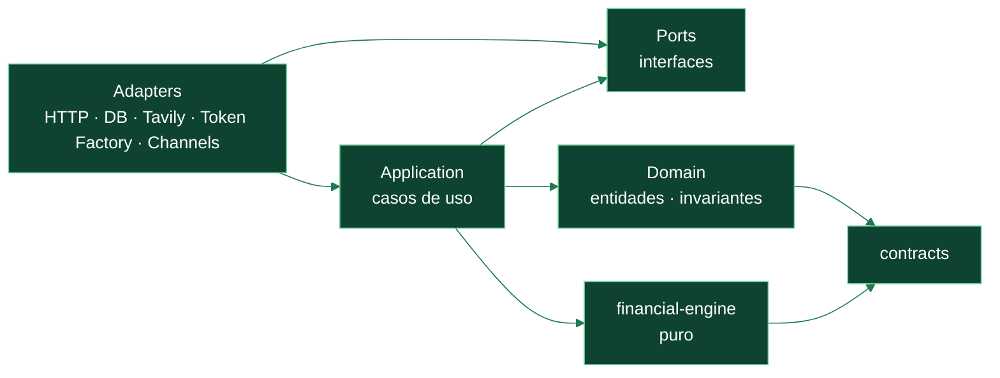
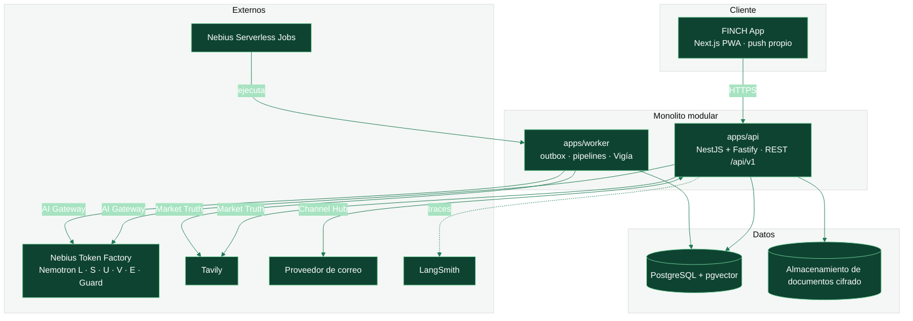

# Arquitectura de software y método de ingeniería de FINCH

> **Estado:** PROPUESTO (ADR-0040) · **Fecha:** 2026-09-28 · **Autoridad superior:**
> [CONSTITUTION.md](CONSTITUTION.md) y ADRs aceptados.
> Este documento concreta **cómo** se construye FINCH: estilo arquitectónico, módulos, capas,
> componentes de IA gobernados por **CRISP-ML(Q)**, prácticas de **Extreme Programming (XP)** y
> cadencia **Agile** para un equipo de dos fundadores con herramientas de IA.

---

## 1. Estilo arquitectónico

FINCH combina cinco patrones, cada uno con una razón concreta:

| Patrón                                                     | Dónde                         | Por qué                                                                                                                |
| ---------------------------------------------------------- | ----------------------------- | ---------------------------------------------------------------------------------------------------------------------- |
| **Monolito modular** con fronteras desplegables (ADR-0001) | `apps/api` + `apps/worker`    | Transacciones ACID donde importan, un solo despliegue para dos personas, extracción futura posible.                    |
| **Hexagonal (ports & adapters)**                           | Cada módulo                   | El dominio no conoce NestJS, Drizzle, Tavily ni Token Factory; los proveedores se cambian sin tocar reglas (ADR-0022). |
| **DDD — bounded contexts**                                 | Módulos por contexto (§3)     | Cada contexto posee sus invariantes y tablas; sin lecturas cruzadas de base de datos.                                  |
| **Functional core, imperative shell**                      | `packages/financial-engine`   | Toda la matemática es pura, determinista y testeable; el I/O vive fuera (ADR-0017).                                    |
| **Eventos con outbox + CQRS ligero**                       | Worker, Vigía, notificaciones | Consumidores idempotentes, entrega at-least-once, vistas de lectura para pantallas (Constitución §21, §88).            |

### Regla de dependencias (verificada por `pnpm architecture:check`)



Las flechas indican "depende de". **Nunca** al revés. Una violación rompe el CI.

## 2. Vista de contenedores (C4 nivel 2)



## 3. Bounded contexts → módulos → funciones del catálogo

Cada módulo vive como carpeta en `apps/api/src/modules/<contexto>/` con las capas
`domain/ · application/ · ports/ · adapters/` y su `README.md` (Constitución §98).

| Contexto                                                      | Responsabilidad                                                   | Funciones (08)     | Paquetes que usa                           |
| ------------------------------------------------------------- | ----------------------------------------------------------------- | ------------------ | ------------------------------------------ |
| `identity` · `workspaces` · `authorization` · `consent`       | Principal, Party, Workspace, Membership, permisos, consentimiento | A8, F1, F3         | `authorization`, `contracts`               |
| `financial-twin`                                              | Hechos con clase de verdad, snapshots inmutables                  | A1                 | `domain`, `db`                             |
| `accounts` · `transactions` · `categorization` · `recurrence` | Cuentas, movimientos, normalización, recurrentes                  | E4, D2, D3         | `financial-engine`, `ai-core`              |
| `income` · `planning` · `budgeting`                           | Ingresos, Payday Autopilot, sobres, cierre                        | B1, B2, B5, B6     | `financial-engine`                         |
| `credit-cards` · `debts`                                      | Tarjetas, deudas, usura, compra de cartera                        | B3, D1             | `financial-engine`, `jurisdictions/*`      |
| `calendar`                                                    | Pagos, cortes, vencimientos, .ics                                 | B4, H2             | —                                          |
| `simulation` · `forecasting` · `goals`                        | Afford, ¿y si…?, tormenta, metas, inversión                       | C1–C5              | `financial-engine`                         |
| `health` · `networth`                                         | Salud financiera, patrimonio                                      | B7, B8             | `financial-engine`                         |
| `market` (Market Truth)                                       | Tasas, productos, FX, remesas, planes, DIAN                       | D1, D4, D5, F5, G3 | `provider-sdk` (adapter Tavily)            |
| `documents` (captura + bóveda)                                | Recibos, facturas, bóveda, vencimientos                           | E1, E2             | `ai-core`, almacenamiento                  |
| `query`                                                       | Buscador NL → DSL acotado                                         | E3                 | `ai-core`                                  |
| `household`                                                   | Gastos compartidos, liquidación                                   | F1                 | `financial-engine`, `authorization`        |
| `protection`                                                  | Radar de protección                                               | F2                 | `financial-engine`                         |
| `rights` (casos)                                              | Copiloto de derechos, documentos, plazos                          | F4                 | `ai-core`                                  |
| `tax`                                                         | Impuestos por jurisdicción                                        | F5                 | `jurisdictions/*`                          |
| `habits`                                                      | Compromisos y hábitos                                             | G1                 | —                                          |
| `decision-cards` · `actions`                                  | Cards, segunda opinión, borradores R2                             | A5, A6             | `ai-core`                                  |
| `assistant` (agente)                                          | Orquestación, skills, recibos, memoria                            | A3, A4, A7         | `ai-core`                                  |
| `notifications` · `channels`                                  | Bandeja, push, correo, briefing (Channel Hub)                     | G2, H1–H3          | adapters por canal                         |
| `watcher` (Vigía)                                             | Job diario, eventos, cards proactivas                             | A11                | worker                                     |
| `audit` · `observability`                                     | Auditoría, métricas, traces                                       | A8, A9             | `observability`                            |
| `jurisdictions`                                               | Reglas por país (fuera del core)                                  | G4, F5, A10        | `jurisdictions/CO`, `jurisdictions/<D-11>` |

**Reglas de módulo:** un módulo solo expone su API de aplicación y eventos; nunca lee tablas de otro
módulo; toda comunicación cruzada es por llamada a caso de uso o evento del outbox.

## 4. Subsistema de IA

```text
Petición → AI Gateway (packages/ai-core)
  ├─ Clasificación de datos + redacción de PII
  ├─ Router por niveles (L · S · U · V · E · Guard) + fallback
  ├─ Prompt registry versionado
  ├─ Validación de esquema (zod) de toda salida
  ├─ Verificador de recibos (ninguna cifra sin recibo)
  ├─ Presupuesto (día / sesión) + kill switch
  └─ Auditoría ai_calls + traces redactados (LangSmith)
```

Detalle completo en `docs/hackathon/04-ai-design-safety-evals.md`.

## 5. CRISP-ML(Q) — ciclo de vida de los componentes de IA

FINCH trata cada componente de IA como un **producto de ML con aseguramiento de calidad**, siguiendo
las seis fases de CRISP-ML(Q) (Cross-Industry Standard Process for Machine Learning with Quality
assurance). Aunque usamos modelos preentrenados (Nemotron) y no entrenamos desde cero, las fases
aplican a la selección de modelo, prompts, datos de evaluación, despliegue y monitoreo.

### Componentes de IA gobernados

| ID    | Componente                                    | Tipo                       | Modelo       |
| ----- | --------------------------------------------- | -------------------------- | ------------ |
| ML-1  | Router de intención y extracción de entidades | Clasificación / extracción | L            |
| ML-2  | Lectura de notificaciones bancarias y correos | Extracción estructurada    | L            |
| ML-3  | Extracción de recibos, facturas y documentos  | Extracción multimodal      | V            |
| ML-4  | Normalización de comercios y categorías       | Clasificación              | L            |
| ML-5  | Agente con skills (tool calling)              | Orquestación               | S            |
| ML-6  | Buscador NL → DSL                             | Traducción semántica       | S            |
| ML-7  | Segunda opinión                               | Juez/auditor               | U            |
| ML-8  | Memoria semántica                             | Recuperación               | E            |
| ML-9  | Línea base de anomalías por usuario           | Estadística (no LLM)       | determinista |
| ML-10 | Seguridad de entradas/salidas                 | Clasificación              | Guard        |

### Fases, entregables y compuertas de calidad

| Fase CRISP-ML(Q)                     | Qué hacemos en FINCH                                                                                                                        | Entregable (en el repo)                                                                                     | Compuerta de calidad (Q)                                                                                   |
| ------------------------------------ | ------------------------------------------------------------------------------------------------------------------------------------------- | ----------------------------------------------------------------------------------------------------------- | ---------------------------------------------------------------------------------------------------------- |
| **1. Business & Data Understanding** | Definir la tarea, el éxito en términos de negocio, riesgos y límites (qué NO decide la IA).                                                 | Ficha del componente `docs/ml/<ML-x>.md`: objetivo, métrica, umbral, riesgos, clase de verdad de la salida. | Aprobada por ambos fundadores; riesgo evaluado (R0–R4).                                                    |
| **2. Data Engineering**              | Datasets sintéticos y de evaluación (personas, recibos, notificaciones, preguntas), sin PII real; esquema de entrada/salida.                | `evals/datasets/<ML-x>.jsonl` + `fixtures/` versionados.                                                    | Sin PII (verificación automática); cobertura de casos límite y adversariales ≥ 20 %.                       |
| **3. Model Engineering**             | Selección de modelo por nivel, diseño de prompt, few-shot, esquema de salida estructurada, parámetros; comparativa entre modelos.           | `packages/ai-core/prompts/<id>/<version>.md` con resultados.                                                | El candidato supera el umbral de la fase 1 en el set de desarrollo.                                        |
| **4. Evaluation**                    | Evaluación offline (batch inference), humana (Toloka) y con juez (U); robustez y seguridad.                                                 | `evals/RESULTS.md` con métricas por versión.                                                                | Umbral cumplido en set de prueba separado; E4 ≥ 95 %; sin regresiones > 2 pp.                              |
| **5. Deployment**                    | Activación por configuración (feature flag), rollout, fallback por nivel, presupuesto.                                                      | Cambio de configuración revisado + nota de versión.                                                         | Health check en producción; fallback probado; costo por turno dentro del presupuesto.                      |
| **6. Monitoring & Maintenance**      | Métricas en vivo (errores de esquema, rechazos del verificador, fallbacks, latencia, costo), muestreo para revisión, re-evaluación semanal. | Tablero + informe semanal en la retro.                                                                      | Alertas definidas; si una métrica cruza el umbral → vuelta a la fase 3 con nueva versión de prompt/modelo. |

**Regla:** ningún componente ML llega a producción sin pasar las compuertas 1–5, y cualquier cambio de
modelo o prompt crea una **versión nueva** (nunca se edita en sitio), igual que las fórmulas.

## 6. Extreme Programming (XP) adaptado a FINCH

| Práctica XP                  | Cómo la aplicamos                                                                                                                                                                        |
| ---------------------------- | ---------------------------------------------------------------------------------------------------------------------------------------------------------------------------------------- |
| **Planning game**            | Lunes: se eligen las historias de la semana desde el catálogo (08) según valor; cada una con estimación en horas.                                                                        |
| **Small releases**           | Cada merge a la rama de etapa despliega a _preview_; cada hito semanal va a `main` y al demo público.                                                                                    |
| **Metáfora del sistema**     | "Un CFO personal que muestra sus recibos": guía nombres, UX y decisiones.                                                                                                                |
| **Diseño simple**            | Lo mínimo que cumple la historia y sus invariantes; nada especulativo (Constitución §4.19).                                                                                              |
| **TDD**                      | **Obligatorio** en `financial-engine`, `authorization`, verificador de recibos y DSL de consulta: test (golden vector o caso de autorización) antes del código. Recomendado en el resto. |
| **Refactorización continua** | En cada PR, dejar el código mejor que como se encontró, sin mezclar refactor con lógica financiera en el mismo diff.                                                                     |
| **Programación en parejas**  | Pareja humana para lo crítico (motor, autorización, verificador, dinero compartido); pareja humano + IA (Claude/Cursor) para el resto, con revisión obligatoria del otro humano.         |
| **Propiedad colectiva**      | Cualquiera puede cambiar cualquier módulo, con revisión del otro; CODEOWNERS exige revisión en áreas críticas.                                                                           |
| **Integración continua**     | `pnpm check` local antes de cada push; CI en cada PR (lint, tipos, arquitectura, tests, seguridad).                                                                                      |
| **Ritmo sostenible**         | Jornadas de 8+ h con pausas; un bloque de descanso semanal fijo; nada de "noches heroicas" antes del freeze.                                                                             |
| **Cliente en sitio**         | Los fundadores rotan el rol de _Product Owner_ por semana; las personas sintéticas y 5 testers externos validan cada hito.                                                               |
| **Estándares de código**     | ESLint + reglas de la Constitución FINCH, Prettier, TypeScript estricto, Conventional Commits.                                                                                           |

## 7. Cadencia Agile

- **Sprint = 1 semana = 1 etapa** (S0–S4), alineado con los hitos de `docs/hackathon/05`.
- **Ceremonias:**
  - **Planning** (lunes, 60 min): objetivo del sprint + historias + riesgos.
  - **Daily** (15 min): ayer / hoy / bloqueos; revisar el tablero.
  - **Review** (domingo, 45 min): demo en la URL pública contra el hito; decisión de contingencia (05 §5).
  - **Retro** (domingo, 30 min): qué mantener / cambiar / probar + métricas ML (CRISP-ML(Q) fase 6).
- **Tablero Kanban** (GitHub Projects): `Backlog → Ready → In progress → In review → Done`, con
  **WIP máximo 2 por persona**.
- **Historias** con formato: _"Como [persona], quiero [capacidad] para [beneficio]"_ + criterios de
  aceptación del catálogo (08) + ID de función.
- **Definition of Ready:** criterios de aceptación claros, fórmula/skill identificada, diseño
  disponible si es UI, riesgo R0–R4 asignado.
- **Definition of Done:** ver `README-DEVELOPERS.md` §9 y Constitución §75.
- **Métricas:** burn-up de funciones H, % de hitos cumplidos, tiempo de ciclo de PR, métricas de
  evals.

## 8. Estrategia de ramas

Ver ADR-0040 y `README-DEVELOPERS.md` §6. Resumen:

```text
main                               siempre desplegable; solo recibe merges de hito (etapas)
└─ stage/sN-<nombre>               integración semanal (vive ≤ 7 días)
   ├─ area/design                  sistema de diseño (web · móvil · escritorio)
   ├─ area/backend                 API · worker · motor · IA · datos
   ├─ area/web                     Next.js PWA (+ admin)
   ├─ area/mobile                  Expo: iOS · Android
   └─ area/desktop                 Tauri: Windows · macOS · Linux
      └─ feat|fix|test|chore|docs/sN-<slug>   tarea corta (≤ 2 días), PR a su área
release/v0.1.0-hackathon           se corta en el freeze (27-oct) desde main
next                               desarrollo tras el envío (31-oct → 15-dic)
```

### Plataformas cliente

| Plataforma              | Stack                           | Paquetes compartidos                                    | Alcance hackathon                                                                                  |
| ----------------------- | ------------------------------- | ------------------------------------------------------- | -------------------------------------------------------------------------------------------------- |
| Web / PWA               | Next.js (ADR-0005)              | `design-tokens`, `ui-web`, `api-client`, `contracts`    | Completa — superficie principal del demo                                                           |
| iOS · Android           | React Native + Expo (ADR-0004)  | `design-tokens`, `ui-mobile`, `api-client`, `contracts` | Shell funcional (Hoy, bandeja, recibos, captura con cámara) y builds si hay tiempo; completa en P1 |
| Windows · macOS · Linux | Tauri 2 + React/Vite (ADR-0006) | `design-tokens`, `ui-web`, `api-client`, `contracts`    | Shell funcional (Hoy, bandeja, recibos, importación) y builds si hay tiempo; completa en P1        |

Las tres consumen la misma API y los mismos contratos: la lógica financiera **nunca** se duplica en
un cliente.
