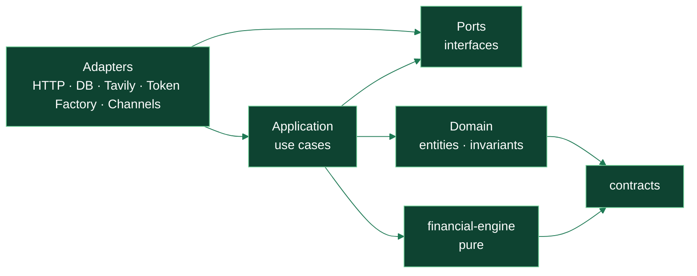
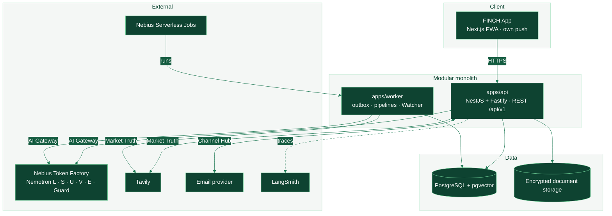

# FINCH software architecture and engineering method

> **Status:** PROPOSED (ADR-0040) · **Date:** 2026-09-28 · **Higher authority:**
> [CONSTITUTION.md](CONSTITUTION.md) and accepted ADRs.
> This document makes concrete **how** FINCH is built: architectural style, modules, layers, AI
> components governed by **CRISP-ML(Q)**, **Extreme Programming (XP)** practices and an **Agile**
> cadence for a two-founder team working with AI tools.

---

## 1. Architectural style

FINCH combines five patterns, each for a concrete reason:

| Pattern                                                    | Where                          | Why                                                                                                                       |
| ---------------------------------------------------------- | ------------------------------ | ------------------------------------------------------------------------------------------------------------------------- |
| **Modular monolith** with deployable boundaries (ADR-0001) | `apps/api` + `apps/worker`     | ACID transactions where they matter, a single deployment for two people, future extraction possible.                      |
| **Hexagonal (ports & adapters)**                           | Every module                   | The domain knows nothing of NestJS, Drizzle, Tavily or Token Factory; providers change without touching rules (ADR-0022). |
| **DDD — bounded contexts**                                 | Modules per context (§3)       | Each context owns its invariants and tables; no cross-database reads.                                                     |
| **Functional core, imperative shell**                      | `packages/financial-engine`    | All the math is pure, deterministic and testable; I/O lives outside (ADR-0017).                                           |
| **Events with outbox + light CQRS**                        | Worker, Watcher, notifications | Idempotent consumers, at-least-once delivery, read views for screens (Constitution §21, §88).                             |

### Dependency rule (verified by `pnpm architecture:check`)



Arrows mean "depends on". **Never** the reverse. A violation breaks CI.

## 2. Container view (C4 level 2)



## 3. Bounded contexts → modules → catalog features

Each module lives as a folder in `apps/api/src/modules/<context>/` with the layers
`domain/ · application/ · ports/ · adapters/` and its `README.md` (Constitution §98).

| Context                                                       | Responsibility                                                | Features (08)      | Packages used                              |
| ------------------------------------------------------------- | ------------------------------------------------------------- | ------------------ | ------------------------------------------ |
| `identity` · `workspaces` · `authorization` · `consent`       | Principal, Party, Workspace, Membership, permissions, consent | A8, F1, F3         | `authorization`, `contracts`               |
| `financial-twin`                                              | Facts with truth class, immutable snapshots                   | A1                 | `domain`, `db`                             |
| `accounts` · `transactions` · `categorization` · `recurrence` | Accounts, transactions, normalization, recurring charges      | E4, D2, D3         | `financial-engine`, `ai-core`              |
| `income` · `planning` · `budgeting`                           | Income, Payday Autopilot, envelopes, close                    | B1, B2, B5, B6     | `financial-engine`                         |
| `credit-cards` · `debts`                                      | Cards, debts, usury, balance transfer                         | B3, D1             | `financial-engine`, `jurisdictions/*`      |
| `calendar`                                                    | Payments, cut-offs, expiries, .ics                            | B4, H2             | —                                          |
| `simulation` · `forecasting` · `goals`                        | Afford, what if…, storm, goals, investment                    | C1–C5              | `financial-engine`                         |
| `health` · `networth`                                         | Financial health, net worth                                   | B7, B8             | `financial-engine`                         |
| `market` (Market Truth)                                       | Rates, products, FX, remittances, plans, DIAN                 | D1, D4, D5, F5, G3 | `provider-sdk` (Tavily adapter)            |
| `documents` (capture + vault)                                 | Receipts, invoices, vault, expiries                           | E1, E2             | `ai-core`, storage                         |
| `query`                                                       | NL search → bounded DSL                                       | E3                 | `ai-core`                                  |
| `household`                                                   | Shared expenses, settlement                                   | F1                 | `financial-engine`, `authorization`        |
| `protection`                                                  | Protection radar                                              | F2                 | `financial-engine`                         |
| `rights` (cases)                                              | Rights copilot, documents, deadlines                          | F4                 | `ai-core`                                  |
| `tax`                                                         | Taxes per jurisdiction                                        | F5                 | `jurisdictions/*`                          |
| `habits`                                                      | Commitments and habits                                        | G1                 | —                                          |
| `decision-cards` · `actions`                                  | Cards, second opinion, R2 drafts                              | A5, A6             | `ai-core`                                  |
| `assistant` (agent)                                           | Orchestration, skills, receipts, memory                       | A3, A4, A7         | `ai-core`                                  |
| `notifications` · `channels`                                  | Inbox, push, email, briefing (Channel Hub)                    | G2, H1–H3          | per-channel adapters                       |
| `watcher`                                                     | Daily job, events, proactive cards                            | A11                | worker                                     |
| `audit` · `observability`                                     | Audit, metrics, traces                                        | A8, A9             | `observability`                            |
| `jurisdictions`                                               | Per-country rules (outside the core)                          | G4, F5, A10        | `jurisdictions/CO`, `jurisdictions/<D-11>` |

**Module rules:** a module exposes only its application API and events; it never reads another
module's tables; all cross-module communication is a use-case call or an outbox event.

## 4. AI subsystem

```text
Request → AI Gateway (packages/ai-core)
  ├─ Data classification + PII redaction
  ├─ Tiered router (L · S · U · V · E · Guard) + fallback
  ├─ Versioned prompt registry
  ├─ Schema validation (zod) of every output
  ├─ Receipt verifier (no figure without a receipt)
  ├─ Budget (day / session) + kill switch
  └─ ai_calls audit + redacted traces (LangSmith)
```

Full detail in `docs/hackathon/04-ai-design-safety-evals.md`.

## 5. CRISP-ML(Q) — lifecycle of the AI components

FINCH treats every AI component as an **ML product with quality assurance**, following the six
phases of CRISP-ML(Q) (Cross-Industry Standard Process for Machine Learning with Quality assurance).
Although we use pre-trained models (Nemotron) and do not train from scratch, the phases apply to
model selection, prompts, evaluation data, deployment and monitoring.

### Governed AI components

| ID    | Component                                | Type                        | Model         |
| ----- | ---------------------------------------- | --------------------------- | ------------- |
| ML-1  | Intent router and entity extraction      | Classification / extraction | L             |
| ML-2  | Reading bank notifications and emails    | Structured extraction       | L             |
| ML-3  | Receipt, invoice and document extraction | Multimodal extraction       | V             |
| ML-4  | Merchant and category normalization      | Classification              | L             |
| ML-5  | Agent with skills (tool calling)         | Orchestration               | S             |
| ML-6  | NL search → DSL                          | Semantic translation        | S             |
| ML-7  | Second opinion                           | Judge/auditor               | U             |
| ML-8  | Semantic memory                          | Retrieval                   | E             |
| ML-9  | Per-user anomaly baseline                | Statistics (not an LLM)     | deterministic |
| ML-10 | Input/output safety                      | Classification              | Guard         |

### Phases, deliverables and quality gates

| CRISP-ML(Q) phase                    | What we do in FINCH                                                                                                     | Deliverable (in the repo)                                                                    | Quality gate (Q)                                                                                     |
| ------------------------------------ | ----------------------------------------------------------------------------------------------------------------------- | -------------------------------------------------------------------------------------------- | ---------------------------------------------------------------------------------------------------- |
| **1. Business & Data Understanding** | Define the task, success in business terms, risks and limits (what AI does NOT decide).                                 | Component card `docs/ml/<ML-x>.md`: objective, metric, threshold, risks, output truth class. | Approved by both founders; risk assessed (R0–R4).                                                    |
| **2. Data Engineering**              | Synthetic and evaluation datasets (personas, receipts, notifications, questions), no real PII; input/output schema.     | Versioned `evals/datasets/<ML-x>.jsonl` + `fixtures/`.                                       | No PII (automatic check); edge and adversarial coverage ≥ 20 %.                                      |
| **3. Model Engineering**             | Model selection per tier, prompt design, few-shot, structured output schema, parameters; comparison across models.      | `packages/ai-core/prompts/<id>/<version>.md` with results.                                   | The candidate beats the phase 1 threshold on the development set.                                    |
| **4. Evaluation**                    | Offline evaluation (batch inference), human (Toloka) and judge-based (U); robustness and safety.                        | `evals/RESULTS.md` with metrics per version.                                                 | Threshold met on a separate test set; E4 ≥ 95 %; no regressions > 2 pp.                              |
| **5. Deployment**                    | Activation by configuration (feature flag), rollout, per-tier fallback, budget.                                         | Reviewed configuration change + release note.                                                | Production health check; fallback tested; cost per turn within budget.                               |
| **6. Monitoring & Maintenance**      | Live metrics (schema errors, verifier rejections, fallbacks, latency, cost), sampling for review, weekly re-evaluation. | Dashboard + weekly report in the retro.                                                      | Alerts defined; if a metric crosses its threshold → back to phase 3 with a new prompt/model version. |

**Rule:** no ML component reaches production without passing gates 1–5, and any model or prompt change
creates a **new version** (never edited in place), just like formulas.

## 6. Extreme Programming (XP) adapted to FINCH

| XP practice                | How we apply it                                                                                                                                                              |
| -------------------------- | ---------------------------------------------------------------------------------------------------------------------------------------------------------------------------- |
| **Planning game**          | Monday: the week's stories are chosen from the catalog (08) by value; each with an estimate in hours.                                                                        |
| **Small releases**         | Every merge to the stage branch deploys to _preview_; every weekly milestone goes to `main` and the public demo.                                                             |
| **System metaphor**        | "A personal CFO who shows their receipts": guides names, UX and decisions.                                                                                                   |
| **Simple design**          | The minimum that satisfies the story and its invariants; nothing speculative (Constitution §4.19).                                                                           |
| **TDD**                    | **Mandatory** in `financial-engine`, `authorization`, the receipt verifier and the query DSL: test (golden vector or authorization case) before code. Recommended elsewhere. |
| **Continuous refactoring** | In every PR, leave the code better than you found it, without mixing refactoring with financial logic in the same diff.                                                      |
| **Pair programming**       | Human pairs for the critical parts (engine, authorization, verifier, shared money); human + AI pairs (Claude/Cursor) for the rest, with mandatory review by the other human. |
| **Collective ownership**   | Anyone may change any module, with the other's review; CODEOWNERS requires review in critical areas.                                                                         |
| **Continuous integration** | `pnpm check` locally before every push; CI on every PR (lint, types, architecture, tests, security).                                                                         |
| **Sustainable pace**       | 8+ h days with breaks; a fixed weekly rest block; no "heroic nights" before the freeze.                                                                                      |
| **On-site customer**       | The founders rotate the _Product Owner_ role weekly; synthetic personas and 5 external testers validate each milestone.                                                      |
| **Coding standards**       | ESLint + FINCH Constitution rules, Prettier, strict TypeScript, Conventional Commits.                                                                                        |

## 7. Agile cadence

- **Sprint = 1 week = 1 stage** (S0–S4), aligned with the milestones in `docs/hackathon/05`.
- **Ceremonies:**
  - **Planning** (Monday, 60 min): sprint goal + stories + risks.
  - **Daily** (15 min): yesterday / today / blockers; review the board.
  - **Review** (Sunday, 45 min): demo at the public URL against the milestone; contingency decision
    (05 §5).
  - **Retro** (Sunday, 30 min): keep / change / try + ML metrics (CRISP-ML(Q) phase 6).
- **Kanban board** (GitHub Projects): `Backlog → Ready → In progress → In review → Done`, with **WIP
  at most 2 per person**.
- **Stories** in the format _"As [persona], I want [capability] so that [benefit]"_ + acceptance
  criteria from the catalog (08) + feature ID.
- **Definition of Ready:** clear acceptance criteria, formula/skill identified, design available if
  it is UI, risk tier R0–R4 assigned.
- **Definition of Done:** see `README-DEVELOPERS.md` §9 and Constitution §75.
- **Metrics:** burn-up of H features, % of milestones met, PR cycle time, eval metrics.

## 8. Branching strategy

See ADR-0040 and `README-DEVELOPERS.md` §6. Summary:

```text
main                               always deployable; receives only milestone merges (stages)
└─ stage/sN-<name>                 weekly integration (lives ≤ 7 days)
   ├─ area/design                  design system (web · mobile · desktop)
   ├─ area/backend                 API · worker · engine · AI · data
   ├─ area/web                     Next.js PWA (+ admin)
   ├─ area/mobile                  Expo: iOS · Android
   └─ area/desktop                 Tauri: Windows · macOS · Linux
      └─ feat|fix|test|chore|docs/sN-<slug>   short task (≤ 2 days), PR to its area
release/v0.1.0-hackathon           cut at the freeze (27 Oct) from main
next                               development after submission (31 Oct → 15 Dec)
```

### Client platforms (delivery order: web → Windows → Android → macOS + iOS)

| Phase | Platform    | Stack                           | Shared packages                                         | Window                   |
| ----- | ----------- | ------------------------------- | ------------------------------------------------------- | ------------------------ |
| 1     | Web / PWA   | Next.js (ADR-0005)              | `design-tokens`, `ui-web`, `api-client`, `contracts`    | Hackathon (until 29 Oct) |
| 2     | Windows     | Tauri 2 + React/Vite (ADR-0006) | `design-tokens`, `ui-web`, `api-client`, `contracts`    | Nov 2026                 |
| 3     | Android     | React Native + Expo (ADR-0004)  | `design-tokens`, `ui-mobile`, `api-client`, `contracts` | Nov–Dec 2026             |
| 4     | macOS · iOS | Tauri 2 · Expo                  | the same                                                | Jan 2027                 |

Task detail: `docs/delivery/DELEGATION.md`; front-end architecture:
`docs/design/FRONTEND-ARCHITECTURE.md`.

All clients consume the same API and the same contracts: financial logic is **never** duplicated in a
client.
