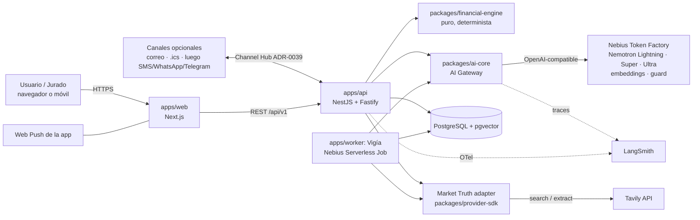

# 03 — Arquitectura del demo y uso del stack Nebius / NVIDIA

Principio: **la arquitectura objetivo de FINCH no cambia; la topología desplegada sí se reduce**
(README §6: "la topología desplegada debe ser la mínima que satisfaga correctamente el workload
actual"). El demo usa los mismos paquetes y fronteras del monorepo. No se crea un repo "de juguete".

> **VERIFICAR:** todo lo marcado así debe confirmarse contra la documentación oficial o la consola
> antes de implementarlo (AGENTS.md §7: nunca inventar versiones, APIs ni flags). Los IDs de modelo
> se confirman con `GET https://api.tokenfactory.nebius.com/v1/models` usando la llave del equipo.

---

## 1. Vista de contexto

## 2. Componentes y su lugar en el monorepo

| Componente      | Ubicación                                         | Responsabilidad en la hackathon                                                                                                 | Frontera que NO se rompe                                                               |
| --------------- | ------------------------------------------------- | ------------------------------------------------------------------------------------------------------------------------------- | -------------------------------------------------------------------------------------- |
| Web             | `apps/web` (Next.js, ADR-0005)                    | UI completa, i18n, recibos, Decision Cards.                                                                                     | No llama a Token Factory ni a Tavily directamente: las llaves nunca llegan al cliente. |
| API             | `apps/api` (NestJS/Fastify, ADR-0007)             | REST, orquestación del agente, sesiones de demo, Channel Hub (ADR-0039): bandeja, web push, .ics, correo.                       | Autorización por workspace en backend (ADR-0010/0011, versión mínima).                 |
| Worker / Vigía  | `apps/worker`                                     | Job del Vigía, empaquetado como contenedor para Nebius Serverless Jobs.                                                         | Idempotente (clave `workspace_id + fecha`), at-least-once (Constitución §4.12–13).     |
| Motor           | `packages/financial-engine`                       | Todas las fórmulas de [colombia-credit.md](../financial-formulas/colombia-credit.md).                                           | Puro: sin I/O ni SDKs (ADR-0017, dependency-cruiser).                                  |
| Jurisdicción CO | `jurisdictions/CO`                                | Convenciones de tasas, festivos, copy legal y fuentes oficiales permitidas.                                                     | Las reglas colombianas no entran al core global (README §36).                          |
| AI Gateway      | `packages/ai-core`                                | Ruteo por niveles, redacción de PII, registro de prompts, validación de esquema, verificador numérico, presupuesto y auditoría. | Única ruta hacia modelos (ADR-0018). La salida siempre es `GENERATED_NARRATIVE`.       |
| Market Truth    | `packages/provider-sdk` (puerto) + adapter Tavily | Búsqueda y extracción con lista blanca, parseo determinista, caché y procedencia.                                               | El SDK del proveedor vive solo en el adapter (ADR-0022).                               |
| Contratos       | `packages/contracts`                              | `CalcReceipt`, `DecisionCard`, `SkillDefinition`, eventos.                                                                      | Sin dependencias a otros paquetes.                                                     |
| DB              | `packages/db` (Drizzle)                           | Esquema mínimo: principals/workspaces demo, twin facts, snapshots, receipts, cards, memories, audit, vigia_runs.                | Solo `packages/db` toca el driver.                                                     |
| Observabilidad  | `packages/observability`                          | OTel + logs estructurados; exportador hacia LangSmith.                                                                          | Nunca PII ni montos crudos en analítica (AGENTS.md §4).                                |

> El Channel Hub (ADR-0039) y usar Tavily como proveedor son decisiones que README §76 obliga a registrar
> (nuevo _core vendor_ y nueva frontera de confianza): quedan en ADR-0035/0036.

## 3. Topología de despliegue del demo (detalle en ADR-0038)

### Topología A: preferida, máximo uso de Nebius

| Pieza                    | Dónde                                                                                                 | Notas                                                                                                                                                                                                 |
| ------------------------ | ----------------------------------------------------------------------------------------------------- | ----------------------------------------------------------------------------------------------------------------------------------------------------------------------------------------------------- |
| Inferencia               | **Nebius Token Factory** (serverless, por token)                                                      | Obligatorio. `NEBIUS_BASE_URL=https://api.tokenfactory.nebius.com/v1/`.                                                                                                                               |
| Vigía                    | **Nebius Serverless Jobs**                                                                            | Contenedor de `apps/worker`. **VERIFICAR:** si los Jobs admiten cron nativo; si no, un GitHub Actions `schedule` lanza el job con la CLI de Nebius (credencial de servicio con el mínimo privilegio). |
| Web + API                | **Nebius Serverless Endpoint** con contenedor HTTP, o VM pequeña en Nebius AI Cloud                   | **VERIFICAR:** si los Serverless Endpoints aceptan un contenedor HTTP genérico solo-CPU y su costo por 11 semanas encendido (hasta el 15-dic).                                                        |
| PostgreSQL               | **Nebius Managed PostgreSQL** (VERIFICAR disponibilidad, pgvector y costo), o Postgres en la misma VM | Backups diarios.                                                                                                                                                                                      |
| Inferencia privada (C-1) | **Nebius Serverless Endpoint** con Nemotron Lightning                                                 | Solo si hay crédito de AI Cloud; es opcional.                                                                                                                                                         |

### Topología B: fallback de bajo costo y alta estabilidad

- Web + API: Railway / Render / Fly.io (un contenedor, _always-on_).
- Postgres: Neon o Supabase (plan con pgvector).
- Vigía: GitHub Actions cron → endpoint interno autenticado. **O** Nebius Serverless Job si está
  verificado (se conserva "deployed/run using Nebius AI Cloud compute").
- Inferencia: Token Factory (el requisito de "runs on Nebius" se cumple por la llamada en runtime).

**Regla de decisión (tarea S0-06, fecha límite viernes 2-oct):** si la Topología A cuesta más de lo
que cubren los créditos disponibles para AI Cloud **o** no puede garantizar disponibilidad continua
hasta el 15-dic, se usa B para web/API/DB y se mantiene el Vigía en Nebius Serverless Jobs.

## 4. Mapa de herramientas: qué se usa, para qué y con qué crédito

| Herramienta                                                                                                                                  | Fuente del crédito                                                                                       | Uso en FINCH                                                                                                                                                   | Criterio de jurado que alimenta       |
| -------------------------------------------------------------------------------------------------------------------------------------------- | -------------------------------------------------------------------------------------------------------- | -------------------------------------------------------------------------------------------------------------------------------------------------------------- | ------------------------------------- |
| **Nebius Token Factory**: Nemotron 3.5 Lightning (30B/3B activos, 1M ctx)                                                                    | USD 25 (promo `NEBIUS-DEVPOST-GLOBAL26`) + USD 25 (Builders Program)                                     | Router de intención, clasificación, extracción de texto, respuestas rápidas, lectura de notificaciones bancarias, briefing. Es **la mayoría de las llamadas**. | Tech Impl., Idea                      |
| Token Factory: **Nemotron 3 Super 120B-A12B**                                                                                                | idem                                                                                                     | Agente orquestador con tool calling y structured outputs; narrativa de Decision Cards.                                                                         | Tech Impl.                            |
| Token Factory: **Nemotron 3 Ultra 550B-A55B**                                                                                                | idem                                                                                                     | Segunda opinión auditora (solo en Decision Cards y acciones) y juez en evals. Uso escaso y medido.                                                             | Idea, Tech Impl.                      |
| Token Factory: modelo multimodal Nemotron (Nano VL u Omni; **VERIFICAR** disponibilidad)                                                     | idem                                                                                                     | Extracción de ofertas y extractos en imagen o PDF escaneado (S-2).                                                                                             | Design, Tech Impl.                    |
| Token Factory: **embeddings** (p. ej. `Qwen/Qwen3-Embedding-8B`; **VERIFICAR** si existe un embedding NVIDIA disponible y preferirlo)        | idem                                                                                                     | Memoria semántica (pgvector).                                                                                                                                  | Tech Impl.                            |
| Token Factory: **guard model** (p. ej. `meta-llama/Llama-Guard-3-8B`; **VERIFICAR** si hay un Nemotron safety guard disponible y preferirlo) | idem                                                                                                     | Clasificación de seguridad de entradas y salidas.                                                                                                              | Tech Impl.                            |
| Token Factory: **structured outputs + function calling**                                                                                     | —                                                                                                        | Contratos del agente.                                                                                                                                          | Tech Impl.                            |
| Token Factory: **batch inference** (~50 % menos costo, resultados < 24 h)                                                                    | idem                                                                                                     | Correr las evals E2–E6 completas.                                                                                                                              | Tech Impl.                            |
| Token Factory: **post-training / LoRA** (C-2)                                                                                                | idem                                                                                                     | Extractor de ofertas colombianas especializado. Opcional.                                                                                                      | Idea                                  |
| **Nebius AI Cloud: Serverless Jobs**                                                                                                         | Créditos AI Cloud (**VERIFICAR** si el Builders Program o la promo cubren AI Cloud o solo Token Factory) | Vigía siempre activo.                                                                                                                                          | Personal AI ("always-on"), Tech Impl. |
| Nebius AI Cloud: Serverless Endpoints                                                                                                        | idem                                                                                                     | Web/API (Topología A) e inferencia privada (C-1).                                                                                                              | Personal AI ("private")               |
| **Tavily**                                                                                                                                   | USD 25 (Builders) + código `BBDEVPOST` (**VERIFICAR** vigencia)                                          | Market Truth: usura, tasas de referencia, ofertas. Search + Extract.                                                                                           | **Best Use of Tavily**, Impact        |
| **LangSmith**                                                                                                                                | USD 100 (Builders)                                                                                       | Tracing de cada turno del agente, datasets de eval y comparación de versiones de prompts.                                                                      | Tech Impl. (evidencia visible)        |
| **Toloka**                                                                                                                                   | USD 100 (Builders)                                                                                       | Evaluación humana de la calidad de las explicaciones en español colombiano e inglés (E5).                                                                      | Design, Impact                        |
| **Nebius Academy**: certificación por USD 1 y curso gratuito de Agentic AI                                                                   | Builders                                                                                                 | Ambos fundadores la toman en la semana 0–1 (2–4 h). Sirve de credencial en el pitch y para aprender el patrón de agentes de Nebius.                            | — (equipo)                            |
| **Office hours de Nebius y Discord**                                                                                                         | Builders                                                                                                 | Resolver las dudas VERIFICAR (Jobs con cron, endpoints CPU, modelos disponibles, retención de datos). Agendar en la semana 0.                                  | —                                     |
| NVIDIA NemoClaw / OpenShell / Hermes Agent                                                                                                   | Open source                                                                                              | P6 (post-hackathon): exponer FINCH por MCP a agentes personales. En la hackathon el encaje con el track se cubre con Nebius Serverless y la app autónoma.      | Personal AI                           |

**Presupuesto de inferencia:** los precios por token cambian y no se fijan aquí. El gateway aplica
un **presupuesto diario configurable** (`AI_DAILY_BUDGET_USD`) y un **presupuesto por sesión de
demo**, y reserva **≥ 40 % del crédito total para el periodo de jurados** (01–15-dic). En la semana
1 se mide el costo real por conversación y se recalcula. Si no alcanza, comprar entre USD 20 y 50
adicionales es un gasto razonable frente al premio (decisión D-08).

## 5. Datos y privacidad

| Dato                                                        | Clasificación (ADR-0028) | ¿Sale hacia un LLM?                                                                                            | Tratamiento                                                         |
| ----------------------------------------------------------- | ------------------------ | -------------------------------------------------------------------------------------------------------------- | ------------------------------------------------------------------- |
| Nombre, cédula, número de cuenta o tarjeta, teléfono, email | PII alta                 | **No.** Se redacta antes de salir (`<PERSON_1>`, `<ACCOUNT_1>`); el mapa de reemplazo vive solo en el backend. | Cifrado en reposo; nunca en logs ni en analítica.                   |
| Montos, tasas, fechas                                       | Financiero sensible      | Sí, lo mínimo necesario para la tarea.                                                                         | Minimización por skill. Los montos que ve el LLM vienen de recibos. |
| Documentos subidos                                          | Sensible                 | Solo el texto o imagen necesario para extraer; opcionalmente a un endpoint privado (C-1).                      | Cuarentena; borrado automático a los 7 días en modo demo.           |
| Recuerdos                                                   | Sensible                 | Solo los recuperados y relevantes.                                                                             | Visibles, editables y borrables por el usuario.                     |

**VERIFICAR con Nebius (office hours):** la política de retención y uso de datos de Token Factory
(¿se usan prompts para entrenar? ¿hay opción de _zero data retention_?). La respuesta se documenta
en el README, porque es central para el argumento de privacidad del track.

## 6. Seguridad del demo público

- Llaves solo en variables de entorno del host; `.env.example` con placeholders; gitleaks en CI.
- Rate limit por IP y por sesión; tope de tokens por sesión; _credit guard_ global (kill switch,
  README §62).
- CORS restringido; cabeceras de seguridad; subida de archivos limitada (tipo y tamaño).
- El contenido web (Tavily) y los documentos son **datos no confiables**: nunca se concatenan como
  instrucciones (ver 04 §5).
- Las sesiones de demo están aisladas por workspace efímero; se limpian cada 24 h.
- Modelo de amenazas del slice en `docs/architecture/threat-models/hackathon-demo.md` (tarea S1-10;
  README §39 lo exige para R1+).

## 7. Stack técnico concreto (versiones a verificar en el registro antes de agregar, AGENTS.md §7)

| Necesidad                                                        | Elección propuesta                                        | Estado                                           |
| ---------------------------------------------------------------- | --------------------------------------------------------- | ------------------------------------------------ |
| Cliente OpenAI-compatible                                        | SDK oficial `openai` (Node) apuntando a `NEBIUS_BASE_URL` | VERIFICAR versión                                |
| Validación de esquemas                                           | `zod` + conversión a JSON Schema                          | VERIFICAR versión                                |
| Decimal de precisión arbitraria (tasas, potencias fraccionarias) | `decimal.js` (soporta `pow` con exponente no entero)      | VERIFICAR; requiere ADR menor o nota en ADR-0016 |
| Tavily                                                           | SDK oficial `@tavily/core` o HTTP directo                 | VERIFICAR                                        |
| Web Push                                                         | API estándar Web Push + VAPID (librería a VERIFICAR)      | VERIFICAR soporte iOS en PWA instalada           |
| Correo transaccional + recepción                                 | Proveedor a elegir en S0-06 (ADR-0039)                    | VERIFICAR costo y dominio                        |
| ORM                                                              | Drizzle (ya en README)                                    | VERIFICAR                                        |
| Vector                                                           | extensión `pgvector`                                      | VERIFICAR en el host elegido                     |
| i18n web                                                         | `next-intl` o i18n nativo de Next                         | VERIFICAR                                        |
| PDF (cartas)                                                     | `@react-pdf/renderer` o `pdf-lib`                         | VERIFICAR                                        |
| Tracing                                                          | LangSmith SDK u OTel exporter hacia LangSmith             | VERIFICAR soporte OTel                           |
