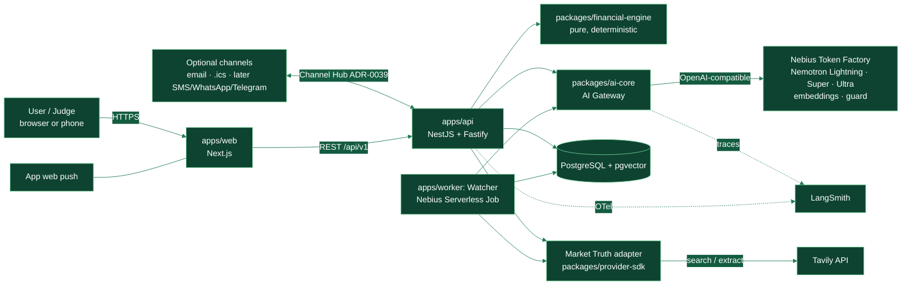

# 03 — Demo architecture and use of the Nebius / NVIDIA stack

Principle: **FINCH's target architecture does not change; the deployed topology is reduced**
(README §6: "the deployed topology must be the minimum that correctly satisfies the current
workload"). The demo uses the same packages and boundaries as the monorepo — no "toy" repository.

> **VERIFY:** everything marked this way must be confirmed against official documentation or the
> console before implementation (AGENTS.md §7: never invent versions, APIs or flags). Model IDs are
> confirmed with `GET https://api.tokenfactory.nebius.com/v1/models` using the team's key.

---

## 1. Context view

## 2. Components and their place in the monorepo

| Component        | Location                                        | Hackathon responsibility                                                                                           | Boundary that is NOT broken                                                    |
| ---------------- | ----------------------------------------------- | ------------------------------------------------------------------------------------------------------------------ | ------------------------------------------------------------------------------ |
| Web              | `apps/web` (Next.js, ADR-0005)                  | Complete UI, i18n, receipts, Decision Cards.                                                                       | Never calls Token Factory or Tavily directly: keys never reach the client.     |
| API              | `apps/api` (NestJS/Fastify, ADR-0007)           | REST, agent orchestration, demo sessions, Channel Hub (ADR-0039): inbox, web push, .ics, email.                    | Workspace authorization on the server (ADR-0010/0011, minimal version).        |
| Worker / Watcher | `apps/worker`                                   | Watcher job, packaged as a container for Nebius Serverless Jobs.                                                   | Idempotent (`workspace_id + date` key), at-least-once (Constitution §4.12–13). |
| Engine           | `packages/financial-engine`                     | Every formula in `docs/financial-formulas/`.                                                                       | Pure: no I/O, no SDKs (ADR-0017, dependency-cruiser).                          |
| CO jurisdiction  | `jurisdictions/CO`                              | Rate conventions, holidays, legal copy, allowed official sources.                                                  | Colombian rules never enter the global core (README §36).                      |
| AI Gateway       | `packages/ai-core`                              | Tiered routing, PII redaction, prompt registry, schema validation, number verifier, budget and audit.              | The only path to models (ADR-0018). Output is always `GENERATED_NARRATIVE`.    |
| Market Truth     | `packages/provider-sdk` (port) + Tavily adapter | Allowlisted search and extraction, deterministic parsing, cache and provenance.                                    | The provider SDK lives only in the adapter (ADR-0022).                         |
| Contracts        | `packages/contracts`                            | `CalcReceipt`, `DecisionCard`, `SkillDefinition`, events.                                                          | No dependencies on other packages.                                             |
| DB               | `packages/db` (Drizzle)                         | Minimal schema: demo principals/workspaces, twin facts, snapshots, receipts, cards, memories, audit, watcher runs. | Only `packages/db` touches the driver.                                         |
| Observability    | `packages/observability`                        | OTel + structured logs; exporter to LangSmith.                                                                     | Never PII or raw amounts in analytics (AGENTS.md §4).                          |

> The Channel Hub (ADR-0039) and Tavily as a provider are decisions README §76 requires to record
> (new _core vendor_ and new trust boundary): they live in ADR-0035/0036/0039.

## 3. Demo deployment topology (details in ADR-0038)

### Topology A: preferred, maximum use of Nebius

| Piece                  | Where                                                                                              | Notes                                                                                                                                                                                            |
| ---------------------- | -------------------------------------------------------------------------------------------------- | ------------------------------------------------------------------------------------------------------------------------------------------------------------------------------------------------ |
| Inference              | **Nebius Token Factory** (serverless, per token)                                                   | Mandatory. `NEBIUS_BASE_URL=https://api.tokenfactory.nebius.com/v1/`.                                                                                                                            |
| Watcher                | **Nebius Serverless Jobs**                                                                         | Container of `apps/worker`. **VERIFY** whether Jobs support native scheduling; if not, a GitHub Actions `schedule` triggers the job through the Nebius CLI (least-privilege service credential). |
| Web + API              | **Nebius Serverless Endpoint** running an HTTP container, or a small VM on Nebius AI Cloud         | **VERIFY** whether Serverless Endpoints accept a generic CPU-only HTTP container, and the cost of 11 weeks always-on (until 15 Dec).                                                             |
| PostgreSQL             | **Nebius Managed PostgreSQL** (VERIFY availability, pgvector and cost), or Postgres on the same VM | Daily backups.                                                                                                                                                                                   |
| Private inference (P7) | **Nebius Serverless Endpoint** with Nemotron Lightning                                             | Only with AI Cloud credit; optional.                                                                                                                                                             |

### Topology B: low-cost, high-stability fallback

- Web + API: Railway / Render / Fly.io (one always-on container).
- Postgres: Neon or Supabase (plan with pgvector).
- Watcher: GitHub Actions cron → authenticated internal endpoint, **or** a Nebius Serverless Job once
  verified (keeping "deployed/run using Nebius AI Cloud compute").
- Inference: Token Factory (the "runs on Nebius" requirement is met by the runtime call).

**Decision rule (task S0-06, due Friday 2 Oct):** if Topology A costs more than the available AI Cloud
credits cover **or** cannot guarantee continuous availability until 15 Dec, use B for web/API/DB and
keep the Watcher on Nebius Serverless Jobs.

## 4. Tool map: what is used, for what, and with which credit

| Tool                                                                                                                                       | Credit source                                                                                             | Use in FINCH                                                                                                                                          | Judging criterion it feeds            |
| ------------------------------------------------------------------------------------------------------------------------------------------ | --------------------------------------------------------------------------------------------------------- | ----------------------------------------------------------------------------------------------------------------------------------------------------- | ------------------------------------- |
| **Nebius Token Factory**: Nemotron 3.5 Lightning (30B/3B active, 1M context)                                                               | USD 25 (promo `NEBIUS-DEVPOST-GLOBAL26`) + USD 25 (Builders Program)                                      | Intent routing, classification, text extraction, quick replies, bank-notification reading, briefing. **The majority of calls.**                       | Tech Impl., Idea                      |
| Token Factory: **Nemotron 3 Super 120B-A12B**                                                                                              | same                                                                                                      | Orchestrating agent with tool calling and structured outputs; Decision Card narrative.                                                                | Tech Impl.                            |
| Token Factory: **Nemotron 3 Ultra 550B-A55B**                                                                                              | same                                                                                                      | Auditing second opinion (Decision Cards and actions only) and eval judge. Sparse, measured use.                                                       | Idea, Tech Impl.                      |
| Token Factory: multimodal Nemotron model (Nano VL or Omni; **VERIFY** availability)                                                        | same                                                                                                      | Receipts, invoices, offers and statements in images or scanned PDFs.                                                                                  | Design, Tech Impl.                    |
| Token Factory: **embeddings** (e.g. `Qwen/Qwen3-Embedding-8B`; **VERIFY** whether an NVIDIA embedding model is available and prefer it)    | same                                                                                                      | Semantic memory (pgvector).                                                                                                                           | Tech Impl.                            |
| Token Factory: **guard model** (e.g. `meta-llama/Llama-Guard-3-8B`; **VERIFY** whether a Nemotron safety guard is available and prefer it) | same                                                                                                      | Input and output safety classification.                                                                                                               | Tech Impl.                            |
| Token Factory: **structured outputs + function calling**                                                                                   | —                                                                                                         | Agent contracts.                                                                                                                                      | Tech Impl.                            |
| Token Factory: **batch inference** (~50 % cheaper, results < 24 h)                                                                         | same                                                                                                      | Running the full E2–E6 evals.                                                                                                                         | Tech Impl.                            |
| Token Factory: **post-training / LoRA** (P8)                                                                                               | same                                                                                                      | Specialized extractor for Colombian documents. Optional.                                                                                              | Idea                                  |
| **Nebius AI Cloud: Serverless Jobs**                                                                                                       | AI Cloud credits (**VERIFY** whether the Builders Program or promo covers AI Cloud or only Token Factory) | Always-on Watcher.                                                                                                                                    | Personal AI ("always-on"), Tech Impl. |
| Nebius AI Cloud: Serverless Endpoints                                                                                                      | same                                                                                                      | Web/API (Topology A) and private inference (P7).                                                                                                      | Personal AI ("private")               |
| **Tavily**                                                                                                                                 | Builders add-on credits + `BBDEVPOST` code (**VERIFY** validity)                                          | Market Truth: usury cap, reference rates, offers, FX, remittances, official tax data. Search + Extract.                                               | **Best Use of Tavily**, Impact        |
| **LangSmith**                                                                                                                              | USD 100 (Builders)                                                                                        | Tracing every agent turn, eval datasets, comparing prompt versions.                                                                                   | Tech Impl. (visible evidence)         |
| **Toloka**                                                                                                                                 | USD 100 (Builders)                                                                                        | Human evaluation of explanation quality in Colombian Spanish and English (E5).                                                                        | Design, Impact                        |
| **Nebius Academy**: USD 1 certification and free Agentic AI course                                                                         | Builders                                                                                                  | Both founders take it in weeks 0–1 (2–4 h): a credential for the pitch and Nebius agent patterns.                                                     | — (team)                              |
| **Nebius office hours and Discord**                                                                                                        | Builders                                                                                                  | Resolve the VERIFY items (Jobs scheduling, CPU endpoints, available models, data retention). Book in week 0.                                          | —                                     |
| NVIDIA NemoClaw / OpenShell / Hermes Agent                                                                                                 | Open source                                                                                               | P6 (post-hackathon): expose FINCH over MCP to personal agents. In the hackathon the track fit is covered by Nebius Serverless and the autonomous app. | Personal AI                           |

**Inference budget:** per-token prices change and are not fixed here. The gateway enforces a
**configurable daily budget** (`AI_DAILY_BUDGET_USD`) and a **per-demo-session budget**, and reserves
**≥ 40 % of total credit for the judging period** (1–15 Dec). Real cost per conversation is measured
in week 1 and the plan recalculated. If credit falls short, buying USD 20–50 more is reasonable
against the prize (decision D-08).

## 5. Data and privacy

| Data                                                    | Classification (ADR-0028) | Sent to an LLM?                                                                                             | Handling                                                      |
| ------------------------------------------------------- | ------------------------- | ----------------------------------------------------------------------------------------------------------- | ------------------------------------------------------------- |
| Name, national ID, account or card number, phone, email | High PII                  | **No.** Redacted before egress (`<PERSON_1>`, `<ACCOUNT_1>`); the replacement map lives only on the server. | Encrypted at rest; never in logs or analytics.                |
| Amounts, rates, dates                                   | Sensitive financial       | Yes — the minimum needed for the task.                                                                      | Minimized per skill; amounts the LLM sees come from receipts. |
| Uploaded documents                                      | Sensitive                 | Only the text or image needed to extract; optionally to a private endpoint (P7).                            | Quarantine; automatic deletion after 7 days in demo mode.     |
| Memories                                                | Sensitive                 | Only those retrieved and relevant.                                                                          | Visible, editable and deletable by the user.                  |

**VERIFY with Nebius (office hours):** Token Factory's data retention and usage policy (are prompts
used for training? is there a _zero data retention_ option?). The answer is documented in the README,
because it is central to the track's privacy argument.

## 6. Security of the public demo

- Keys only in host environment variables; `.env.example` with placeholders; gitleaks in CI.
- Rate limits per IP and session; token cap per session; global _credit guard_ (kill switch,
  README §62).
- Restricted CORS; security headers; limited uploads (type and size).
- Web content (Tavily) and documents are **untrusted data**: never concatenated as instructions
  (see 04 §5).
- Demo sessions are isolated in ephemeral workspaces, cleaned every 24 h.
- Threat model of the slice in `docs/architecture/threat-models/hackathon-demo.md` (task S1-09;
  README §39 requires it for R1+).

## 7. Concrete technical stack (versions verified in the registry before adding, AGENTS.md §7)

| Need                                                   | Proposed choice                                          | Status                                |
| ------------------------------------------------------ | -------------------------------------------------------- | ------------------------------------- |
| OpenAI-compatible client                               | Official `openai` Node SDK pointed at `NEBIUS_BASE_URL`  | VERIFY version                        |
| Schema validation                                      | `zod` + JSON Schema conversion                           | VERIFY version                        |
| Arbitrary-precision decimal (rates, fractional powers) | `decimal.js` (supports `pow` with non-integer exponents) | VERIFY; note in ADR-0016              |
| Tavily                                                 | Official `@tavily/core` SDK or direct HTTP               | VERIFY                                |
| Web Push                                               | Standard Web Push + VAPID (library to VERIFY)            | VERIFY iOS support for installed PWAs |
| Transactional + inbound email                          | Provider chosen in S0-06 (ADR-0039)                      | VERIFY cost and domain                |
| ORM                                                    | Drizzle (already in the Constitution)                    | VERIFY                                |
| Vector                                                 | `pgvector` extension                                     | VERIFY on the chosen host             |
| Web i18n                                               | `next-intl` or Next's built-in i18n                      | VERIFY                                |
| PDF (letters)                                          | `@react-pdf/renderer` or `pdf-lib`                       | VERIFY                                |
| Tracing                                                | LangSmith SDK or OTel exporter to LangSmith              | VERIFY OTel support                   |
